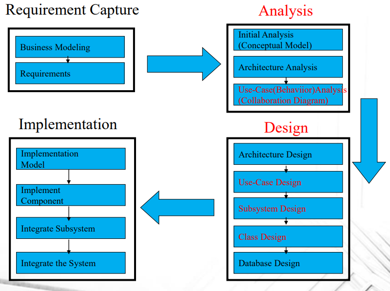
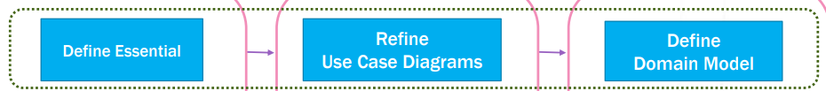
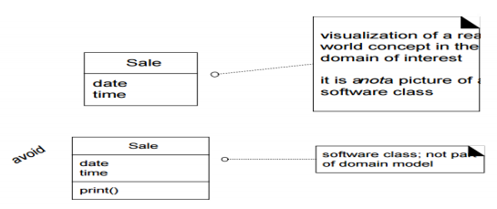
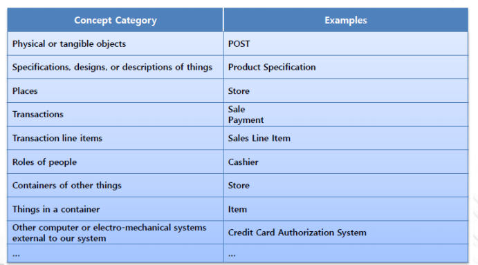
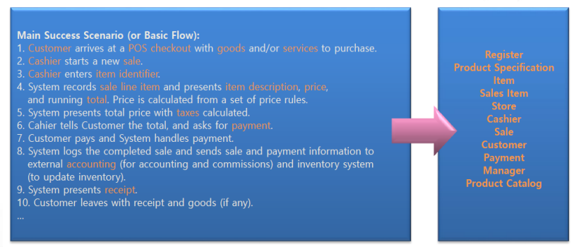
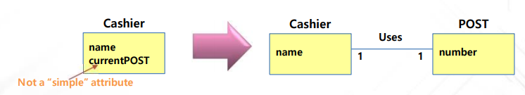
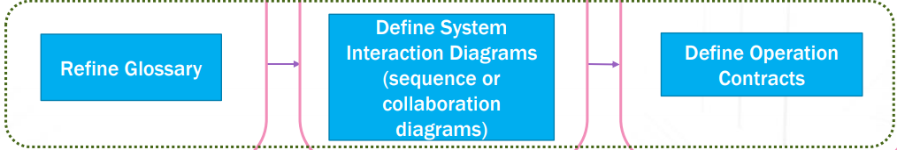
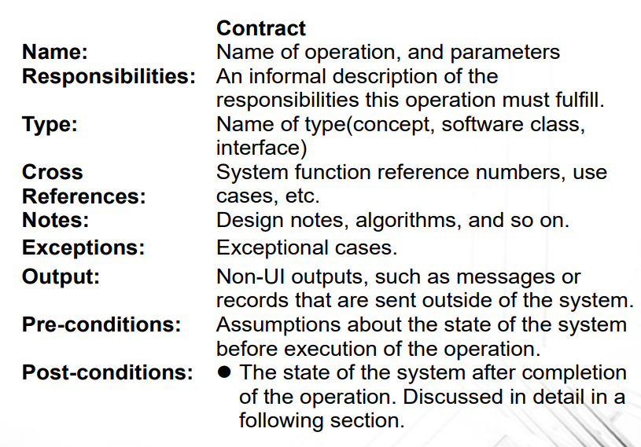

# Elaboration Phase 1

- SW Development Process Analysis / Design
  - Use Case Analysis : Requirement에서 만든 Use case를 반영하도록 하는 것

## Elaboration Iteration

- 통상적으로 2~4개의 Iteration으로 구성

- Focus

  - 코어 아키텍쳐 구조 잡기
  - High-risk elements의 해결
  - 대부분의 요구사항 정의
  - 전체 스케쥴/자원(사람, 컴퓨터 등) 추측

- 하나의 유즈케이스를 짧은 Iteration 하나에 담기에는 너무 복잡할 수 있기 때문에, 다른 Iteration에 배치 해야 할 때도 있음

- Artifacts

  - Domain Model : 도메인 컨셉의 가시화, 도메인 엔티티의 정적 정보 모델
  - Design Model : 논리적 디자인을 describe 하는 diagrams (Class diagram, interaction diagrams)
  - Software Architecture Document : Summary of the design ideas / motivation in the system
  - Data Model : DB 스키마, Mapping strategies
  - Use-Case Storyboards, UI Prototypes : Stakeholder <-> 개발자가 생각하는 UI가 일치하는지 확인

  

### Define Essential Use Case

- 유즈 케이스들 중 중요한 유즈 케이스 정의
- 앞서 했던걸 다시 한번 검증하는 단계

### Refine Essential Use Case

- Input : 유즈케이스 모델, descriptions
- Output : **Refined** Use Case Diagram

### Define Domain Model

- Input : Essential Use Case Descriptions, Business Concept Model
- Output : **Conceptual** class diagram
- Domain Model : 현실세계에서 식별된 Conceptual Classes를 표현하는 것
  - Visualizing Concepts
  - 의미있는 Conceptual Class를 도출
  - 객체지향분석 중 가장 중요한 Artifact
  - 소프트웨어 컴포넌트의 모델과는 다름

- Steps

  1. Use Case, Business Concept Model로 부터 Domain Class 추출

     - Guideline 1(Concept Category List 이용)

       - **Transaction** : 다른 종류의 기능들로 하나의 의미있는 기능으로 묶어주는 것 

       

     - Guideline 2(시나리오 이용)

       

  2. 추출한 컨셉들에 클래스 이름 부여

     - 없는거 추가하지는 말 것

  3. 클래스 간의 관계를 식별

     

  4. 식별한 관계들에 우선순위 부여

     - 높은 우선순위 :
       - A는 B의 물리적 / 논리적 부분이다
       - A는 물리적 / 논리적으로 B에 속한다
       - A가 B에 기록된다

  5. 관계들에게 이름 부여

  6. 관계에 Multiplicity(1,n) 추가

  7. 시나리오, 요구사항 등을 읽으며 특성 식별

- Associations : 클래스 간의 관계를 좀 더 직관적으로 표현

- Attributes : 적절한 데이터 타입 지정, 요구사항에 명세된 것들

#### Mistakes

- 컨셉을 Attribute로 정의해버리는 경우
- If we do **not** think of some conceptual class **X as a number or text** in the real world, X is probably a **conceptual class**, not an attribute

### Refine Glossary

- 사용되는 Term들을 List 하고 Refine한다
  - Risk를 낮추고, Communication시의 Misunderstanding 방지
  - Input : Term Dictionary, Essential Use Case Descriptions, Conceptual Class Diagram
  - Output : Refined **Term Dictionary**

### Define System Interaction Diagrams

- Actor -> System으로 가는 이벤트 상황을 보여주는 다이어그램
- System Behaviour : 시스템이 뭘하는지 설명하는 것 (How가 아님)
- System Interaction Diagram 
  - 유즈 케이스 시나리오 반영
  - 액터가 만들어내는 시스템의 동작

#### System Sequence Diagram(SSD)

- Input : Essential Use Case Descriptions, Use Case Diagram

- Output : Sequence Diagram

- 시스템과 액터 사이의 상호작용을 그림

  - 시스템을 뜻하는 Black Box 하나, 액터 하나별로 라인 하나 그림
  - 시스템 바운더리 설정 

  

- Main Success Scenarios, Frequent/Complex/Alternative Scenarios에 대해 작성

### Define Operation Contracts

- System Operation에 관한 Contract 정의
  - Contract : Operation이 목표달성을 위해 뭘하는지
  - System Operation 각각 하나씩 작성
  - System Opeation이 호출됐을 때 전체 시스템의 상태 변화를 정의
- Input : System Sequence Diagram, Conceptual Class Diagram
- Output : Operation Contracts
- 어떻게 보다 **무엇**을

