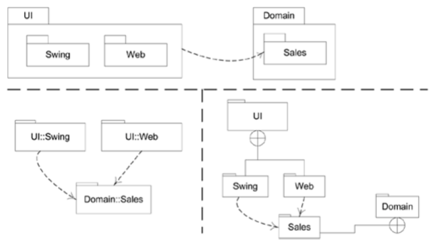
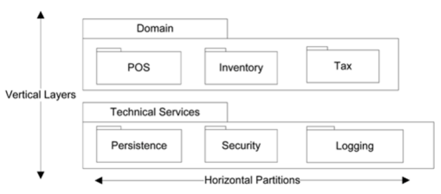

# Elaboration Phase 2

## Logical Architecture and UMP Package Diagrams

### Analysis-Oriented Software Design

- 큰 스케일로 시작
- Logical Layered Architecture, 관련된 UML Notation을 보여줌

### Logical Architecture

- Package, subsystems, layers로 나눠진 큰 스케일의 Organization of software classes

#### Layer

- 클래스, 패키지, 서브시스템의 조잡한 Grouping, 대부분의 시스템과 화합함
- 상위 레이어가 하위 레이어의 서비스를 호출

- Typical Layers
  - UI
  - Application Logic / Domain Objects
    - Application의 요구사항을 충족하는 Domain concept를 대표하는 **소프트웨어 객체**들
  - Technical Services
    - 데이터베이스 연동 / 에러 로깅 등의 Technical Service를 포함하는 **일반적인 목적**을 가진 객체/서브시스템
- Common Layers
  - UI(Presentation, View)
  - Application(Workflow, Process, Mediation, App Controller)
  - Domain(Business, Application Logic, Model)
  - Business Infrastructure(Low-level business services)
  - Technical Services(Technical Infrastructure, High-level Technical Services)
  - Foundation(Core Services, Base Services, Low-level Technical Services)
- 레이어 사용의 이점
  - 레이어 간의 분리 : 의존성을 줄이고, 재사용성을 높임
  - 복잡도가 Encapsulate되고 분해가능해짐
  - 몇몇 레이어는 새로운 Implementation으로 대체 가능
  - 하위 레이어들은 재사용가능한 기능으로 구성
  - 레이어 따로 배포가능
  - 서로 다른 팀에서 다른 파트 작업 가능
- Cohesive Responsibilities
  - 걱정의 분할
  - 높은 응집력을 유지(basic architecture principle)

### Software Architecture

- 중요한 결정의 집합
  - 소프트웨어 시스템의 정리
  - 구조적 Elements, Interfaces들의 선택
  - Elements, Interfaces의 구성
- Architectural Style
  - 아키텍쳐의 Organization을 Guide
    - Elements, Interfaces, Collaborations, Composition

- UML Package Diagrams

  - 시스템 / 레이어 / 서브시스템 / 패키지의 논리적 아키텍쳐를 Illustrate
  - 패키지 사이의 의존성
    - 큰 스케일에서의 커플링
    - 화살표로 표현(의존하는 쪽으로)

  

  

### Domain

#### Domain Objects

- 현실세계의 도메인과 비슷한 이름/정보로 소프트웨어 객체 생성
  - Application Logic Responsibilities를 이들에게 지정 => **Domain Objects**

#### Domain Layer

- 작동을 위해 Domain Objects를 포함하는 Application Logic

### Model-View Separation Principle

- non-UI 객체를 직접적으로 UI 객체와 연결하지 말 것
- Application Logic을 UI 객체 메소드에 넣지 말 것
  - UI element를 초기화하고, 이벤트를 받거나, 요청을 전달하는 역할