# Elaboration Phase 3

## Interaction Diagrams

- 객체들이 메세지를 통해 어떻게 의사소통 하는지
- 동적 객체 모델링에 사용

### Sequence Diagrams

- Fence 포맷으로 상호작용을 illustrate, 새로운 객체를 오른쪽에
- 장점 : 분명하게 메세지의 순서를 명시, 다양한 Notation Options
- 단점 : 새로운 객체를 추가할때마다 오른쪽에 추가 => 가로공간 부족

#### Basic Notation

- Singleton Objects : 해당 클래스가 하나의 객체만 생성할 경우

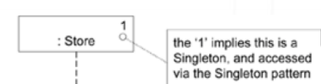

- Messages : Lifeline 사이의 꽉찬 화살표로 표현
- Return / Reply 표기 : 선언문 또는 점선화살표로

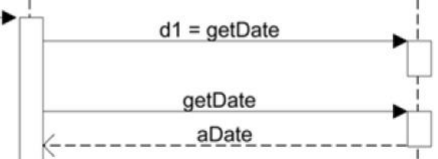

- Self / This 메시지 : Nested Activation Bar로 표현, 화살표를 자기자신에게
- Instance 생성 : 점선 화살표로 표시

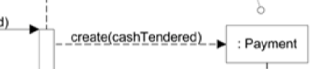

- Instance 제거 : destroy 표시

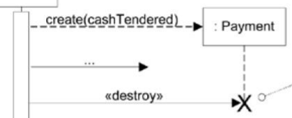

- Frame 사용 : 조건문 / 반복문 지원, 네스팅 가능

  - alt : Alternative, guard 조건이 TRUE일때 실행, main에서 벗어남

  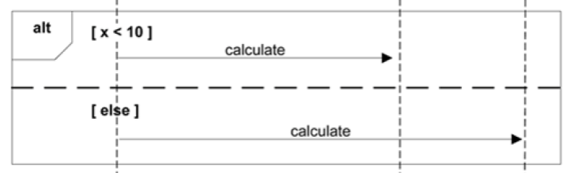

  - loop : 반복문, loop(n)으로 n번 반복한다는거 표현 가능
    - Collection 대상 루프 표현도 가능

  

  - opt : guard 조건이 TRUE일때 실행되는 Fragments

  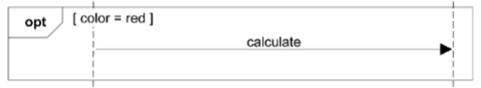

  - par : 평행적으로 실행되는 Fragments
  - region : 하나의 스레드만 실행되는 **Critical Region**
  - ref : 모든 Sequence Diagram에서 사용될 수 있는 프레임 참조

  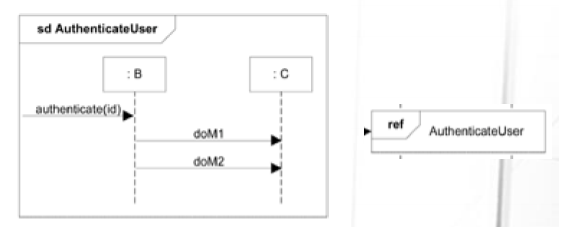

- Class / Static 메소드 호출

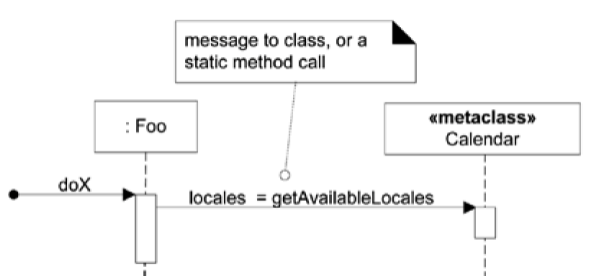

- 다형성 메시지(추상 클래스 / 인터페이스 대상) : 해당 메소드까지만 표기하고 상세 내용은 따로

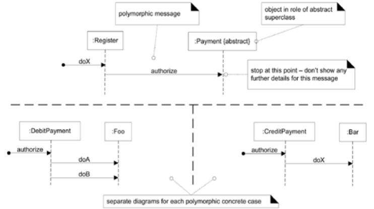

- Asynchronous / Synchronous Calls

  - Asynchronous : 응답을 안 기다림 => 멀티 스레드 환경에서 사용가능(runnable object, run으로 실행)
  - Synchronous : 기다림

  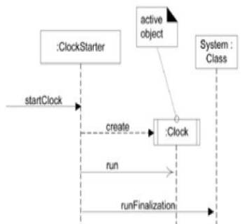

- Active Object : 각각의 인스턴스가 독립된 스레드에서 실행/제어되는 오브젝트

### Communication Diagrams

- Graph / Network 포맷으로 상호작용을 illustrate, 아무곳에나 객체 배치

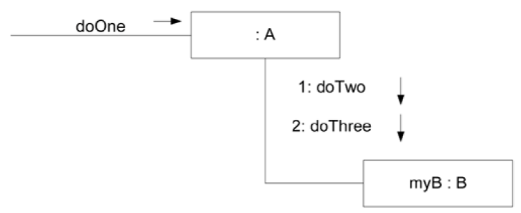

- 장점 : 공간사용이 효율적, 유연성 높음
- 단점 : 메세지의 순서를 보는것이 어려움, Notation Option이 적은편