# Elaboration Phase 4

## UML Class Diagrams

- 클래스, 인터페이스, 관계를 도식화하기 위한 Diagram
- 정적인 Object Modeling

### DCD (Design Class Diagram)

- 모든 DCD가 UP의 Design Model에 포함됨
  - UML Interaction, Package 다이어그램도 있음

### Classifier

- Behavioral, Structural 기능을 설명하는 모델 요소
- Specialize될 수 있음
- 많은 UML 요소들의 Generalization임
  - 클래스, 인터페이스, 유즈케이스, 액터
- 일반적인 Classifier : 클래스와 인터페이스

- Classifer의 속성들
  - Attribute Text Notation
    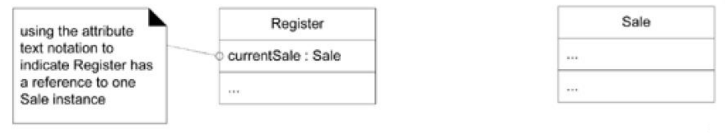
  - Association Line Notation
    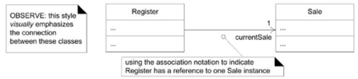
  - 둘이 동시에
    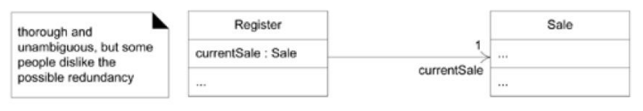
- Association
  - Classifier간의 관계를 설명
  - 어떤 속성이 연관되어있는지 표기
  - End
    - Navigability Arrow
    - 속성을 뜻하는 Optional Role name
    - Multiplicity Value(*,0,1)
  - {ordered}, {unique} 사용가능
- Notes, Comments, Constraints, Method Bodies
  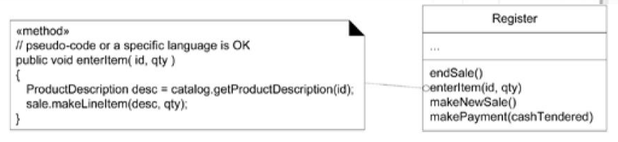
  - 제약사항 : << >>로 표시
  - 메소드 구현 내용
- Operation 
  - Name, Parameter, Return Type, Exceptions List, pre/post conditions를 가지고 있는 선언문
  - Operation의 시그니처
    
  - DCD에서의 Operation
    - 생성 Operation : new 연산자, 생성자 호출
    - 접근 Operation : set/get operations(Retrieve or Set)
- Method
  - Operation의 구현
  - 제약사항이 있으면 만족시켜야함
  - Interaction 다이어그램에서 메세지의 디테일, 시퀀스를 포함
  - Class Diagram에서 Note Symbol \<\<method>>로 표시

- Keywords
  - 모델 요소를 분류하기위한 문자형식의 장식
    - <\<interface>>, <\<actor>>
  - {}로 감싸진 제약사항
    - {abstract}, {ordered}
- Stereotype : 존재하는 모델링 컨셉의 정제
  - UML Profile에서 정의
  - 많이 있음
  - Extension Mechanism의 역할
    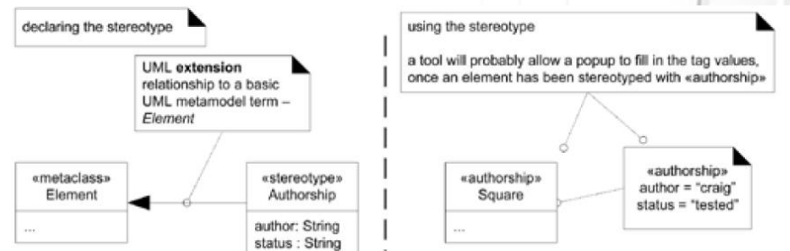
- Property : Element의 특성을 의미하는 이름값, 의미론적인 존재
- Property String
  - {name1 = value1, name2 = value2}
  - {abstract, visibility = public}
- Generalization : 일반화, 뚱뚱한 세모 화살표로 표현
- Dependency
  - 한 Client Element가 다른 Supplier Element에 대한 지식이 있음을 뜻함
  - Supplier의 변화가 Client에 영향을 끼침
  - Client -> Supplier 점선 화살표로 표현
  - Coupling으로 보여짐
  - Kinds
    - Supplier Type의 속성이 있는 경우
    - Supplier에게 메세지를 보내는 경우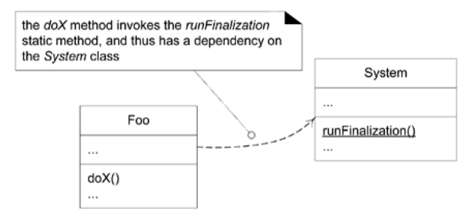
    - Supplier Type의 Parameter를 받는 경우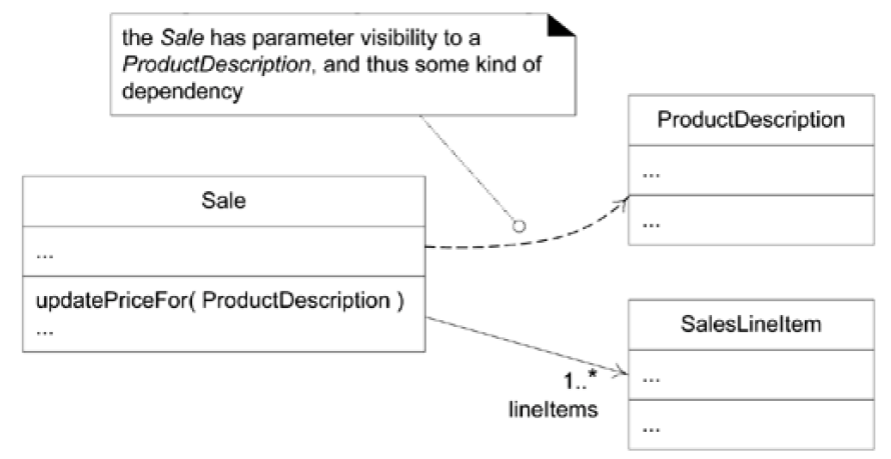
    - Supplier가 Superclass거나 인터페이스인 경우

- Interfaces
  - Client에게 인터페이스 제공
  - Interface Dependency
  - 구현 : Interface Realization

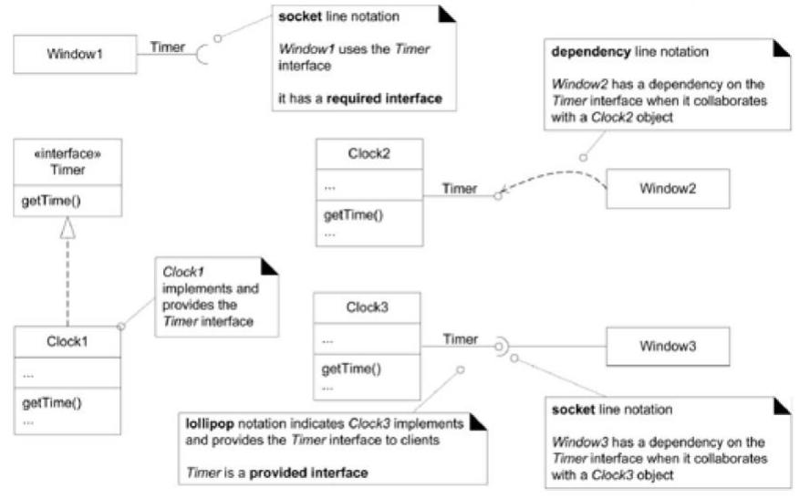

- Aggregation : Whole-part Relationship의 모호한 kind

- Composition : Composite Aggregation

  - Whole-part Relationship의 강력한 Kind
    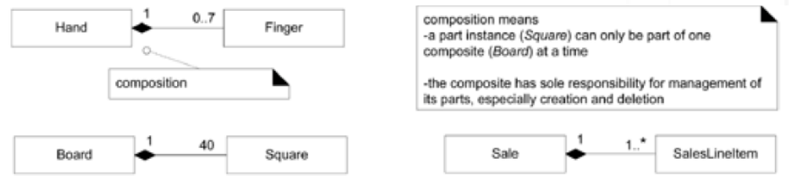

- Constraints : UML 요소에 대한 제한 사항/조건

  - 중괄호 안에 작성

    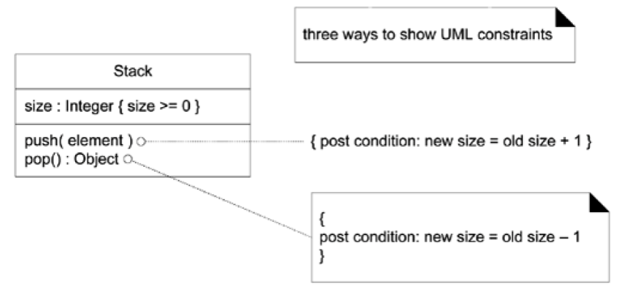

- Qualified Association
  - 관련된 더 큰 개념의 객체들로부터 객체를 구분하는 Qualifier가 있는 관계
    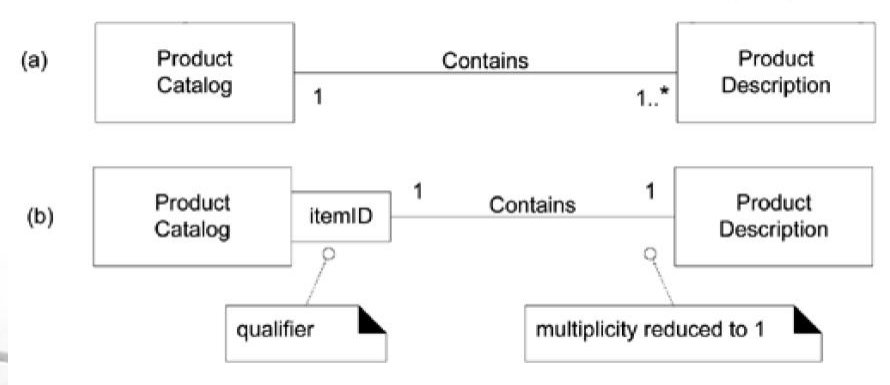

- Association Class
  - 관계 자체를 클래스로 취급
  - Attributes, Operations등으로 채움
    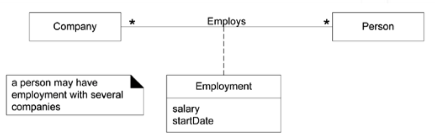
- Singleton Classes
  - 하나의 인스턴스만 생성되는 클래스
    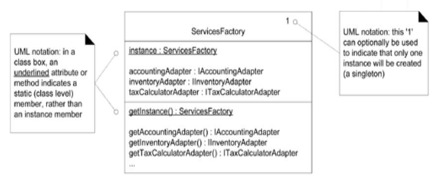
- Template Classes and Interfaces
  - 주로 Collection Class의 엘리먼트 타입으로 쓰임
    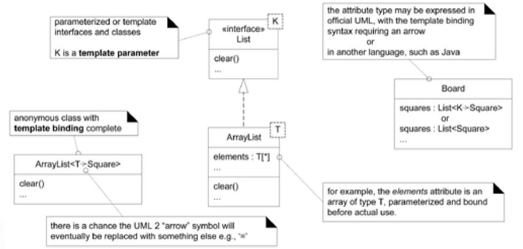
- User-Defined Compartments
  - 이름, 속성, 연산 포함
    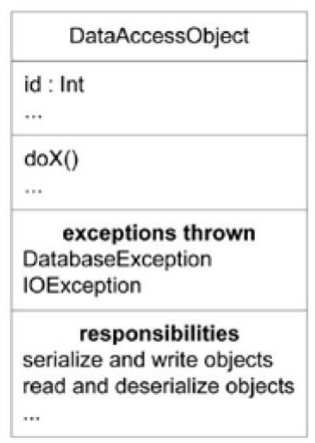
- Active Class
  - 하위 스레드를 제어하고, 실행
  - Active Object의 클래스가 Active Class
    

- Interaction Diagram의 Class Diagram에 대한 영향
  - Interaction Diagram에서 Class Diagram의 정의가 만들어질수있음