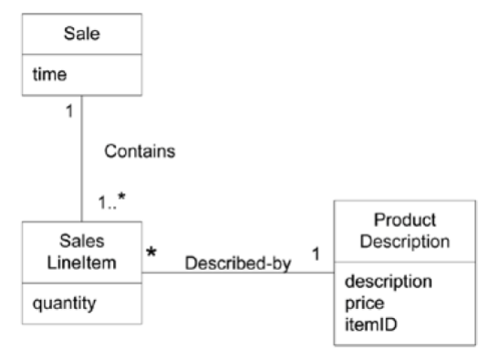

# GRASP

- General Responsibility Assignment Software Patterns
  - 의무적이고 보편적인 객체지향 설계 방법이 담긴 패턴
  - 클래스에게 어떤 책임을 부여할지 결정
  - 어떤 클래스가 설계에 포함될지 결정

## Responsibilities and Responsibility-Driven Design

- 소프트웨어 객체에게 일종의 책임이 있는것으로 생각(추상화한대로)
- 책임
  - Classifier의 계약 또는 책임
  - 해당 객체의 역할에 따른 행동 및 의무와 관련됨
- Doing Responsibility
  - 혼자서 뭐하는거(객체를 만들거나, 연산을 수행)
  - 다른 객체의 행동을 시작하는것
  - 다른 객체를 Control 하거나, 행동을 설계하는것
- Knowing Responsibility
  - Private 데이터에 대해 아는것
  - 관련된 객체에 대해 아는것
  - 유도되거나 계산될 수 있는것에 대해 아는것

- 책임은 객체 설계시의 클래스에게 지정됨
- Collaboration의 Idea를 포함
  - 혼자서 행동하거나, 다른 메소드/객체들과 Collaborate하는 용도로 구현됨

### Patterns

- 문제의 설명, 해당 문제에 대한 해결법
- 새로운 Context에 적용될 수 있는 잘 알려진 Problem-Solution

#### Creator

- Name : Creator
- Problem : 누가 A를 만들었는가
- Solution(Advice) : 다음 조건중 하나 만족시 클래스 B에게 클래스 A의 인스턴스를 만드는 책임을 부여
  - B가 A를 포함하거나 복합적으로 통합할시
  - B가 A를 기록할시
  - B closely uses A
  - B가 A의 초기화 데이터를 가지고 있다

- Sale이 SalesLineItem의 Creator