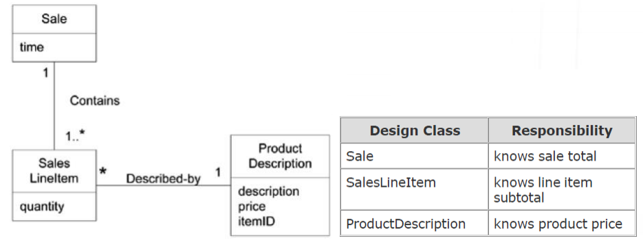
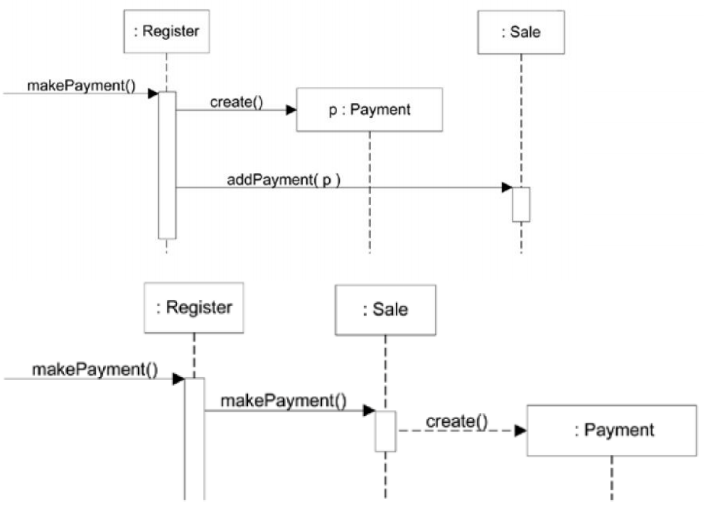
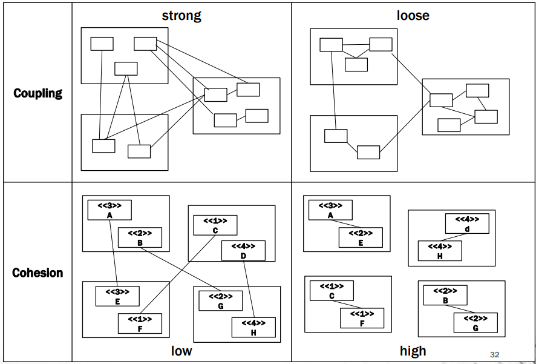

# GRASP

- General Responsibility Assignment Software Patterns
  - 의무적이고 보편적인 객체지향 설계 방법이 담긴 패턴
  - 클래스에게 어떤 책임을 부여할지 결정
  - 어떤 클래스가 설계에 포함될지 결정

## Responsibilities and Responsibility-Driven Design

- 소프트웨어 객체에게 일종의 책임이 있는것으로 생각(추상화한대로)
- 책임
  - Classifier의 계약 또는 책임
  - 해당 객체의 역할에 따른 행동 및 의무와 관련됨
- Doing Responsibility
  - 혼자서 뭐하는거(객체를 만들거나, 연산을 수행)
  - 다른 객체의 행동을 시작하는것
  - 다른 객체를 Control 하거나, 행동을 설계하는것
- Knowing Responsibility
  - Private 데이터에 대해 아는것
  - 관련된 객체에 대해 아는것
  - 유도되거나 계산될 수 있는것에 대해 아는것

- 책임은 객체 설계시의 클래스에게 지정됨
- Collaboration의 Idea를 포함
  - 혼자서 행동하거나, 다른 메소드/객체들과 Collaborate하는 용도로 구현됨

### Patterns

- 문제의 설명, 해당 문제에 대한 해결법
- 새로운 Context에 적용될 수 있는 잘 알려진 Problem-Solution

#### Creator

- Name : Creator
- Problem : 누가 A를 만들었는가
- Solution(Advice) : 다음 조건중 하나 만족시 클래스 B에게 클래스 A의 인스턴스를 만드는 책임을 부여
  - B가 A를 포함하거나 복합적으로 통합할시
  - B가 A를 기록할시
  - B closely uses A
  - B가 A의 초기화 데이터를 가지고 있다

- Sale이 SalesLineItem의 Creator

#### Information Expert

- Problem : 객체들에게 책임을 Assign하는 General Principle이 무엇인가?
- Solution
  - Information Expert에게 책임을 Assign한다. 책임을 충족하는 정보를 가진 Class에게
- 장점
  - Encapsulation이 유지됨, 자신들의 정보를 사용
  - 필요한 정보를 가진 클래스들을 통해 유통됨
    - 이해/유지하기 쉬움
    - 응집력이 높음

	#### Low Coupling

- Expert supports low coupling
- Principle : 의존성을 줄이고 재사용성을 증가시키도록 책임을 assign한다

- Problem : 변화의 영향을 어떻게 줄일까?
- Solution : Coupling이 low하게 유지되도록 책임을 assign 한다
  - Coupling : 하나의 클래스가 다른 클래스와 얼만큼 강하게 연결돼있는지, 알고있는지의 정도
  - High coupling의 문제점
    - 관련된 클래스에서의 변경이 변경을 강제함
    - 클래스 단독으로 있을 때 이해가 어려움
    - 재사용이 어려움

#### Controller

- Model-View Separation Principle에서, UI는 business logic을 포함하면 안됨
  - 이벤트를 확인하면, 해당 정보를 Domain 객체에게 delegate(forward)해야 함
- Problem : UI 레이어 뒤쪽에서 어떤 객체가 가장 먼저 System Operation을 컨트롤 하는가?외부/내부 이벤트 소스를 간접적으로 Coupling 하기 위함Solution : 다음 중의 하나의 객체에게 책임을 Assign
  - Facade Controller :
    전체 시스템이나, Root Object를 상징하는 경우, 소프트웨어가 작동하고 있는 장치, Major Subsystem
  - Session Controller:
    System Operation이 발생하는 Use Case Scenario를 상징하는 경우
  - 현실세계에서 Active한 무언가를 상징하는 경우
  - Use Case Controller
    
  - Solution : System Event를 Handle할 클래스에게 책임 부여
    - 전체 시스템을 상징함
    - 전체 비즈니스 / 단체를 상징
    - 실생활에서 Active한 무언가를 상징
    - 유즈케이스의 인공적인 Handler를 상징 (\<UseCaseName> Handler)

#### High Cohesion

- Cohesion
  - 클래스들의 책임이 얼마나 강하게 연관되고, 집중되어있는지의 정도
  - 강하게 연관된 책임을 가지지만, 정작 하는일은 엄청 많지 않은 클래스 = High Cohesion
- Cohesion이 낮은 클래스의 문제점
  - 너무 많은 일을하거나, 너무 연관안된 일을 함
  - 이해하기 어렵고, 재사용하기 어렵고, 유지보수하기 어려움
  - 변화에 민감함
- Principle : Complexity를 감당할수있도록 Cohesion을 High하게 유지하는 책임을 Assign하자

##### Don't Talk to strangers	

- 두 클래스가 서로에 대해 알거나, 커플링 된 경우가 아니면, 서로 직접적으로 상호작용해서는 안됨
- 다른 클래스를 통해서 상호작용하는게 바람직함
- Coupling Level을 줄이는 결과를 초래함(좋음)