# 2019-1 DB 과제#2 - 20142697 권민수

- Q1 : 이름이 John B. Smith인 사원의 생년월일과 주소를 검색하시오

~~~mysql
SELECT Bdate, address
FROM employee
WHERE CONCAT(Fname, Minit, Lname) = 'JohnBSmith'
~~~


- Q2 :  부서번호가 5인 부서에 근무하는 모든 사원의 모든 컬럼을 검색하시오

```mysql
SELECT *
FROM employee
WHERE Dno = 5;
```

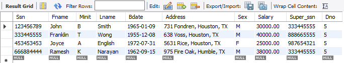

- Q3 : 'Research' 부서에 근무하는 모든 사원의 이름, 그리고 주소를 검색하시오 

```mysql
SELECT CONCAT(e.Fname, " ", e.Minit, " ", e.Lname) AS name, e.address
FROM employee e JOIN department d ON e.Dno = d.Dnumber
WHERE d.Dname = 'Research';
```

- Q4 : 'Stafford'에 위치한 모든 프로젝트에 대해서, 프로젝트 번호, 담당부서 번호, 부서관리자의 이름을 검색하시오 

```mysql
SELECT p.Pnumber, p.Dnum, d.Mgr_ssn
FROM project p JOIN department d ON d.Dnumber = p.Dnum
WHERE p.Plocation = 'Stafford';
```

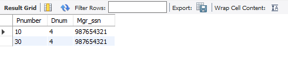

- Q5 : 각 사원에 대해 사원의 이름과 성별, 그리고 직속 상사의 이름과 성별을 검색하시오. 단, 직속 상사가 없는 직원도 검색하시오. 출력 컬럼은 사원의 이름과 성별, 그리고 직속 상사의 이름과 성별 순으로 하며, 테이블 데이터는 사원 이름 중 Fname의 오름차순으로 나타내시오 

```mysql
SELECT CONCAT(e.Fname, " ", e.Minit, " ", e.Lname) AS name, e.sex, CONCAT(s.Fname, " ", s.Minit, " ", s.Lname) AS s_name, s.sex
FROM employee e LEFT JOIN employee s ON e.Super_ssn = s.Ssn
ORDER BY e.Fname;
```

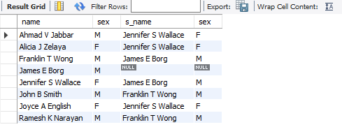

- Q6 : 사원 'Franklin Wong'이 직접 관리하는 사원의 이름을 검색하시오. 테이블 데이터는 사원 이름 중 Fname의 오름차순으로 나타내시오 

```mysql
SELECT CONCAT(e.Fname, " ", e.Minit, " ", e.Lname) AS name
FROM employee e JOIN employee s ON e.Super_ssn = s.Ssn
WHERE CONCAT(s.Fname, " ", s.Lname) = 'Franklin Wong'
ORDER BY e.Fname;
```

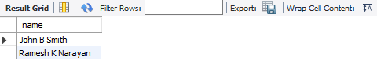

- Q7 : 사원의 SSN과 부서의 Dname에 대한 모든 조합을 생성하시오. 출력 컬럼은 Ssn, Dname 순으로 나열하며, 테이블 데이터는 Ssn과 Dname의 오름차순으로 출력하시오

```mysql
SELECT e.Ssn, d.Dname
FROM employee e CROSS JOIN department d
ORDER BY e.Ssn, d.Dname;
```

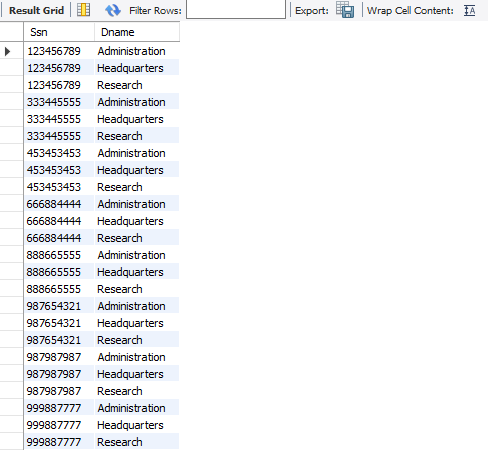

- Q8 : 성이 'Wong'인 사원이 일하는 프로젝트, 혹은 성이 'Wong'인 사원이 관리하는 부서에서 진행하는 프로젝트의 번호를 검색하시오. 테이블 데이터는 프로젝트 번호의 오름차순으로 나타내시오 

```mysql
SELECT p.Pnumber
FROM (employee e JOIN department d ON e.Ssn = d.Mgr_ssn) JOIN project p ON d.Dnumber = p.Dnum
WHERE e.Lname = 'Wong' 
ORDER BY p.Pnumber;
```

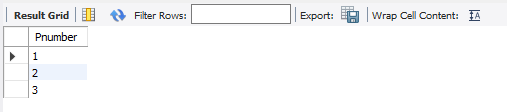

- Q9 : 주소에 'Houston, TX'이 들어있는 모든 사원의 이름을 검색하시오. 출력 컬럼은 사원의 이름, 주소 순으로 하며, 테이블 데이터는 이름 중 Fname의 오름차순으로 나타내시오. 

```mysql
SELECT CONCAT(Fname, " ", Minit, " ", Lname) AS name, address
FROM employee
WHERE address LIKE '%Houston, TX%'
ORDER BY Fname;
```

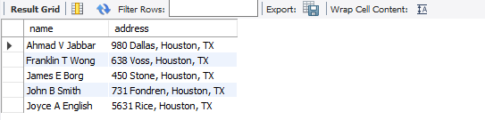

- Q10 :  'ProductX' 프로젝트에 참여하는 모든 사원의 이름, 그리고 그들의 급여를 10% 올린 경우의 급여를 구하시오

```mysql
SELECT CONCAT(e.Fname, " ", e.Minit, " ", e.Lname) AS name, (e.Salary*1.1) AS 'Salary(10% up)'
FROM employee e JOIN department d ON e.Dno = d.Dnumber JOIN project p ON d.Dnumber = p.Dnum
WHERE p.Pname = 'ProductX';
```

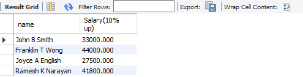

- Q11 : 모든 부서 이름, 부서에 소속한 사원의 이름, 그리고 각 사원이 진행하는 프로젝트 이름의 리스트를 검색하시오. 테이블 데이타는 부서 이름의 내림차순, 그리고 각 부서 내에서 사원 이름의 오름차순, 프로젝트 이름의 오름차순으로 나타내시오 

```mysql
SELECT d.Dname,  CONCAT(e.Fname, " ", e.Minit, " ", e.Lname) AS Ename, p.Pname
FROM employee e JOIN department d ON e.Dno = d.Dnumber JOIN project p ON d.Dnumber = p.Dnum
ORDER BY d.Dname DESC, Ename ASC, p.Pname ASC;
```


- Q12 : 5번 부서에 근무하는 사원 중에서, ProjectX 프로젝트에 주당 10시간 이상 일하는 사원의 이름과 주당근무시간을 검색하시오

```mysql
SELECT DISTINCT CONCAT(e.Fname, " ", e.Minit, " ", e.Lname) AS Ename, w.Hours
FROM employee e JOIN department d ON e.Dno = d.Dnumber 
		JOIN project p ON d.Dnumber = p.Dnum 
		JOIN works_on w ON e.Ssn = w.Essn AND p.Pnumber = w.Pno
WHERE p.Pname = 'ProductX' AND e.Dno = '5' AND w.Hours >= 10;
```

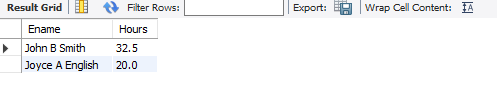

- Q13 : 배우자가 있는 사원 수를 검색하시오 

```mysql
SELECT COUNT(e.Ssn)
FROM employee e JOIN dependent d ON e.Ssn = d.Essn
WHERE d.Relationship LIKE 'Spouse';
```

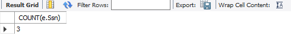

- Q14 : 부양가족이 있는 사원에 대해, 부양가족 수를 구하시오. 출력으로 사원의 이름과 부양가족 수(컬럼 이름은 NumOfDependents로 할 것)를 나열하시오

```mysql
SELECT CONCAT(e.Fname, " ", e.Minit, " ", e.Lname) AS Ename, COUNT(*) AS NumOfDependents 
FROM employee e JOIN dependent d ON e.Ssn = d.Essn
GROUP BY e.Ssn;
```

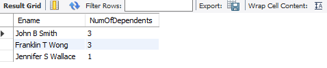

- Q15 : 모든 사원에 대해, 부양가족의 이름과 관계를 구하시오. 이때 부양가족이 없는 사원도 포함합니다. 출력 컬럼은 사원의 이름, 부양가족과의 관계, 부양가족의 이름 순으로 나열하시오. 테이블 데이터는 사원 이름 중 Fname, Minit, Lname의 오름차순으로 나타내시오 

```mysql
SELECT CONCAT(e.Fname, " ", e.Minit, " ", e.Lname) AS Ename, 
			d.Relationship, d.Dependent_name
FROM employee e LEFT JOIN dependent d ON e.Ssn = d.Essn
ORDER BY e.Fname, e.Minit, e.Lname;
```

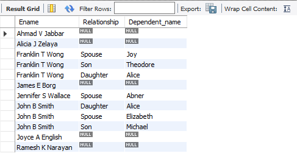

- Q16 : 모든 사원에 대해, 부양가족 수를 구하고, 이때 부양가족이 없는 사원은 부양가족수를 0으로 표시하시오. 출력 컬럼은 사원의 이름과 부양가족 수(NumOfDependents) 순으로 나열하시오. 테이블 데이터는 부양가족수의 내림차순, 이름 중 Fname의 오름차순으로 나타내시오.

```mysql
SELECT CONCAT(e.Fname, " ", e.Minit, " ", e.Lname) AS Ename, 			
			COALESCE(COUNT(d.Relationship), 0) AS NumOfDependents
FROM employee e LEFT JOIN dependent d ON e.Ssn = d.Essn
GROUP BY e.Ssn
ORDER BY NumOfDependents DESC, e.Fname ASC;
```

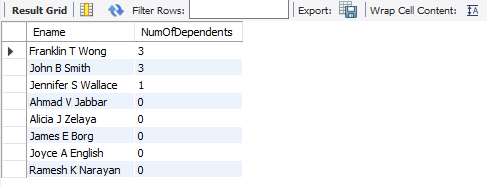

- Q17 : 부양가족이 없는 사원의 이름을 구하시오. 테이블 데이터는 이름 중 Fname의 오름차순으로 나타내시오

```mysql
SELECT CONCAT(e.Fname, " ", e.Minit, " ", e.Lname) AS Ename
FROM employee e LEFT JOIN dependent d ON e.Ssn = d.Essn
WHERE ISNULL(d.Essn)
GROUP BY e.Ssn
ORDER BY e.Fname ASC;
```

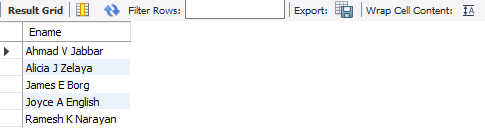

- Q18 : 자녀가 있는 사원에 대해, 부양가족 수를 구하시오. 출력 컬럼으로 사원의 이름과 부양가족수(NumOfDependents) 순으로 나열하시오. 테이블 데이터는 이름 중 Fname의 오름차순으로 나타내시오

```mysql
SELECT CONCAT(Fname, " ", Minit, " ", Lname) AS Ename, COUNT(*) AS NumOfDependents
FROM employee e JOIN dependent d ON e.Ssn = d.Essn
WHERE e.Ssn IN (
					SELECT DISTINCT e.Ssn
					FROM employee e JOIN dependent d ON e.Ssn = d.Essn
					WHERE d.Relationship IN ('Son', 'Daughter')
                )    
GROUP BY e.Ssn
ORDER BY e.Fname ASC
```

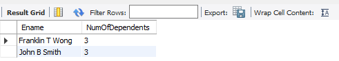

- Q19 : 각 부서에 대해, 부서의 위치와 같은 곳에서 진행되는 프로젝트를 검색하시오. 출력 컬럼은 부서 명칭, 부서 위치, 프로젝트 명칭, 프로젝트 위치 순으로 나열하시오. 테이블 데이터는 부서 명칭과 프로젝트 명칭은 오름차순으로 나타내시오

```mysql
SELECT d.Dname, dl.Dlocation, p.Pname, p.Plocation
FROM department d JOIN dept_locations dl USING (Dnumber) 
					JOIN project p ON dl.Dlocation = p.Plocation
ORDER BY d.Dname ASC, p.Pname ASC;
```

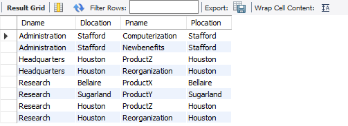