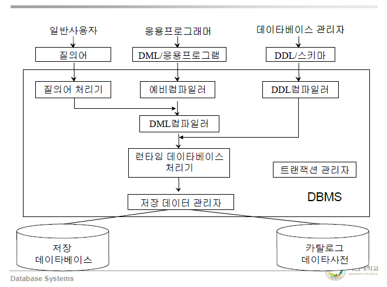
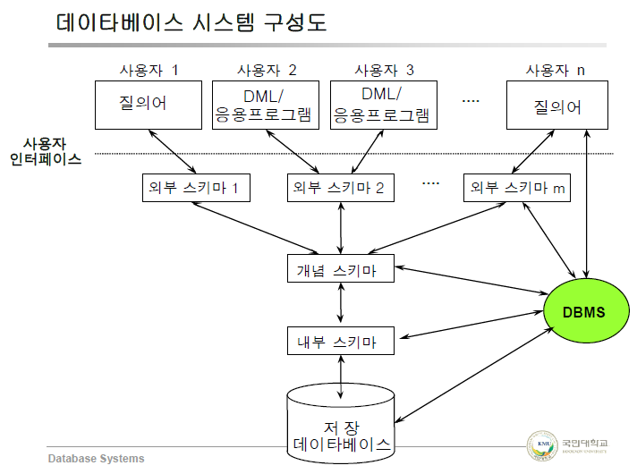

# 데이터베이스 시스템의 구성요소
## 3단계 DB
- 외부 단계, 개념 단계, 내부 단계
- 스키마 : DB의 구조와 제약조건 명세
- Schema는 컴파일되어 데이터 사전(카탈로그)에 저장됨
- 데이터 사전(시스템 카탈로그) : 데이터베이스 관리자의 도구, 사용자와 시스템 **모두 사용**
                                시스템 내의 모든 객체들에 대한 정의나 명세에 관한 정보를 수록
- 데이터 디렉토리 : 데이터 사전에 수록된 데이터를 **실제로 참조하는데** 필요한 **위치정보** 수록
                  **시스템만 사용**
- Schema Diagram : 스키마를 그래픽 형태로 표현한 것 ... E-R Diagram
### 외부 스키마 (External Schema)
- **개개 사용자의 DB 정의**
- 전체 DB의 한 논리적인 부분
- Subschema
### 개념 스키마 (Conceptual Schema)
- 기관 전체적인 DB 정의
- 모든 응용에 대한 **전체적인 통합된** 데이터 구조
- Schema
### 내부 스키마 (Internal Schema)
- **저장장치 관점에서** 표현
- 개념 스키마의 저장구조 정의

### 사상(Mapping)
- 외부/개념 단계간의 사상
  -> 외부 스키마와 개념 스키마간의 대응 관계 정의
  -> **응용** 인터페이스
  -> **논리적** 데이터 독립성 제공
- 개념/내부 단계간의 사상
  -> 개념 스키마와 내부 스키마간의 대응 관계 정의
  -> **저장** 인터페이스
  -> **물리적** 데이터 독립성 제공
- 데이터 독립성의 구현 방법임
## 데이터 언어
- 데이터베이스의 정의, 조작, 제어를 위한 통신 수단
- 데이터 언어의 완전성 : 사용자가 원하는 객체를 추출하고 관계를 표현 할 수 있는 능력
- 데이터 부속어(Data Sub Language) : 호스트 프로그램 속에 삽입되어 사용되는 DML
### 데이터 정의어(Data Definition Language)
- 데이터베이스의 정의 및 수정에 사용
- 논리적 데이터 구조의 정의(외부 스키마, 개념 스키마의 기술) - Subschema DDL, Schema DDL
- 물리적 데이터 구조의 정의(내부 스키마의 기술) - DSDL(데이터 저장 정의어)
- 논리적 데이터 구조와 물리적 데이터 구조 간의 사상 정의
### 데이터 조작어(Data Manipulation Language)
- 사용자와 DBMS사이의 통신 수단
- 데이터 처리 연산의 집합 : 데이터의 검색, 갱신 연산
- 절차적 DML : 저급어, what & how, 한번에 하나의 레코드 처리, 응용프로그램속에 삽입, DML 예비 컴파일러
- 비절차적 DML : 고급어, what만 명세, 한번에 여러개의 레코드 처리,
                독자적, 대화식 사용(커맨드 타입) - Query Language
### 데이터 제어어(Data Contorl Language)
- 공용 데이터베이스 관리를 위한 데이터 제어를 정의하고 기술하는 언어
- 데이터 관리를 위한 도구(데이터 보안, 무결성, 회복, 병행 수행 제어)
## 사용자
- 일반 사용자(End User) : 비절차적 DML을 통해서 DB에 접근 (Menu, Form, Graphics)
- 응용 프로그래머 : 호스트 언어 + DML(DSL)을 통해서 DB에 접근
- 데이터베이스 관리자 : DDL + DCL을 통해 DB를 정의하고 제어
## 데이터베이스 관리 시스템(DBMS)
- 데이터베이스에 대한 **모든** 접근을 처리
1. 사용자의 접근 요구 접수
2. 시스템이 수행 할 수 있는 형태로 요구를 **변환**
3. 외부/개념/내부/저장 데이터베이스 간의 **사상** 수행
4. 저장 데이터베이스에 대한 연산 수행
### 구성요소
- DDL 컴파일러 : 스키마를 내부 형태로 변환하여 카탈로그에 저장
- 질의어 처리기 : 고급 질의문을 저급 DML 명령어로 변환
- 예비 컴파일러 : 응용 프로그램에서 DSL 추출
- DML 컴파일러 : DML을 목적 코드로 변환
- 런타임 데이터베이스 처리기 : 런타임에 DB에 접근 해 연산 수행
- 트랜잭션 관리자 : 무결성 제약조건, 데이터 접근권한 검사, 병행제어/회복작업 수행
- 저장 데이터 관리자 : 디스크에 있는 DB 접근을 제어, 기본 OS 모듈(파일관리자, 디스크관리자) 이용

## 데이터베이스 관리자
- 데이터베이스 시스템의 전체적인 관리/운영에 대한 모든 책임을 지는 사람의 **집단**
### 업무
- 데이터베이스 설계 및 운영
  DB의 구성요소 결정
  스키마 정의
  저장구조와 접근 방법 설정
  보안 정책 수립, 권한 부여, 유효성 검사
  예비, 회복 절차의 수립
  데이터베이스의 무결성 유지
  성능 향상과 새로운 요구에 대응한 데이터베이스 재구성
  데이터 사전의 유지 및 관리
- 행정 및 불평 해결
  데이터의 표현과 시스템의 문서화에 있어서 표준 설정
  사용자의 요구 및 불평 해결
- 시스템 감시 및 성능 분석
  자원의 이용도, 병목현상, 장비 및 시스템 성능 감시
  사용자 요구의 변화, 데이터 이용 추세, 각종 통계의 종합 분석
## 하드웨어
- 데이터베이스 기능을 수행하기 위한 특수한 목적의 하드웨어
  -> backend processor, 지능형 저장장치, 내용식(associative) 메모리, 병렬 처리
- 후위 컴퓨터(Backend Computer) : 호스트 컴퓨터 + 데이터베이스 기계
- ex) IDM(Intelligent Database Machine), Teradata

