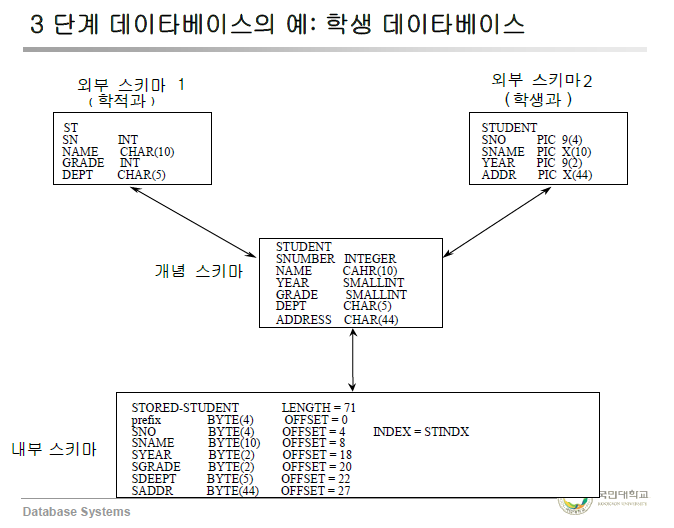

# 데이터베이스 시스템의 구성요소
## 3단계 DB
- 외부 단계, 개념 단계, 내부 단계
- 스키마 : DB의 구조와 제약조건 명세

### 외부 스키마 (External Schema)
- **개개 사용자의 DB 정의**
- 전체 DB의 한 논리적인 부분
- Subschema
### 개념 스키마 (Conceptual Schema)
- 기관 전체적인 DB 정의
- 모든 응용에 대한 **전체적인 통합된** 데이터 구조
- Schema
### 내부 스키마 (Internal Schema)
- 저장장치 관점에서 표현
- 개념 스키마의 저장구조 정의
