# SQL

## 표준

- **강제적** 사용 : 국가 표준
- 사용 권고 : 국제 표준
- 기능을 명세, 벤더별로 표준과 다른 용어 쓰기 가능
  - ANSI/ISO SQL
- 벤더별로 차이가 많음

## 특징 / 기능

- SELECT / FROM / WHERE의 블럭 매핑 이용
- SQL 2003의 새로운 기능
  - Standard Join 기능(CROSS, OUTER JOIN, FROM, JOIN)
  - subquery 기능 : Scalar subquery, top-N query
  - 리포팅 기능 : ROLLUP, CUBE, GROUPING SETS
  - 분석 기능 : WINDOW FUNCTION

## 문장의 종류

- DDL : CREATE, ALTER, DROP, RENAME
- DML : INSERT, DELETE, UPDATE, SELECT
- DCL : GRANT, REVOKE
- TCL(Transaction Control Language) : COMMIT, ROLLBACK, SAVEPOINT

## DDL

### Data Type

- 숫자
  - ANSI/ISO SQL
    - SMALLINT, INTEGER, INT, BIGINT
    - FLOAT, REAL, DOUBLE, PRECISION
    - NUMERIC(i,j), DECIMAL(i,j), DEC(i,j)
  - Oracle
    - Number(n), Number(n,m)
  - SQL Server
    - ANSI/ISO SQL과 비슷(+ TINYINT)
    - MONEY, SMALLMONEY
- 날짜
  - 모두 동일
    - DATE
    - TIME : 단위는 Oracle 1초, Server 3.33ms
    - TIMESTAMP : DATE & TIME
    - INTERVAL
- 고정 문자열
  - 모두 동일
    - CHAR(n)
    - 최소 1, 최대 Oracle 2000, SQL Server 8000 바이트
- 가변 문자열
  - ANSI/ISO : VARCHAR(n)
  - Oracle
    - VARCHAR2(n) : 최소 1, 최대 4000 바이트
    - VARCHAR 사용 X
  - SQL Server
    - VARCHAR(n) : 최소 1, 최대 8000 바이트

### MySQL DataType

#### 종류

- Number
  - Integer
    - TINYINT : 1, SMALLINT : 2, MEDIUMINT : 3, INT : 4, BIGINT : 8 바이트
  - Floating-point
    - FLOAT(n,m) : 전체 자리수 n, 소수 이하 자리수 m
    - DOUBLE
  - Fixed point
    - DECIMAL(n,m), NUMERIC(n,m)
- Character
  - CHAR(n) : 1, VARCHAR(n) : 2
  - TEXT
    - TINYTEXT : 1, TEXT : 2, MEDIUMTEXT : 3, LONGTEXT : 4 (unisigned)
  - ENUM(a,b,c) : enumeration
    - ex) continent ENUM('Asia', 'Europe', 'Africa')
  - SET (a,b,c) : 문자 집합
- Binary (String)
  - BINARY(n) : 1, VARBINARY(n) : 2
  - TINYBLOB : 1, BLOB : 2, MEDIUMBLOB : 3, LONGBLOB : 4
- Temporal
  - DATE : YYYY-MM-DD, 3 바이트
  - TIME : HH:MM:SS, 3 바이트
  - DATETIME : YYYY-MM-DD HH:MM:SS, 8 바이트
  - TIMESTAMP, 4 바이트
  - YEAR : YY or YYYY, 1 바이트
- 고정 문자열과 가변 문자열의 차이
  - VARCHAR는 실제 데이터 크기만 저장
    - CHAR보다 적은 공간 차지
  - 비교방법
    - CHAR : 짧은쪽의 끝에 공백을 채워서 같은 길이를 만든 후 비교
    - VARCHAR : 처음부터 한 문자씩 비교

#### CREATE SCHEMA

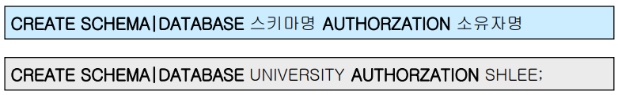

- 스키마
  - 하나의 사용자에 속하는 테이블과 기타 구성요소등의 그룹
  - 스키마 이름, 소유자 포함
- 카탈로그
  - 한 SQL 환경에서의 스키마들의 집합

#### DROP SCHEMA

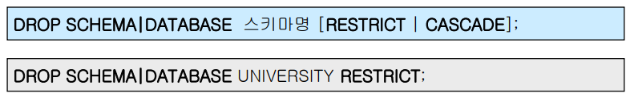

- RESTRICT
  - 다른 스키마에 FK를 통한 **참조 무결성 제약조건**을 위반하는 튜플이 하나라도 존재하면, 스키마 제거 명령이 **실행되지 않음**
- CASCADE
  - 다른 스키마에 FK를 통한 무결성 제약조건을 위반하는 튜플이 하나라도 존재하면, 그 튜플들도 **같이 제거**
- MySQL에서는 **둘다 사용 안함**

#### CREATE TABLE

- 기능 : 테이블의 구조와 제약조건을 명세
- 제약조건
  - NOT NULL
  - UNIQUE : 고유한 값을 가지며, 복수의  NULL값은 허용
    - 내부적으로 저장장치에 인덱스를 생성하라는 명령
  - PRIMARY KEY : UNIQUE + NOT NULL
  - FOREIGN KEY : 참조 무결성 옵션 선택가능
  - CHECK : 입력 가능한 컬럼값의 범위등을 제한하는 논리식 저장
- NULL 값의 표현 
  - NULL = ASCII 00
  - 공백 = ASCII 32
  - 숫자 0 = ASCII 48
- 사용 방식
  - 컬럼 제약조건 : FOREIGN KEY를 제외한 모든 제약조건
  - 테이블 제약조건 : NOT NULL를 제외한 모든 제약조건
- 제약조건의 서술위치에 따라 Syntax가 달라짐
  - 컬럼 레벨 정의 방식 : FOREIGN KEY **X**
  - 테이블 레벨 정의 방식 : NOT NULL **X**

##### INDEX

- PK, FK에 대해서는 BTREE 인덱스 자동 생성
- UNIQUE [KEY]로 선언된 칼럼에도 BTREE 인덱스 생성
- 확인 : SHOW INDEX FROM table_name
- 삭제
  - UNIQUE [KEY] 선언 : UNIQUE 제약조건 삭제
    - ALTER TABLE table_name DROP CONSTRAINT constarint_name
    - 삭제하려면 조건명 사용 -> 선언시에  **table constraint**로 정의해야 함
  - 명시적 삭제 : DROP INDEX index_name

##### 테이블 레벨 정의

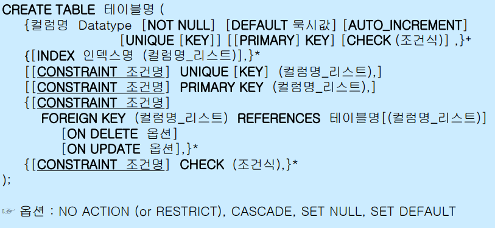

- CONSTRAINT 절 사용
  - UNIQUE, PRIMARY KEY, FOREIGN KEY, CHECK 제약조건의 명칭을 명시적으로 명세
  - 조건명을 만들어야 하는 부담 -> **CONSTRAINT 조건명**은 생략 가능
- 조건명의 namespace 
  - 표준 : 모든 타입의 제약조건 명칭이 같은  namespace에 속함
    - **모든 제약조건**이 서로의 명칭이 달라야 함
  - MySQL : **제약조건 별로** namespace 따로 존재
    - 다른 제약조건에서는 명칭이 겹칠 수 있음

- UNIQUE, PK, FK에서 컬럼이 두개 이상 나열된 경우 
  - 해당 컬럼들을 합해서 사용한다는 뜻

##### 컬럼 레벨 정의

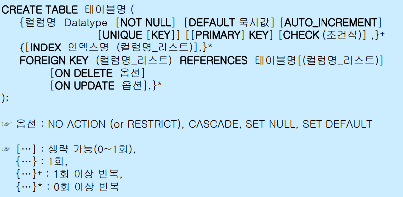

- CONSTRAINT 절을 사용하지 **않음**

  - FK는 사용/정의

- NOT NULL 제약조건의 best practice

  - NULL 값은 질의를 복잡하게 만듬
  - 가능하면 NOT NULL 선언, NULL이 필요한 곳에는 디폴트 값 선언

  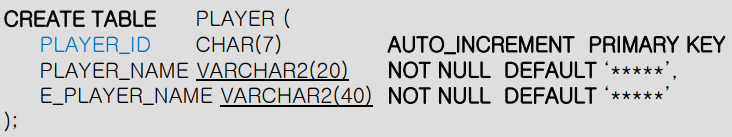

##### 기본키 제약조건

- 데이터베이스의 **개체 무결성**을 유지하는 장치
  - UNIQUE + NOT NULL
- 테이블은 단 하나의 PK를 가짐(한개 이상의 애트리뷰트로 구성)
- 기본 동작
  - Insert / Update 문에서 이 조건에 위반되는 PK값이 시도되면 DBMS가 이를 거부
- 따로 선언되지 않으면, 애트리뷰트 중 UNIQUE + NOT NULL인 첫번째 애트리뷰트가 PK로 선언됨

##### 외래키 제약조건

- 데이터베이스의 **참조 무결성**을 유지하는 장치
  
- 자식 테이블의 FK값은 부모 테이블의 PK값 중 하나이거나 NULL
  
- 테이블은 여러개의 FK를 가질 수 있음(한개 이상의 애트리뷰트로 구성)

- 기본 동작

  - Insert / Update 문에서 존재하지 않는 FK값이 **자식 테이블에서 시도**되면 DBMS가 거부

  - Delete / Update 문에서 **부모 테이블**의 PK값이 삭제 된 경우

    - DBMS가 FK값들을 변경(**SET NULL** / **SET DEFAULT**)

      - SET NULL 사용시 해당 FK가 NOT NULL이면 안됨

    - 자식 테이블의 해당 레코드들을 삭제(**CASCADE**)

      - 삭제의 경우 얼마나 많이 삭제될지 모름(삭제가 삭제를 부르는 상황, UPDATE는 괜찮음)

      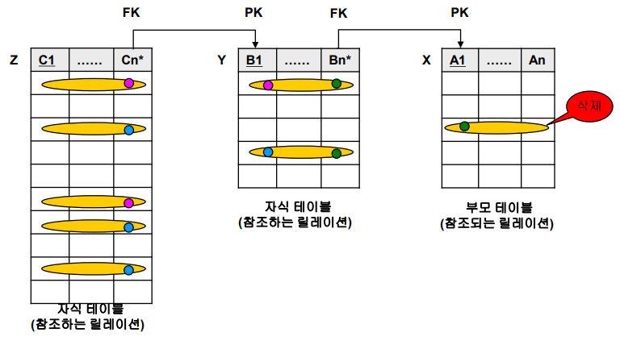

      - 하나라도 거부되면 전체 DELETE가 거부됨

      - 서로 상호참조하는 경우에는 서로 같은 제약이 선언되어야 함

        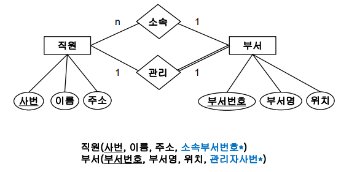

    - DBMS가 명령의 실행을 거부(**NO** **ACTION** / **RESTRICT**) : 디폴트 옵션

    - ON DELETE / ON UPDATE [**referential_options**] 절 이용

    - 옵션 사용 예시(ON DELETE / ON UPDATE)

      - RESTRICT / RESTRICT : 디폴트 조합
      - RESTRICT / CASCADE : 가장 안전한 조합(삭제 거부 / 무결성 유지)
      - SET NULL / CASCADE : 타협안(실행 거부 X)
      - CASCADE / CASCADE : 가장 완벽한 조합

  - MySQL의 foreign_key_chekcs 시스템 변수

    - FK 제약조건의 체크 기능을 중지 할 수 있음(0일때 중지, 1일때 실행)
    - 외부데이터를 import할 때 유용

##### Check 제약조건

- 테이블은 여러개의 Check 제약조건을 가질 수 있음
- 종류
  - Column Constraint : 하나의 애트리뷰트에만 적용되는 조건
  - Table Constraint : 여러 애트리뷰트에 적용되는 조건
    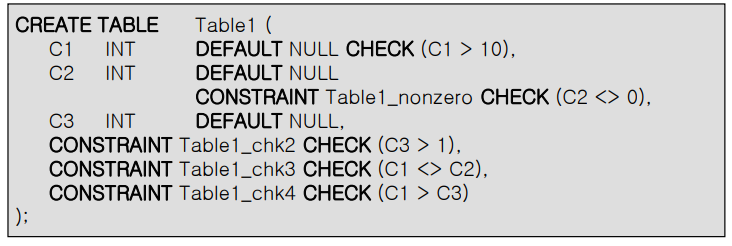

##### SELECT문을 이용한 테이블 생성

- Oracle / MySQL
  - CTAS : CREATE TABLE 테이블명 AS SELECT 문
  - 기존 제약조건 중 NOT NULL만 새로운 복제 테이블에 적용, 기본키/고유키/외래키/CHECK의 제약조건은 없어짐
    
- SQL Server
  

#### DROP TABLE

- 테이블 정의와 테이블 데이터를 모두 삭제
- Syntax : DROP TABLE 테이블명 [RESTRICT | CASCADE]
  - RESTRICT : FK를 통해, 해당 테이블의 튜플을 참조하는 자식 테이블의 튜플이 하나라도 존재하면 DBMS가 명령 **실행 거부**(기본값)
  - CASCADE : FK를 통해, 해당 테이블의 튜플을 잠조하는 자식 테이블의 튜플이 하나라도 존재하면 DBMS가자식 테이블에서 **해당 튜플들도 제거**
- MySQL에서는 아무 역할 안함(다른 DBMS에서의 포팅을 위해서만 사용)

#### ALTER TABLE

- 컬럼의 추가 / 삭제 / 수정
- 제약조건의 추가 / 삭제
- Syntax
  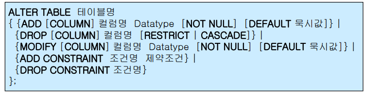

##### ADD

- Syntax
  - ALTER TABLE 테이블명
    ADD 컬럼명 Datatype
- Oracle 
  
- SQL Server
  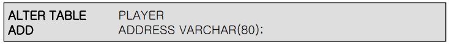

##### DROP COLUMN

- Syntax
  - ALTER TABLE 테이블명
    DROP COLUMN 컬렴명 [RESTRICT | CASCADE]
- Oracle / SQL Server
  
- MySQL : RESTRICT | CASCADE 사용 X

##### MODIFY

- 주의사항
  - 해당 컬럼의 크기를 늘릴 수는 있지만, 줄이지는 못함(기존의 데이터 훼손 방지)
  - 해당 컬럼이 NULL 값만 가지고 있거나 테이블에 아무 행도 없으면 **컬럼의 폭을 줄일 수 있음**
  - 해당 컬럼이 NULL 값만 가지고 있으면 **데이터 유형을 변경**할 수 있음
  - 해당 컬럼의 DEFAULT 값을 바꾸면 **변경 작업 이후** 발생하는 행 삽입에만 영향
  - 해당 컬럼에 NULL 값이 없을 경우에만 NOT NULL 제약조건 추가 가능

- Oracle
  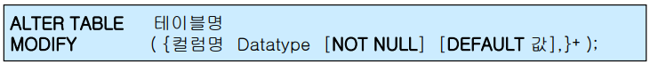
- SQL Server
  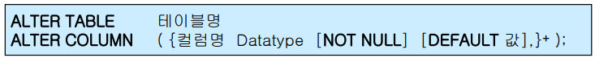

##### RENAME COLUMN

- Oracle 등 일부 DBMS에서만 제공(컬럼의 이름을 바꾸면 **프로그램에도 영향**)
  
- SQL Server : 저장 프로시져 sp_rename 제공
  

##### ADD CONSTRAINT

- Syntax
  

##### DROP CONSTRAINT

- Syntax
  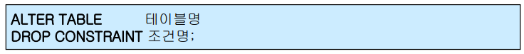

##### RENAME TABLE

- Oracle, MySQL 등 일부 DBMS에서만 제공
  
- SQL Server : 저장 프로시져 sp_rename 제공
  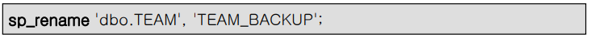

##### TRUNCATE TABLE

- **테이블 관련 삭제 연산**
  - DROP TABLE 테이블명(DDL)
    - 테이블 정의 + 데이터 모두 삭제
    - 로그를 남기지 않음(시스템에 부하가 적음)
    - 복구 불가
  - TRUNCATE TABLE 테이블명(DDL)
    - 테이블 구조는 유지, 데이터만 삭제
    - 로그를 남기지 않음(시스템에 부하가 적음)
    - 복구 불가
  - DELETE FROM 테이블명(DML)
    - 테이블 구조는 유지, 데이터만 삭제
    - 로그를 남김(시스템에 부하)
    - **Rollback을 통한 복구 가능**

- DROP TABLE, TRUNCATE TABLE은 데이터를 메모리에 로딩하지 않고 하드디스크에서 그대로 실행
  - 로그가 남지 않아 복구가 불가능함

#### 테이블의 정의 확인

- DESCRIBE 테이블명
- SHOW CREATE TABLE 테이블명
- SHOW INDEX FROM 테이블명

#### INFORMATION_SCHEMA

- MySQL내의 모든 스키마의 내용을 정리한 스키마
  - SCHEMATA, TABLES, COLUMNS, KEY_COLUM_USAGE, REFERENCE_CONSTRAINTS등 41개 테이블
- DML의 query문으로 내용 검색 가능