# DML

## DATA UPDATE

### INSERT

- Syntax 1
  
  - 컬럼명과 컬럼값은 순서대로 1:1 매핑
  - 컬럼값의 표현
    - 컬럼의 데이터유형이 문자 : ''으로 값을 표현
    - 컬럼의 데이터유형이 숫자 : ''를 **사용안함**

- Syntax 2
  
  

### DELETE 

- Syntax
  
  - WHERE절이 없으면 전체 테이블 데이터 삭제
- 전체 테이블을 삭제하는 경우, 시스템 부하가 적은 **TRUNCATE TABLE** 권장
- DDL과 DML의 차이
  - DDL : 하드디스크에서 테이블에 직접 적용, 즉시 완료
  - DML : 테이블을 메모리 버퍼에 올려놓고 작업, 실시간 영향 X, COMMIT 명령어로 트랜잭션 종료해야 반영
  - SQL Server에서는 DML도 즉시완료, COMMIT 필요없음

### UPDATE

- Syntax
  
  

## QUERY

### SELECT

- Syntax
  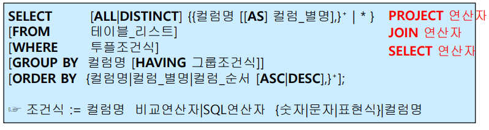
  - From 절은 일부 벤더(MySQL, SQL Server)의 경우 생략 가능
- 실행순서
  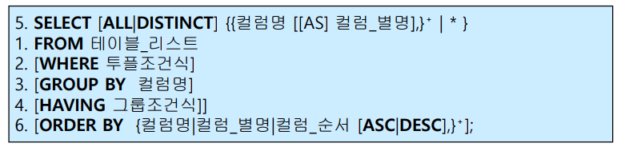
  - FROM : 실행 대상 테이블 참조
  - WHERE : 조건에 맞는 튜플만 선택
  - GROUP BY : 정해진 컬럼의 값에 따라 그룹화
  - HAVING : 각 그룹별로 그룹 조건에 맞는 튜플만 다시 선택
  - SELECT : 선택된 튜플에서 기술된 컬럼 / 표현식만 출력 / 계산 한다
  - ORDER BY : 튜플을 정렬
  - Query Optimizer가 SQL 문장의 에러를 점검하는 순서와 동일

#### SELECT 절

- SELECT ALL이 디폴트 값
- DISTINCT : 중복값은 하나만 출력
- 와일드카드 문자(* 등) 사용가능
- AS(Alias)는 컬럼에 별명을 부여할 때 사용, 조건에는 사용할 수 없음 (오직 출력용)
  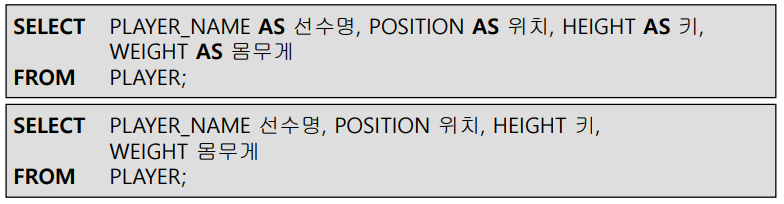
  - 컬럼 별명에 공백을 넣을려면 작은 따옴표로 감싸줘야 함
- 산술연산자 사용가능
  
- 합성연산자 : 컬럼과 컬럼 / 문자열을 연결해 새로운 컬럼 생성
  - Oracle : || 또는 CONCAT(String1, String2)
  - SQL Server : + 또는 CONCAT(String1, String2)
  - MySQL : ' '(Space) 또는 CONCAT(String1, String2, ..., StringN)
    - 스트링은 공백으로 연결할 수 있지만 컬럼명은 안됨

#### WHERE 절

- FTS(Full Table Scan) : WHERE 절이 없는 SELECT 문

  - 시스템에 매우 큰 부담이 되고, SQL 튜닝의 1차적 검토 대상이 됨

- 역할

  - 전체 튜플들에서 조건에 맞는 튜플들만 선택
  - 집단함수는 올 수 없음

- 일반형식
  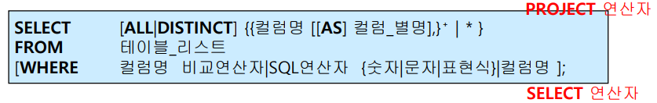

- 종류
  

  - 비교연산자, SQL 연산자가 논리 연산자보다 우선 처리
  - [NOT] IN (list)

  

  

  - [NOT] LIKE

    - =의 의미
    - 와일드카드 사용가능
      - % : 0개 문자 이상의 임의의 문자열
      - _ : 1개의 단일 문자

    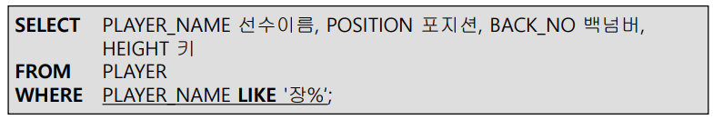

    - 장으로 시작하는 NAME을 가진 튜플들

  - BETWEEN a AND b : 범위 설정

  - IS [NOT] NULL

    - NULL(ASCII 00)
      - 값이 존재하지 않음을 표현
      - 어떤 값과도 비교 불가능(크다 / 작다 판별 불가능, 비교자체가 불가능)
    - **NULL의 특징**
      - NULL값과의 수치연산은 NULL값 리턴
      - NULL값과의 비교연산은 FALSE값 리턴
      - NULL값과의 비교연산은 IS NULL, IS NOT NULL이라는 문구를 사용해야 제대로 된 결과를 얻음

    

  - 논리 연산자

    - (), NOT, AND, OR 순으로 처리

#### Pseudo Column

- Oracle - ROWNUM

  - SQL 처리 결과 각 행에 대해 임시로 부여되는 일련번호
  - 결과 집합으로 출력되는 **행의 개수를 제한**할 때 주로 사용

  

- SQL Server - TOP

  - 결과 집합으로 출력되는 **행의 개수를 제한**

  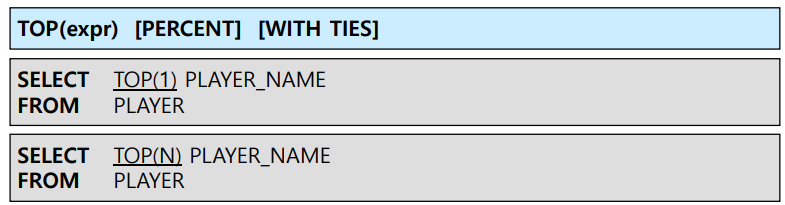

- MySQL - LIMIT

  - 결과 집합으로 출력되는 **행의 개수를 제한**

  

#### SQL 단일형 내장 함수

- Built-in function(내장 함수)

  - 데이터 값을 간편하게 조작하고, SQL을 더욱 강력하게
  - 벤더별로 가장 큰 차이를 보임, 핵심적인 기능은 이름/표기법이 달라도 공통적으로 제공

- 종류

  - 단일행 함수 : 함수의 입력이 단일 행 / 문자형, 숫자형, 날짜형, 변화형, NULL 관련 함수
    - SELECT / WHERE / ORDER BY 절에 사용 가능
    - 각 행들에 대해 개별적으로 작용해 데이터 값 조작, 각각의 행에 대한 조작결과 리턴
    - 여러 인자를 입력해도 **단 하나의 결과**만 리턴
    - 함수의 인자로 상수, 변수, 표현식이 사용가능, 여러개의 인수를 가질 수 있음
    - 특별한 경우가 아니면 함수의 인자로 함수를 사용할 수 있음

  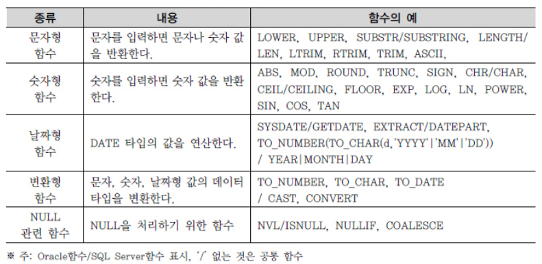

  - 다중행 함수 : 입력이 여러 행, 하나의 결과만 리턴
    - 집단 함수 : COUNT, SUM, AVG, MIN, MAX, STDDEV
    - 그룹 함수 : ROLLUP, CUBE, GROUPING SETS
    - 윈도우 함수 : 다양한 분석 가능

- Syntax
  

##### 문자형 함수

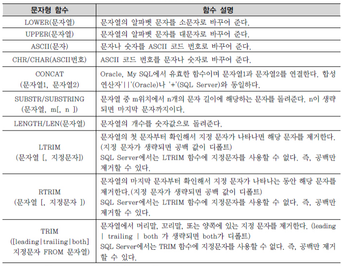

- Oracle - DUAL 테이블
  - 사용자 SYS가 소유하며, 모든 사용자가 액세스 가능한 테이블
  - SELECT ~ FROM ~의 형식을 갖추기 위한 일종의 **더미 테이블**
  - DUMMY라는 VARCHAR2(1) 유형의 칼럼에 'X'라는 값이 들어 있는 행을 1건 포함

- SQL Server, MySQL은 SELECT절 만으로도 문장이 가능하므로 더미 테이블이 필요없음

##### 숫자형 함수

- MySQL에서는 TRUNC 대신 TRUNCATE

##### 날짜형 함수(MySQL)

- 내부적으로 숫자 형식으로 변환하여 저장
  - 공간 절약, 산술 연산이 가능
  - 출려기에는 년 / 월 / 일 / 시 / 분 / 초단위로 추출하여 변환해야 함
- DBMS마다 날짜형 함수의 기능적 차이가 **매우 심함**
- SYSDATE(), NOW()
  - 공통점
    - 컨텍스트가 스트링일 경우 : 'YYYY-MM-DD HH:MM:SS' 포맷
    - 컨텍스트가 숫자일 경우 : YYYYMMDDHHDDSS.uuuuuu 포맷
  - 차이점
    - SYSDATE() : 현재 시간
    - NOW() : 명령어가 실행된 시간
      - DATETIME, TIMESTAMP 컬럼의 **디폴트 값**을 정의하는데 사용
        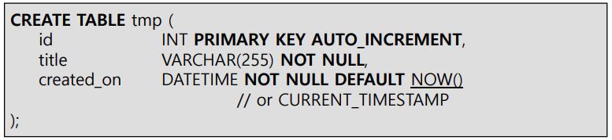
      - CURRENT_TIMESTAMP() / CURRENT_TIMESTAMP와 동의어

- TIMESTAMP(), DATE(), TIME()
  

- EXTRACT()
  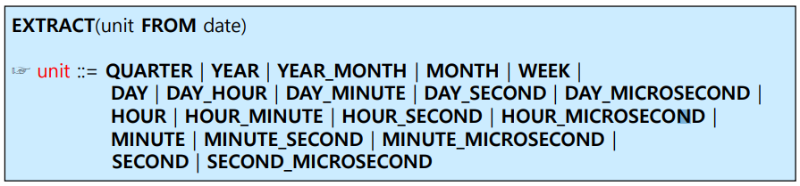

- DATEDIFF(t1, t2)

  - t1 - t2
  - 두 개의 DATE, DATETIME, TIMESTAMP **값의 차이**를 계산
  - 두 인자의 **타입이** **다르면**, NULL 값을 리턴
  - DATETIME, TIMESTAMP 값의 경우 **시간 부분은 무시**(**날짜만** 처리)

  

- TIMEDIFF(t1, t2)

  - t1 - t2
  - 두개의 TIME, DATETIME 값의 차이를 계산
  - 범위 : -838:59:59 ~ 838:59:59 (TIME은 3바이트)
    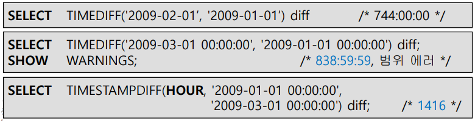

- TIMESTAMPDIFF(unit, begin, end)
  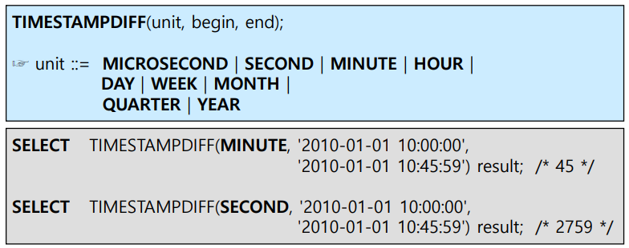

  - end - begin값을 계산
  - 앞의 두 함수와 다르게 뒤의 시간에서 앞의 시간을 뺌

- 나이계산
  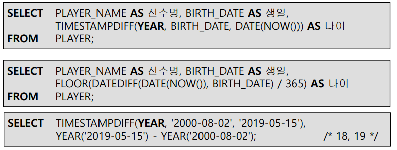

  - TIMESTAMPDIFF의 unit으로 YEAR를 지정한 뒤 계산 하면, 정확히 달,일을 지나야 숫자가 올라감

- DATE_ADD() 및 DATE_SUB()

  - DATE / DATETIME 값에 interval을 더하거나 뺌
    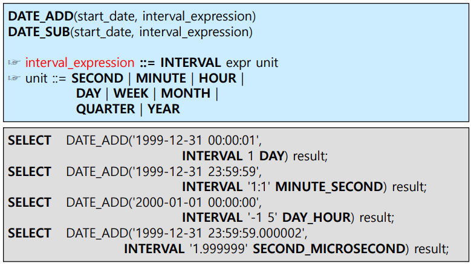
  - DATE에 HOUR / MINUTE등을 더하면 DATETIME으로 자동변환됨

- TIME_ADD() 및 TIME_SUB()

  - DATE_ADD / SUB 와 개념적으로 동일

  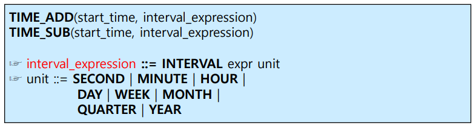

- DATE_FORMAT()
  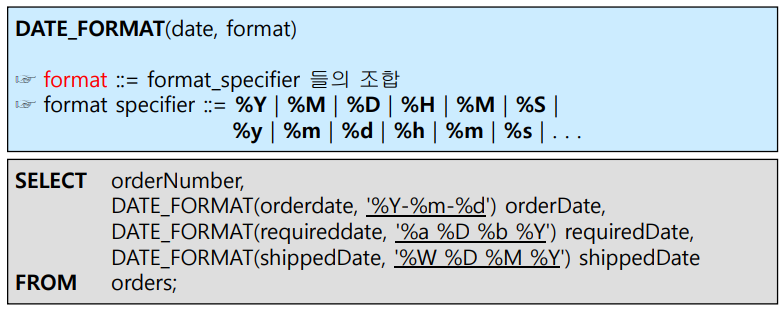

- GET_FORMAT()
  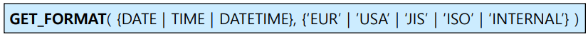
  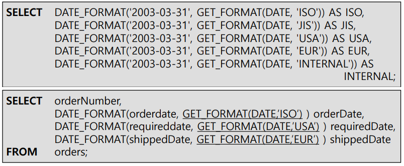

- STR_TO_DATE()
  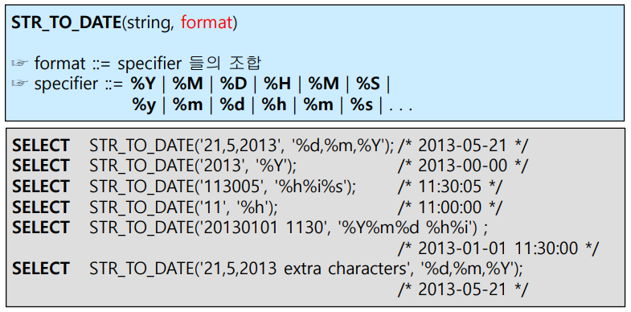

  - 스트링 타입을 데이트로 변환

##### 변환형 함수

- CAST()
  - 데이터를 다른 데이터 타입으로 변환
    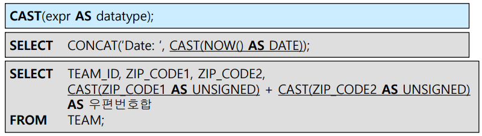
- CONVERT()
  - 데이터를 다른 캐릭터 셋으로 변환
    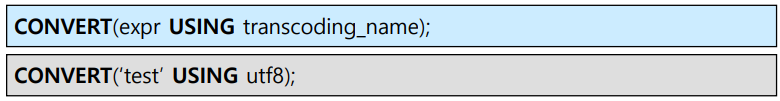

##### CASE Expression

- IF-THEN-ELSE 논리와 유사, SQL의 비교 연산기능을 보완하는 역할
- 중첩가능

- Simple Case Expression
  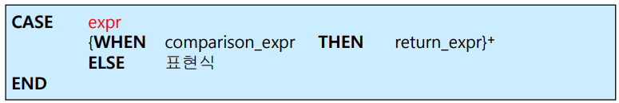
  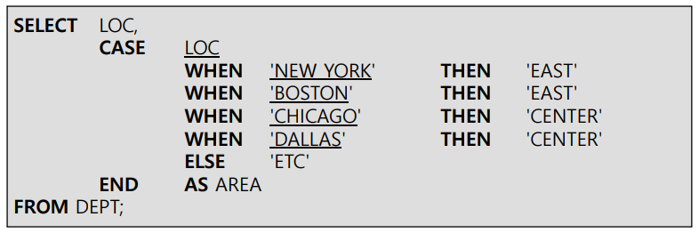
- Searched Case Expression
  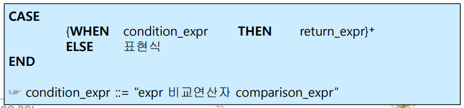
  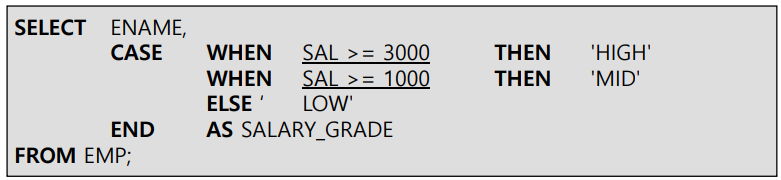

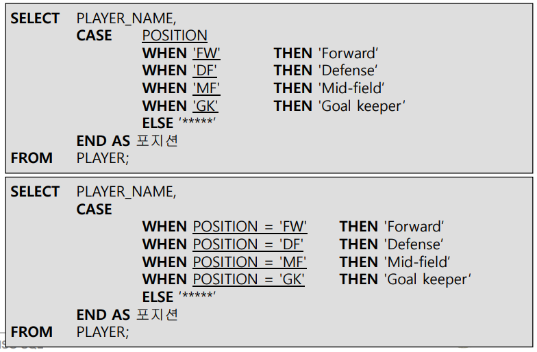

- CASE에서 ELSE절을 생략하면 DEFAULT값은 NULL이 됨

- 중첩된 CASE Expression
  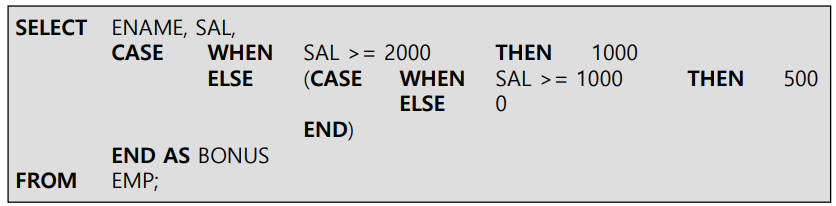

- 오라클에서는 DECODE() 함수로 표현
  

##### NULL 관련 함수 : Standard 함수

- NULL 값의 특징
  - 테이블을 생성할 때 NOT NULL / PRIMARY KEY로 정의되지 않은 모든 데이터 유형은 널 값을 포함할 수 있다
  - 널 값을 포함하는 연산은 그 결과값도 널값이다
- NULL값의 처리방법
  - 테이블 출력시, NULL값은 다른 값으로 대체하는 것이 보기 편함
    - 숫자유형 : 0
    - 문자유형 : blank보다는 \****같이 해당 시스템에서 의미 없는 문자로
  - COALESCE(e1,e2,...)함수 사용
    - 오라클의 NVL(e1, e2) 함수
    - SQL Server의 ISNULL(e1,e2) 함수
    - MySQL의 IFNULL(e1,e2) 함수
      - MySQL의 ISNULL(expr)함수는 비교연산자 IS NULL을 구현한 것(NULL이면 0, 아니면 1 리턴)
    - **이식성을 위해 위의 비표준 함수들은 사용을 자제** 
      - expr1이 NULL이 아니면 expr1, NULL이면 e2를 출력(일반적으로 NULL이 아닌값 지정)

##### COALESCE

- 임의 개수의 expr에서 널이 아닌 **최초의 expr**을 리턴, 모든 expr이 널이면 **널**을 리턴

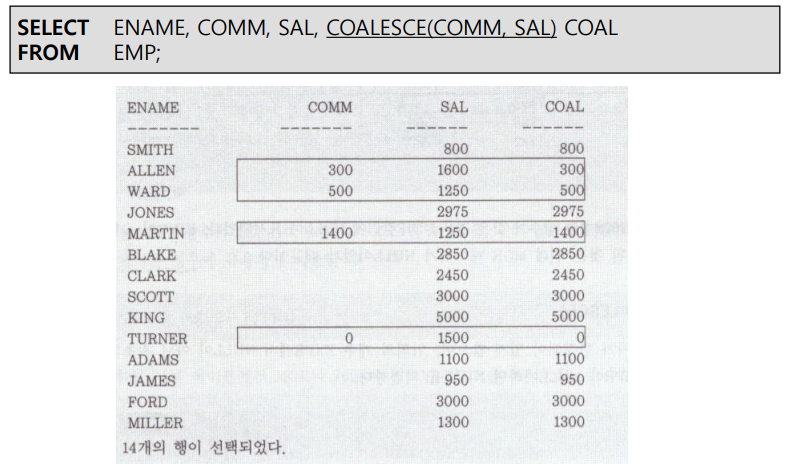

- n개의 중첩된 CASE 문장으로 표현 가능함

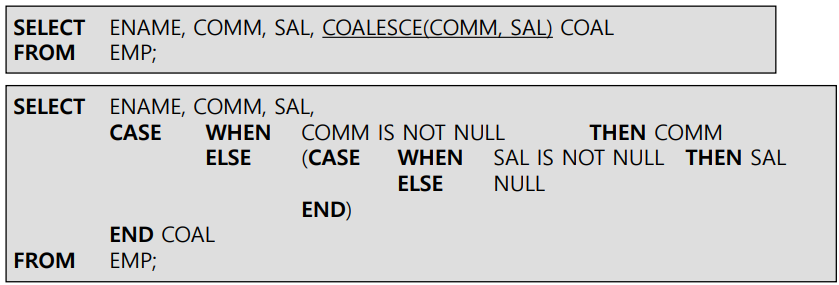

##### NULLIF

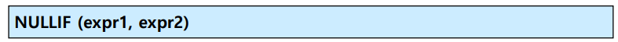

- expr1 = expr2면 NULL, 아니면 expr1을 리턴

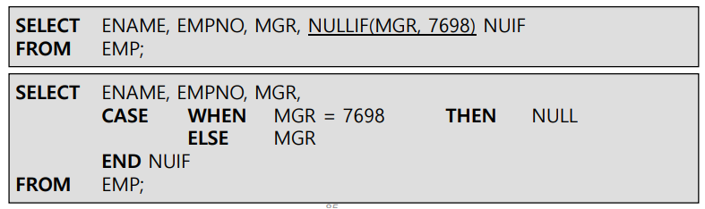

