# DML & Relational Algebra, CTE

## Relational Algebra Operators

### 일반 집합 연산자

- E.F. Codd의 일반 집합 연산자

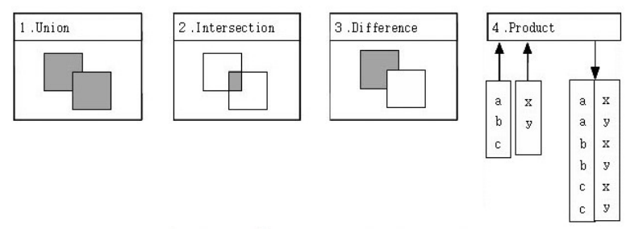

- ANSI/ISO SQL에서의 구현
  - UNION : UNION / UNION ALL
  - INTERSECTION : INTERSECTION
  - DIFFERENCE : EXCEPT (Oracle = MINUS) 
  - CARTESIAN PRODUCT : CROSS JOIN
    - SELECT 문의 FROM 절의 CROSS JOIN

### 순수 관계 연산자

- E.F. Codd의 순수 관계 연산자
  
- ANSI/ISO SQL에서의 구현
  - SELECT : SELECT 문의 WHERE 절
  - PROJECT : SELECT 문의 SELECT 절
  - JOIN
    - SELECT 문의 FROM 절의 다양한 JOIN 기능(INNER, NATURAL, OUTER, CROSS)
    - SELECT 문의 WHERE 절의 INNER JOIN 조건으로 구현
  - DIVIDE : 제공하지 않음

## 집합 연산자

- 목적 : 여러 개의 질의를 **하나로 결합**
  - 서로 다른 테이블에서 얻은 유사한 형태의 결과를 하나로 합칠 때
  - 동일 테이블에서 서로 다른 질의를 수행하여 결과를 만들 때
  - 튜닝 관점에서 실행계획을 분리하고자 하는 목적
- Union compatible 제약 조건 : ∪, ∩
  - SELECT 절의 칼럼 수가 동일
  - SELECT 절의 동일 위치에 존재하는 칼럼의 데이터 타입이 상호호환 가능(꼭 동일한 데이터 타입은 X)
- 종류
  - UNION : 중복된 튜플은 제거
  - UNION ALL : 중복된 튜플도 포함
  - INTERSECT
  - EXCEPT

- Syntax
  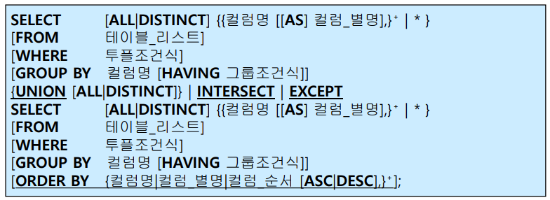
  - ORDER BY는 집합 연산을 적용한 최종 결과에 대한 정렬 처리, 따라서 **마지막 줄에 한번만 기술**

### 예제

- 예제 1 

  - 삼성 블루윙즈팀 선수들과 전남 드래곤즈팀 선수들에 대한 내용을 모두 검색하라
    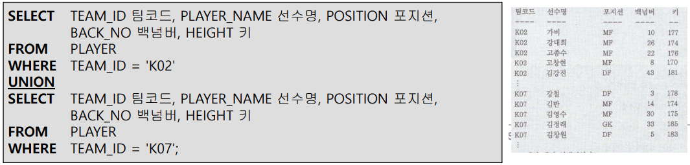
  - IN 또는 OR 연산자로 변환 가능하지만, 출력순서가 다름
    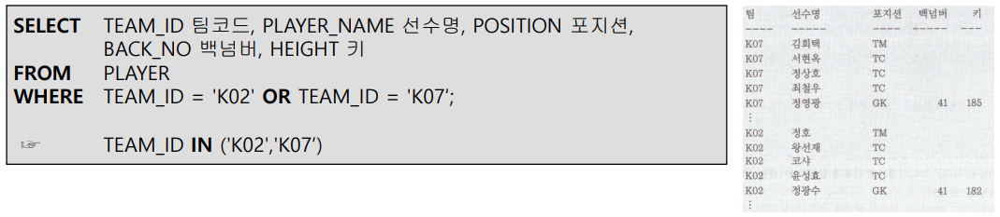

- 예제 2

  - 소속시 삼성블루윙즈팀인 선수들과 포지션이 골키퍼(GK)인 선수들을 모두 검색
    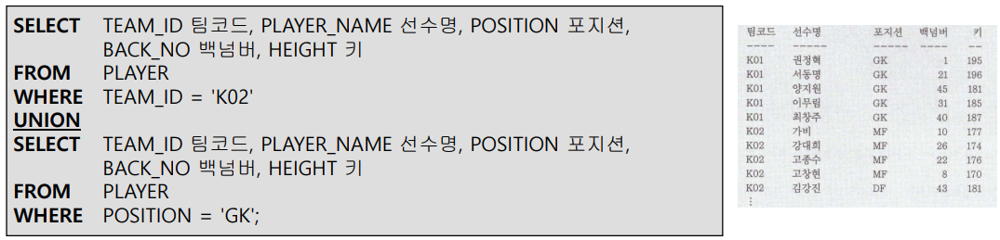
  - 중복포함 검색
    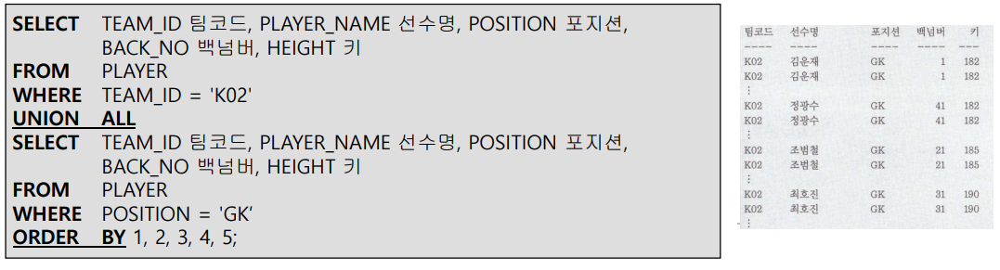

- 예제 3 : 집합 연산자에서 GROUP 절의 사용

  - 선수들의 포지션별 평균키와 팀별 평균키를 검색
    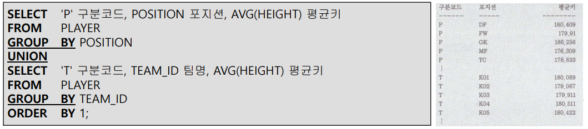
    - 집합 연산자의 결과를 표시할 때, HEADING 부분은 첫 번째 SQL문에서 사용된 HEADING이 사용됨

- 예제 4 : MINUS(Oracle)

  - 소속이 삼성블루윙즈팀이면서 미드필더가 아닌 선수들을 검색
    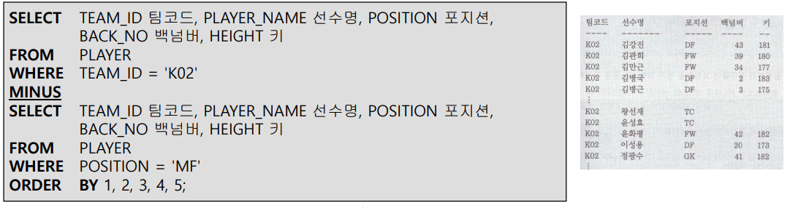

- 예제 5 : INTERSECT

  - 소속이 삼성블루윙즈팀이면서 포지션이 골키퍼인 선수들을 검색
    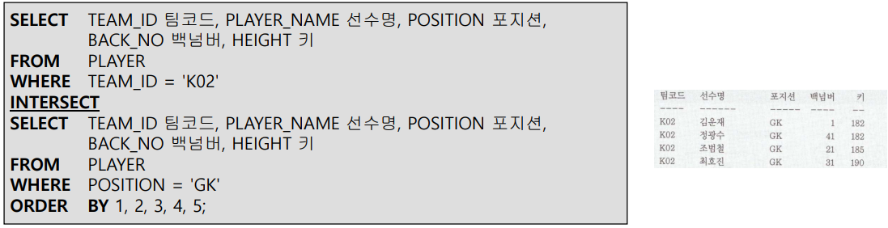

    - MySQL에서는 INTERSECT 연산 지원안함

    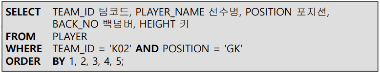

## 순수관계 연산자 JOIN, CARTESIAN PRODUCT

### JOIN 연산

- 성립조건 : 조인할 두 테이블에 공통의 **조인 속성**이 있어야 함
  - 일반적인 경우 PK / FK값의 연관에 의해 조인이 성립
  - 특별한 경우 PK-FK 관계가 없어도 논리적인 값들의 연관만으로 조인이 성립 가능
- 순서
  - **A** JOIN **B** JOIN **C** JOIN **D**의 실행 계획 : 괄호의 위치에 따라 결과가 달라짐
  - Query Optimzer에 의해서 결정
  - 튜닝의 중요 이슈
- 조인 조건 : 대부분 Equi-Join
  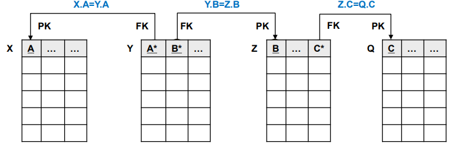

### ANSI/ISO SQL에서 JOIN 연산 표현 방법

- Syntax
  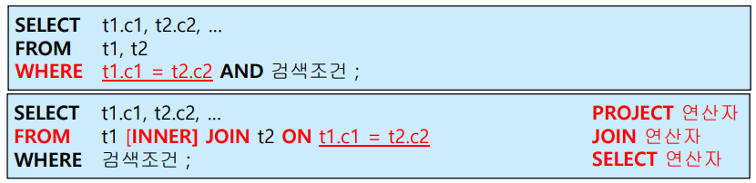
- 예제
  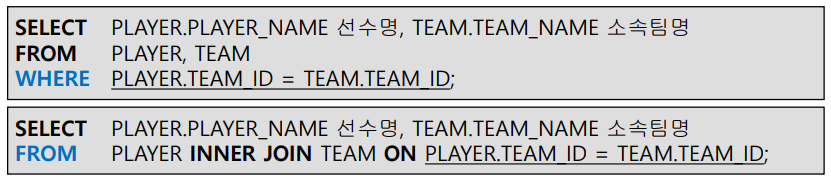

#### SELECT 문의 WHERE 절에서 조인 조건 표현 (IBM-SEQUEL 방식)

- WHERE 절에 검색조건과 조인조건이 혼재된 형태
- INNER JOIN 연산만 제공
- 조인 조건의 표현
  - WHERE 절에서 비교 연산자를 사용해서 표현
- 종류
  - 등가조인(Equi-Join) 연산
    - 대부분 PK <-> FK 관계를 기반으로 함, 반드시 그런건 아님
    - "=" 연산자 이용
  - 비등가 조인(non equi-join) 연산
    - 두 개의 테이블 간에 칼럼 값들이 서로 **정확하게 일치하지 않는 경우**에 사용
    - Between, >, >=, <, <= 등 다른 비교 연산자들 사용
- 예제
  - 선수들의 이름, 백넘버, 소속 팀명 및 연고지를 검색
    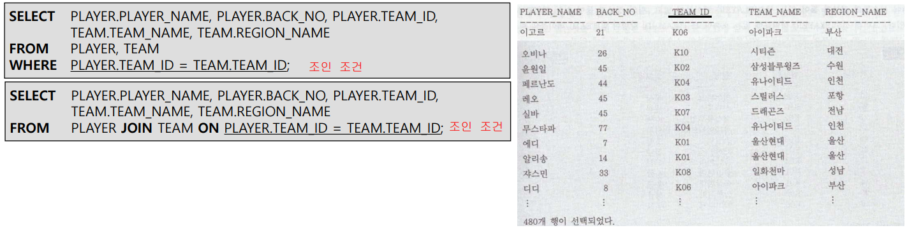
  - 테이블 별명(Table Alias)의 사용
    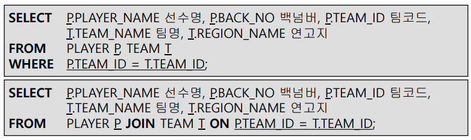
    - FROM 절에서 테이블 별명을 사용한 경우 SELECT/WHERE 절에서 **반드시 테이블 별명을 사용**해야 함
  - 포지션이 GK인 선수들의 이름, 백넘버, 소속 팀명 및 연고지를 검색하라(백넘버의 오름차순으로 출력)
    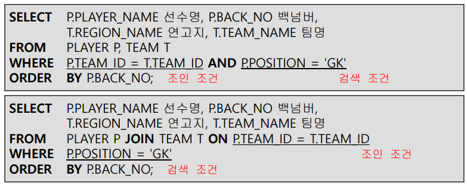
  - 팀정보와 그 팀의 전용구장 정보를 같이 출력
    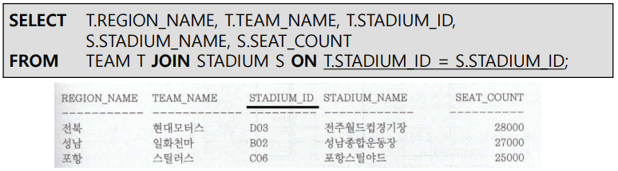
  - 세 개 이상의 다중 테이블 조인
    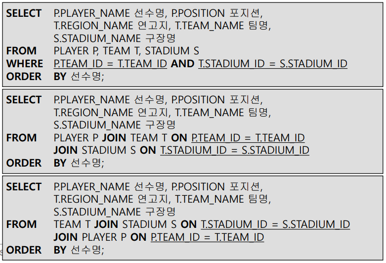
- NON equi-join 연산
  

#### SELECT 문의 FROM 절에서 조인 조건 혹은 조인 속성 표현 (ANSI/ISO SQL 방식)

- FROM 절에는 조인조건 / 조인속성, WHERE 절에는 검색조건을 기술
- 검색조건과 조인조건을 명시적으로 분리
- 다소 복잡하게 보이지만, 가장 많이 사용됨
- 종류
  - (INNER) JOIN : WHERE 절의 조인조건과 동일, 디폴트 옵션

    - ON JOIN : ON 조인\_조건_절
    - USING JOIN : USING (조인\_속성\_리스트_절)

  - NATURAL JOIN : NATURAL INNER JOIN, Equi-Join 연산을 의미

  - LEFT/RIGHT/FULL (OUTER) JOIN

    - ON JOIN : 조인 컬럼명이 다를 때

    - USING JOIN : 조인 컬렴명이 같을 때 (Natural Join과 똑같음, SQL Server 지원 X)

  - CROSS JOIN

##### INNER JOIN 기능

- INNER JOIN과 ON 조인 조건절을 함께 사용
  - 조인조건(**ON 조건절**)과 검색조건(**WHERE 조건절**)을 분리하여 이해가 쉬움
  - **칼럼명이 다르더라도 조인 조건을 사용**할 수 있는 장점
  - 조인 컬럼에 대해, 반드시 테이블명 혹은 테이블의 Alias를 사용하여 SELECT에 사용되는 칼럼의 소속을 명확하게 지정해줘야 함
  - 괄호는 선택
- INNER JOIN과 USING 조인 속성 리스트절을 함께 사용
  - 두 테이블에서 **같은 이름을 가진 칼럼들** 중에서 **원하는 칼럼**에 대해서만 선택적으로 equi-join 수행
  - 조인 컬럼에 대해서 alias나 테이블명과 같은 **접두사를 사용하면 문법에러** 발생
  - 괄호는 **필수**
  - SQL Server에서는 지원하지 않음
- 예제
  - 조인 컬럼의 명칭이 같을 때
    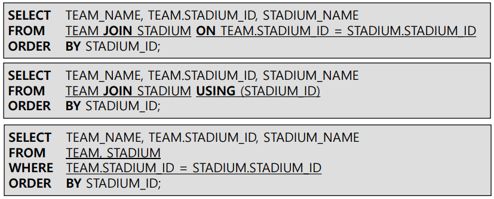
  - 조인 컬럼의 명칭이 다를 때 
    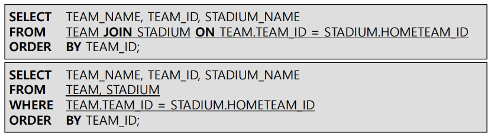

###### ON JOIN과 USING JOIN의 차이

- ON JOIN 
  - 조인 조건절(R.A = S.B)에 사용된 두개의 조인 속성 A와 B가 모두 결과에 나타남
  - 조인 결과에 속성이 나타는 순서 : 첫째로 R의 모든 속성, 다음으로 S의 모든 속성(A,B 모두 포함)
  
- USING JOIN
  - NATURAL JOIN과 같음
  - 이름이 같은 조인 속성 두개중 하나만 나타남
  - 합쳐진 조인 속성의 값은 함수(COALESCE(R.A,S.A))값
    - INNER : R.A = S.A 이므로 A의 값
    - OUTER
      - R.A = S.A : R.A=S.A
      - R.A = NULL : S.A
      - S.A = NULL : R.A
      - R.A = NULL & S.A = NULL : NULL
  - 속성이 나타나는 순서 : 합쳐진 조인 속성 -> R의 나머지 속성 -> S의 나머지 속성

- 예제

  - Inner Join, ON 조인 조건절
    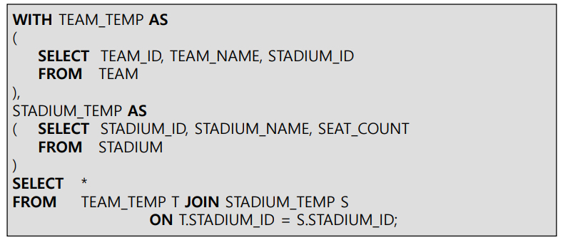

    - USING 조인 속성 리스트절
      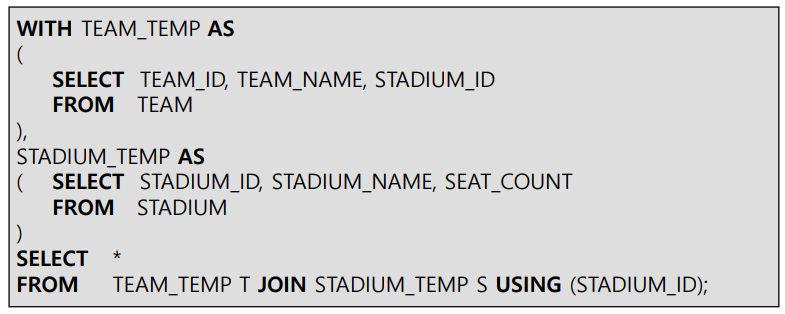

  - Outer Join에서 합쳐진 속성의 값 = COALSCE() 함수 값
    

  - USING JOIN 조건 절

    - DEPT_TEMP 테이블 생성
      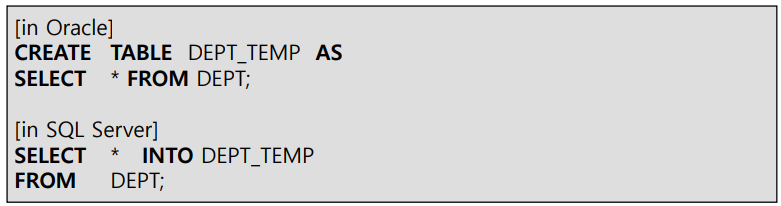

    - 2개 튜플의 값 수정
      

    - DEPT_TEMP 테이블의 수정된 튜플 확인
      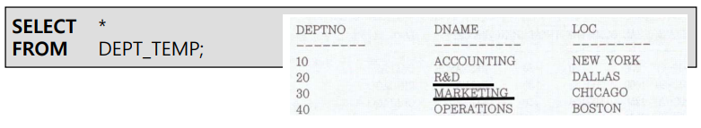

      - DEPT와 DEPT_TEMP의 컬럼 이름이 모두 같지만, 20번/30번 튜플의 내용이 일치하지 않음

    - 두 테이블을 USING절을 이용해 INNER JOIN
      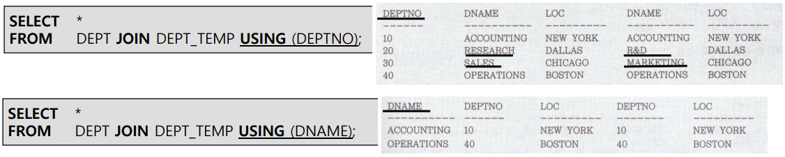

      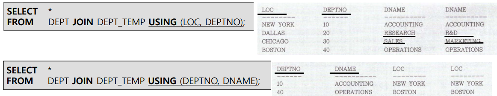

  - 다중 테이블 조인 : 사원과 DEPT 테이블의 소속 부서명, DEPT_TEMP 테이블의 바뀐 부서명 정보 출력
    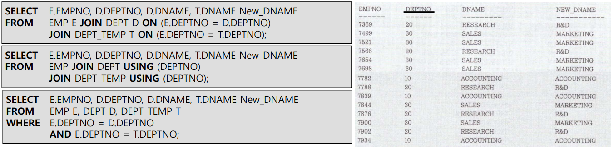
    
  - 다중 테이블 조인 2 : GK 포지션의 선수마다 연고지명, 팀명, 구장명 출력
    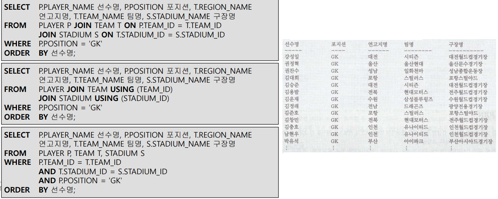
    
    - 관계대수로 표현해보기
  - 속성 이름이 같으면 USING으로 쓰는게 보기 편함
    - 마지막은 좋은 표현이라고 볼 수 없음
    
  - 다중 테이블 조인 3
    
    
    - **라이브코딩에 나오는 것**
      - 경기, 팀 테이블을 JOIN하려면 HOME/AWAY TEAM 관계 때문에 2번 해야됨

##### NATURAL JOIN 기능

- 두 테이블 간 동일한 이름(같은 데이터 유형)을 갖는 "모든" 컬럼들에 대해 equi-join 수행

- NATURL JOIN이 명시되면 추가로 USING 조건절, ON 조건절, WHERE 조건절에서 조인 조건 **정의 불가능**

- SQL Server에서는 지원하지 않는 기능

- 예제

  
  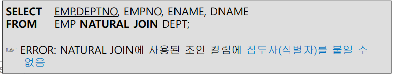

  - 별도의 칼럼순서를 지정하지 않으면, NATURAL JOIN의 조인 컬럼들이 먼저 출력, 같은 이름의 칼럼은 **하나로 처리**
    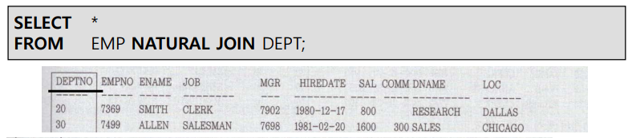
  - INNER JOIN의 경우에는 첫번째, 두번째 테이블의 칼럼이 순서대로 출력된 뒤 조인 칼럼은 **별개로 출력**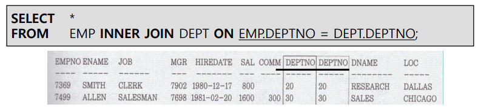

##### OUTER JOIN 기능

- **라이브 코딩에 나옴**

- 조인 조건에서 동일한 값이 없는 튜플도 반환(NULL값 보충)

- 종류

  - LEFT OUTER JOIN
    - A LEFT OUTER JOIN 수행시 A 테이블이 **Driving Table**이 됨
    - A를 먼저 읽은 후, B에서 조인 대상 튜플을 읽어옴
    - 읽어올 튜플 대상이 없는 경우 B컬럼들은 모두 NULL값으로 채움
  - RIGHT OUTER JOIN : 반대
  - FULL OUTER JOIN : LEFT와 RIGHT의 합집
    - 중복되는 데이터는 삭제함

- 키워드 OUTER는 생략 가능

- ON절 /  USING절을 사용해야 함

- 가능한 모든 경우를 구하라 = CROSS JOIN

- 예제
  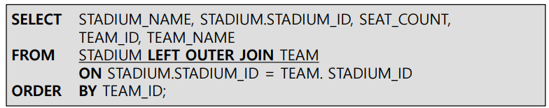
  

  - MySQL에서는 FULL OUTER JOIN이 안되기 때문에 LEFT랑 RIGHT를 따로 해서 UNION으로 합쳐야 함

  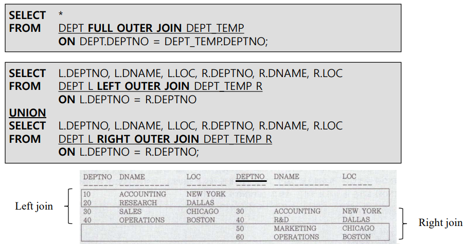

##### CROSS JOIN (CARTESIAN PRODUCT)

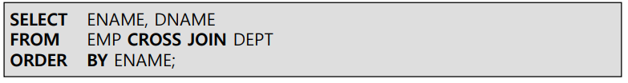

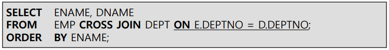

- MySQL에서 CROSS JOIN 사용시 JOIN 혹은 INNER JOIN과 같은 결과를 얻게 됨

##### JOIN 총정리

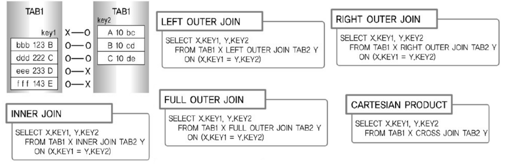

