# Subquery & View

## Subquery

- SQL문 안에 포함되어있는 또 다른 SQL문
- 가능한 곳
  - SELECT 문
    - SELECT 절 (scalar subquery)
    - FROM 절 (inline view)
    - WHERE 절
    - HAVING 절
    - ORDER BY 절
  - INSERT 문의 VALUES 절
  - UPDATE 문의 SET 절
- 특징
  - 컬럼의 참조
    - 일반적으로 (**WHERE 절의 서브쿼리**) 서브쿼리는 메인쿼리의 컬럼을 참조할 수 있지만, 메인쿼리는 **서브쿼리의 컬럼을 참조할 수 없음**
    - inline view (**FROM 절의 서브쿼리**)의 경우, 메인쿼리는 inline view의 컬럼을 **자유롭게 참조할 수 있음**
      - inline view : 동적으로 생성된 테이블이기 때문에, 조인을 사용하는 것과 같음
  - ORDER BY절의 사용
    - WHERE 절 서브쿼리에서는 **ORDER BY를 사용하지 못함**
      - ORDER BY 절은 SELECT 문에서 오직 한 개만 올 수 있기 때문에, 메인쿼리의 마지막 문장에 위치
    - Inline view에서는 **ORDER BY 절을 사용할 수 있음**

### WHERE 절 Subquery

- **서브쿼리 중 가장 중요**

- 반환되는 데이터 형태에 따른 분류
  - 단일행 서브쿼리
    - 서브쿼리의 결과가 반드시 1건이하
    - 단일행 비교연산자 사용 : =, <, <=, >, >=, <>
  - 다중행 서브쿼리
    - 서브쿼리의 결과 건수와 상관 없음
    - 다중행 비교연산자 사용 : IN, ALL, ANY, SOME, EXISTS
- 동작하는 방식에 따른 분류
  - 비연관 서브쿼리
    - 서브쿼리가 **메인쿼리의 컬럼을 가지고 있지 않은** 형태
    - 서브쿼리가 실행한 값을 **메인쿼리에 제공**하기 위해 사용
  - 연관 서브쿼리
    - 서브쿼리가 **메인쿼리 컬럼을 가지고 있는** 형태
    - **메인쿼리에 존재하는 각각의 튜플에 대해 서브쿼리를 반복 실행**

#### 단일행 서브쿼리

- 예제 : '정남일' 선수가 소속된 팀의 선수들에 대한 정보를 검색
  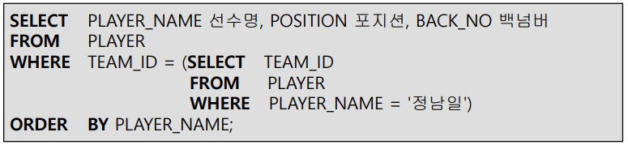
  - WHERE 절 서브쿼리 : '정남일'이 소속된 팀코드
  - 동명이인이 존재하면 에러 발생(결과가 2건 이상) -> 다중행 서브쿼리로 표현(= 대신 IN)
- 예제 : 서브쿼리에서 집단함수 사용
  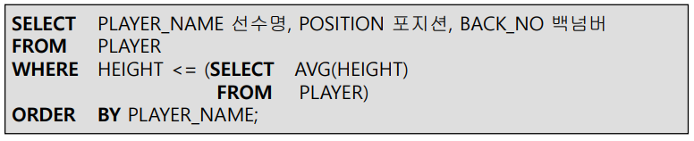
  - 항상 1개의 결과만 생성 : 오류 안남

#### 다중행 서브쿼리

- 다중행 비교연산자
  - IN (서브쿼리) : 서브쿼리 결과에 존재하는 값과 동일한 값의 존재여부를 확인 / Multiple OR
  - EXISTS (서브쿼리) 
    - 서브쿼리의 결과를 **만족하는 값의 존재 여부를 확인**
    - 조건을 만족하는 건을 1건만 찾으면 더 이상 검색하지 않음
  - 단일행_비교연산자 ALL (서브쿼리) : 서브쿼리 결과에 존재하는 **모든 값**의 만족여부 확인
  - 단일행_비교연산자 ANY|SOME (서브쿼리) : 서브쿼리 결과에 존재하는 **어느 한 값의 만족 여부** 확인
- 예제 : '정현수'가 소속되어 있는 팀 정보를 검색
  
  - IN을 씀
- 예제 : 소속팀별 **키가 가장 작은 사람들**의 정보 검색
  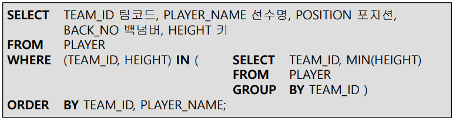

#### 연관 서브쿼리

- 예제 : 선수 자신이 속한 팀의 평균 키보다 작은 선수들의 정보 검색
  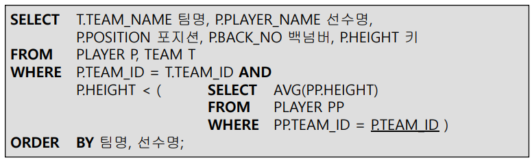

  - 메인쿼리의 **각각의 튜플에 대해 서브쿼리를 반복 실행함**

- 예제 : 20120501부터 20120502 사이에 경기가 있는 경기장을 조회
  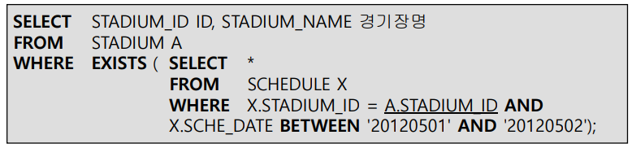

  - EXISTS는 항상 연관 서브쿼리로 사용
    - 아무리 조건을 만족하는 건이 여러 건이라도 조건을 만족하는 1건만 찾으면 추가적인 검색 X

- JOIN과 서브쿼리의 차이

  - 참조 가능한 컬럼

    - JOIN은 조인할 두 테이블이 동등한 관계에 있음, 두 테이블의 컬럼을 어느 위치에서도 자유롭게 사용
    - 서브쿼리는 메인쿼리의 컬럼을 모두 참조 가능, 메인쿼리는 서브쿼리의 컬럼을 참조하는 것은 불가능(Inline View 제외)
    - 질의결과에 서브쿼리 컬럼을 표시해야하면 조인방식으로 변환하거나 함수, scalar subquery 사용

  - 결과 집합의 크기

    - 조인은 집합 간의 곱의 관계이다
      - 1:1 관계의 테이블을 조인 : 1레벨의 집합 생성
      - 1:M 관계의 테이블을 조인 : M레벨의 집합 생성
      - M:N 관계의 테이블을 조인 : M*N레벨의 집합 생성
      - 예) 부서(1)와 사원 테이블(M)을 조인하면 결과는 사원 (M)레벨의 집합이 생성
    - 서브쿼리는 서브쿼리 레벨과 상관없이, 항상 메인쿼리 레벨로 결과 집합 생성
      - 예) 메인쿼리 부서(1), 서브쿼리(M) -> 결과집합 = 부서(1)레벨
    - 조인 사용시 1레벨로 만들려면 DISTINCT 옵션을 추가해야함

  - 예제 : 릴레이션 R, S의 튜플 수 n, m
    

    - 조인 : 결과 튜플 수는 최대 n*m

    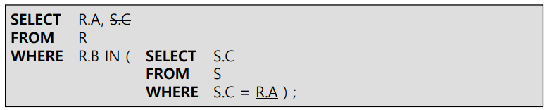

    - 서브쿼리 : 결과 튜플 수는 최대 n

### 그 밖의 서브쿼리

#### Inline View(FROM 절 Subquery)

- Inline View
  - 서브쿼리의 결과가 마치 실행시에 동적으로 생성된 테이블인 것처럼 사용
  - 데이터베이스에 해당 정보 저장 X
  - 일반적인 뷰 = static view, 인라인 뷰 = dynamic view
- 특징
  - 일반적으로 메인쿼리는 서브쿼리의 컬럼 참조 불가능
  - inline view는 동적으로 생성된 테이블이기 때문에 조인을 사용하는 것과 같은 효과, **메인쿼리가 inline view의 컬럼 참조 가능**
- 주의사항
  - 메인쿼리에서 inline view 컬럼 사용가능
  - inline view에서 ORDER BY 절 사용가능

- 예제 : 팀번호 K09의 선수 이름, 포지션, 백넘버를 검색
  
  - **시험에 나옴 : FROM 절에 Subquery를 쓰면 반드시 Alias를 써야함 (AS Alias)**	
- 예제 : 포지션이 MF인 선수들의 소속팀명 및 선수 정보를 검색
  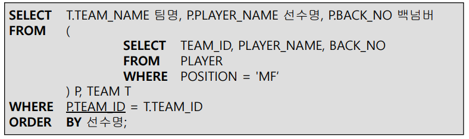
- 예제 : 키가 제일 큰 5명 선수들의 정보를 검색(top-N query)
  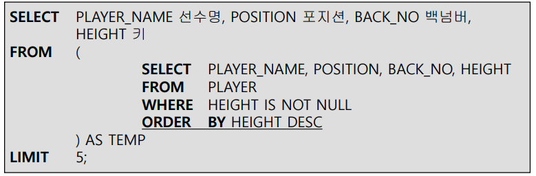

#### Scalar Subquery(SELECT 절)

- 예제 : 선수 정보와 해당 선수가 속한 팀의 평균 키를 함께 검색
  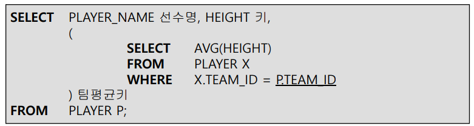
  - 메인쿼리의 결과 건수만큼 반복됨

#### Having 절에서 사용하는 Subquery

- 예제 : 평균키가 K02 팀의 평균키보다 작은 팀의 이름과 해당 팀의 평균키를 검색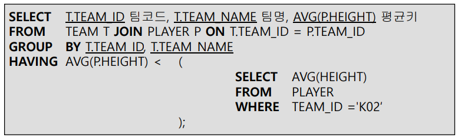

#### Update 문의 SET절에서 사용하는 Subquery

- 예제
  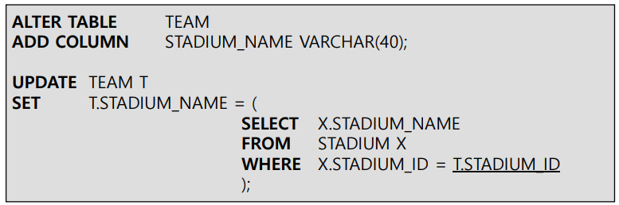

#### Insert 문의 VALUES 절에서 사용하는 Subquery

- 예제
  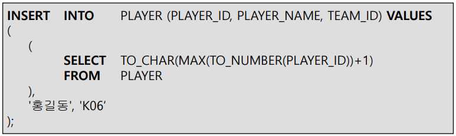

## View

- 정의
  - <-> 베이스 테이블(CREATE로 정의되는 테이블)
  - 하나 또는 둘 이상의 베이스 테이블로부터 유도되어 만들어지는 **가상테이블(Virtual)**
  - 뷰 정의만 저장하고, 데이터는 필요시 동적으로 생성
    - 실행시간에만 구체화되는 테이블
- 외부 스키마 = 뷰 + 기본 테이블들의 정의
  - 뷰의 정의는 시스템 카탈로그에 **검색문의 형태**로 저장
- **질의 재작성(query rewrite)**
  - 질의에서 뷰가 사용되면, 뷰 정의를 참조해 DBMS **내부적으로 해당 질의를 재작성** 해 질의 수행
- 조작
  - 검색 : 뷰와 기본 테이블 사이에 차이 X
  - 갱신 : 많은 제약이 따름
- 장점
  - 독립성 : 테이블 구조가 변경되어도, 뷰를 사용하는 응용 프로그램은 변경하지 않을 수 있음
  - 편리성 : 복잡한 질의의 일부를 뷰로 미리 생성 -> 관련 질의 단순하게 작성(자주 사용하면 유용)
  - 보안성 : 숨기고 싶은 정보(컬럼)는 제외하고 뷰를 생성해 사용자에게 정보 숨기기 가능(접근 제어)
  - 여러 사용자에게 다양한 뷰 제공
- 단점
  - 독자적인 인덱스를 가질 수 없음
  - 정의 변경 불가능
  - 데이터 갱신에 제한이 많음

### CREATE VIEW

- Syntax
  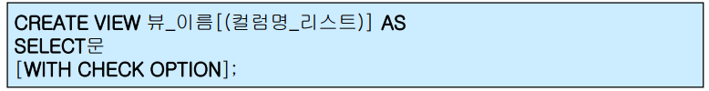
  - WITH CHECK OPTION
    - 뷰에 대한 삽입/수정 연산 실행시 뷰의 정의조건(WHERE절)이 위배되면 연산의 실행이 거절됨
- 예제 : 한 개 base 테이블에서 유도된 VIEW
  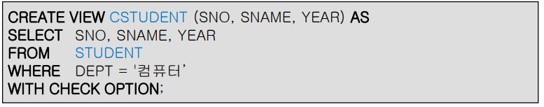
- 예제 : 두 개 base 테이블에서 유도된 VIEW (조인 VIEW)
  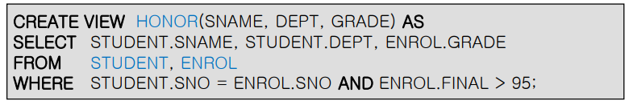
- 예제 : 뷰에서 유도된 VIEW
  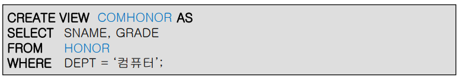
- 컬럼명의 상속
  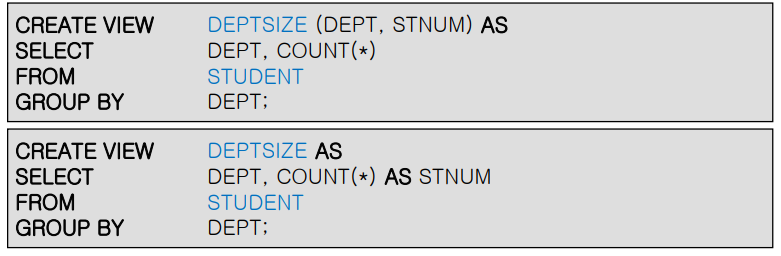
  - 따로 지정해주지 않아도 알아서 컬럼이 상속됨

### DROP VIEW

- Syntax
  
- 기본 테이블 혹은 뷰가 제거되면, 그 위에 만들어진 모든 뷰도 자동적으로 제거
  
  

### Query Rewrite

- 기본 테이블에서 유도한 뷰, 그리고 뷰에서 유도한 뷰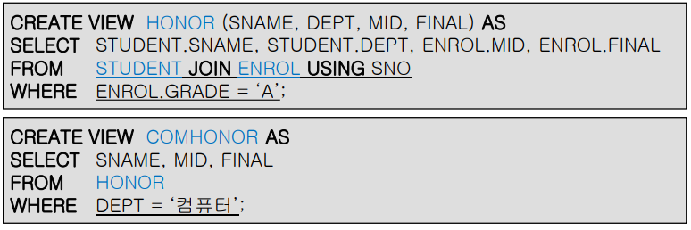
- Query 1 : 뷰에 대한 검색
  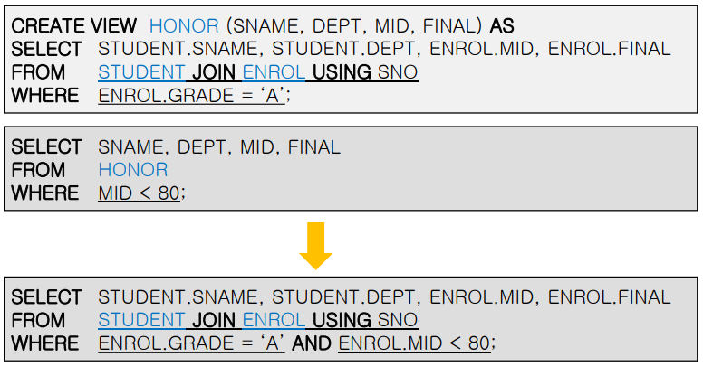
- Query 2 : 뷰에 대한 검색
  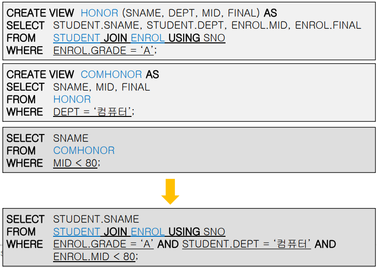
- 예제 : 뷰에 대한 질의 재작성
  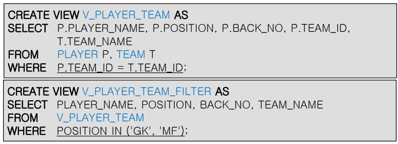
  - 기본 테이블에서 유도한 뷰 + 뷰에서 유도한 뷰
- 질의 1
  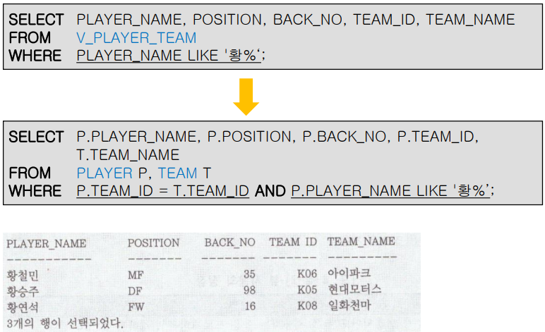
- 질의 2
  
- 뷰의 조작
  - 기본 테이블에 사용 가능한 어떤 검색문도 뷰에 사용가능
  - 변경 연산의 제약
    - 열 부분집합 뷰
      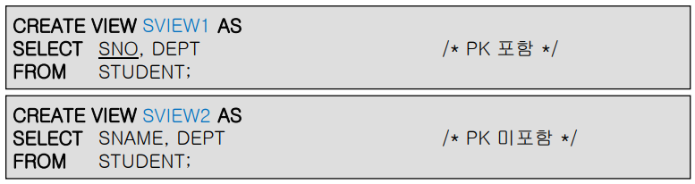
    - 행 부분집합 뷰
      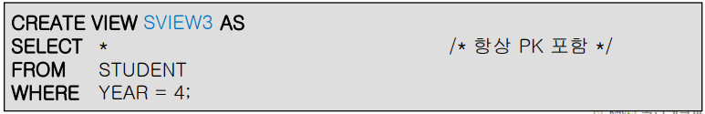
- 뷰에 대한 갱신
  - 허용 가능한 갱신
    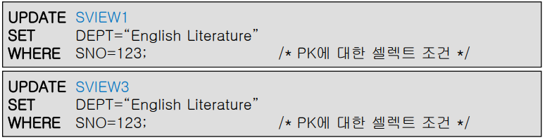
  - 허용 불가능한 갱신
    
- 뷰는 제한적인 갱신만 가능
  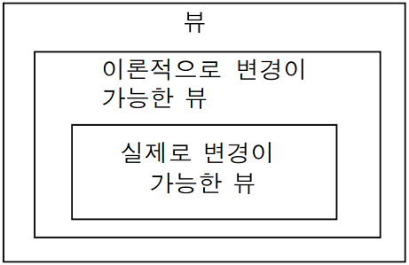

- 