# Condition Variables

- 실행 전 조건이 참인지 확인해야하는 스레드가 많음
  - 부모 스레드가 자식 스레드가 끝났는지 확인해야하는 경우
  - join()

- 비효율적임(계속해서 Spin을 해 CPU 시간을 낭비함)

## Using Condition Variable

- Waiting : 실행 대기
- Signaling : 다른 기다리고 있는 스레드를 깨워주는 것

- Condition Variable 선언
  
- 연산
  wait() : mutex를 인자로 받음, lock을 release 한 뒤 호출한 스레드를 sleep상태로 만듬
  
  - - 다시 깨어날려면 lock을 얻어야 함
- 사용예시
  
  
  - Parent
    - Child를 만들고, 계속 실행
    - thr_join()을 호출해서 Child가 끝날때까지 기다림
      - lock을 받아서, child가 끝난지 확인하고, wait()를 호출해서 sleep으로 들어가서 lock을 release
  - Child
    - thr_exit()를 호출해서 Parent 스레드를 깨움
    - lock을 받아서, done을 바꾼 뒤, Parent에게 signal
  
- Done 변수의 중요성
  

  - done이 없으면, child가 호출 즉시 작업을 완료해 signal하는 케이스에서 부모가 이를 받지 못한 뒤 나중에 sleep에 들어가면 stuck됨 -> 절대 못깨어남

  

  - 미묘한 Race Condition 발생
    - 부모쪽에서 join 호출 중 done의 상태를 체크하고  wait를 호출하기전, 인터럽트 발생으로 자식으로 흐름이 넘어가버리면
    - done을 그때서야 자식이 1로 바꾸고, 시그널보냄
    - 아까랑 똑같이 부모 스레드가 stuck됨

## Producer / Consumer (Bound Buffer) Problem

- Producer : 데이터 아이템을 만드는 역할, 버퍼에 데이터 아이템을 넣고싶어 함
- Consumer : 버퍼에서 데이터 아이템을 가져와 자신의 방식대로 소비하길 원함

### Bounded Buffer

- 한 프로그램의 아웃풋을 pipeout해서 다른 프로그램으로 보내는 것
-  공유자원이기 때문에, 동기화된 접근이 필요함
  

- Put
  
  - count값이 0일때만 버퍼에 데이터를 넣음
- Get
  
- count값이 1일때만 버퍼에서 데이터를 가져옴
  
- Producer / Consumer Threads (Version 1)
  
  - Producer는 루프를 돌면서 정수를 버퍼에 여러번 넣고
  - Consumer는 버퍼에서 데이터를 가져옴
- Single C/V and If Statement
  
  - 하나의 Condition Variable, lock mutex
  - 하나의 Producer / 하나의 Consumer를 대상으로는 코드가 잘 작동함

- Multiple Producer/Consumer
  
  - T_c1이 데이터를 받아야하는데, 중간에 T_c2가 받아버림
  - Mesa Semantics : 깨워진 스레드가 원하는 값을 받는다는 확신이 없음
  - Hoare Semantics : 깨워진 스레드가 원하는 값을 받을 가능성이 높아짐(깨운 스레드를 바로 실행)

- Single C/V and While
  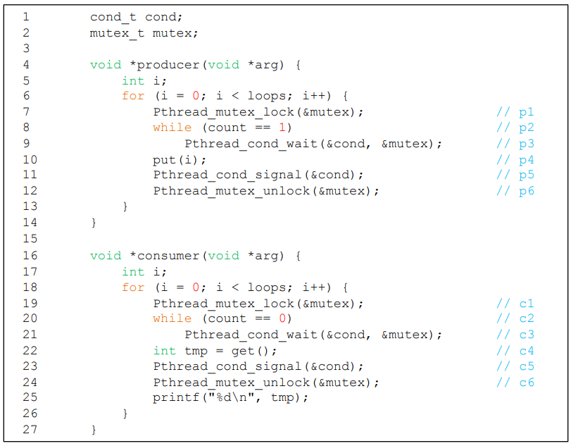
  - 조건문에 while 구문을 사용하는 것
  - 여전히 버그가 있음
    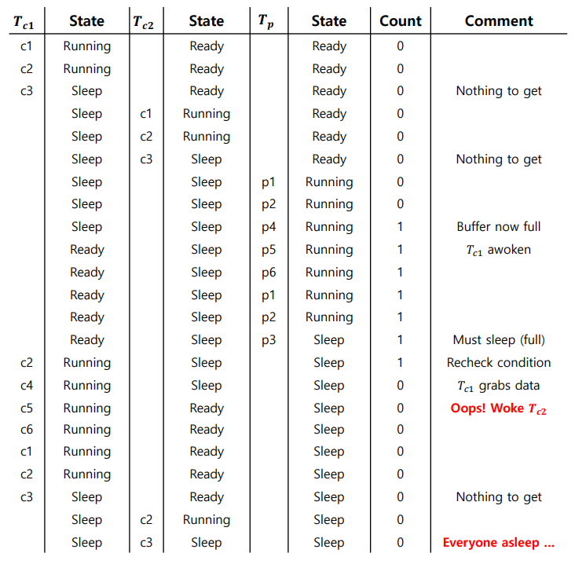
    - Consumer가 Consumer를 깨우는 일이 없어야함(Producer만이 깨울 수 있음)
- Single Buffer P/C
  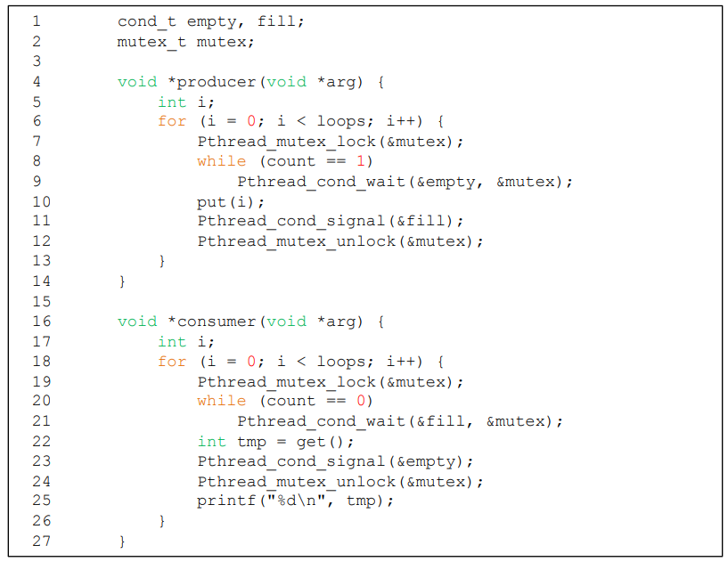
  - Producer는 empty 컨디션일때 wait, fill 컨디션일 때 signal
  - Consumer는 fill 컨디션일때 wait, empty 컨디션일 때 signal

- Final Producer/Consumer
  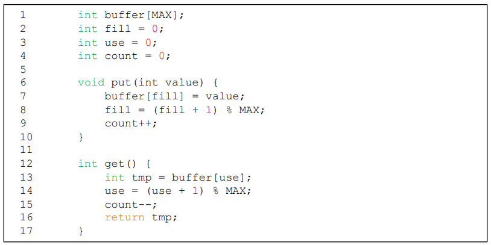

  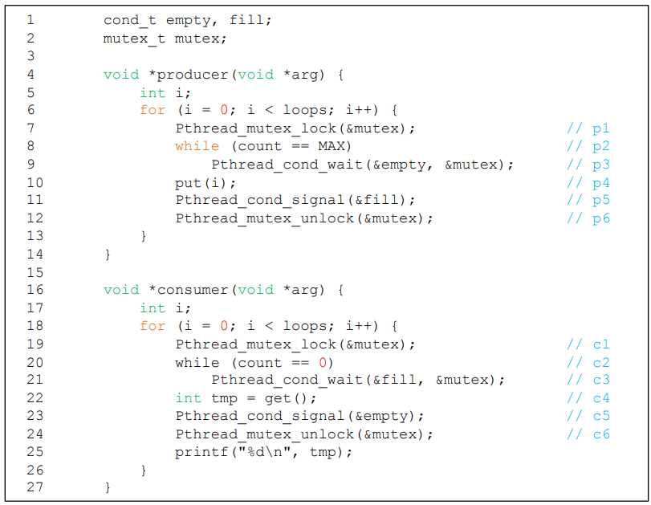

  - 버퍼 슬롯을 더해서, Concurrency / Efficiency를 향상
    - 동시에 Producing / Consuming을 가능하게 함
    - Context Switch를 줄임
  - Proucer는 모든 버퍼가 fill 일때만 sleep
  - Conusmer는 모든 버퍼가 empty 일때만 sleep

## Covering Conditions

- 남은공간이 0바이트라고 가정
  - 스레드 T_a가 allocate(100) 호출
  - 스레드 T_b가 allocate(10) 호출
  - 두 스레드 모두 wait, sleep에 들어감
  - 스레드 T_c가 free(50) 호출
    - 어떤 스레드가 깨워져야 할까?

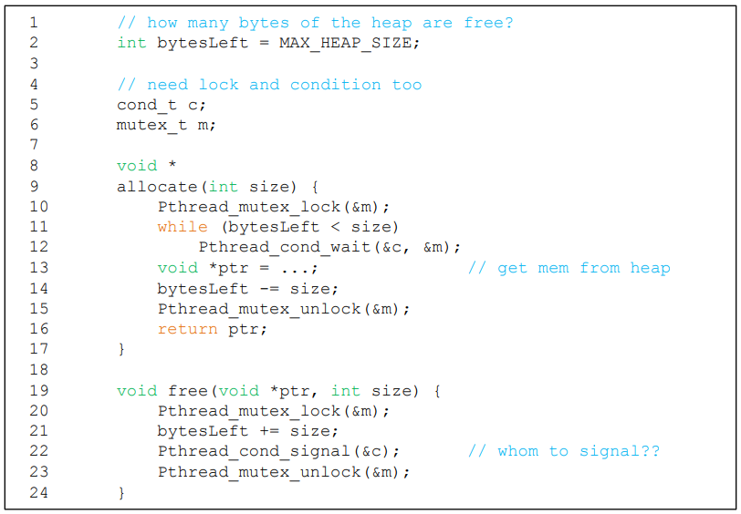

- Lampson / Redell이 제안한 해결법
  - pthread_cond_signal을 pthread_cond_broadcast()로 변경
    - wait하고 있는 를 **모든 스레드를** 깨움
    - 비용 : 너무 많은 스레드가 일어날 수 있음
    - 일어나면 안되는 스레드들은 일어나서 조건을 확인한뒤 다시 sleep할 것임 

# Semaphore

- 정수값을 가지는 객체
- 초기화
  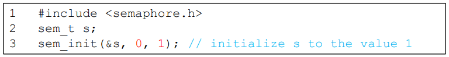
  - semaphore s를 선언하고 1으로 초기화
  - 두번째 인수 0은 Semaphore가 같은 프로세스 내의 스레드들 간에 공유된다는 것을 뜻함
  - 초기화는 딱 한번만

- sem_wait()
  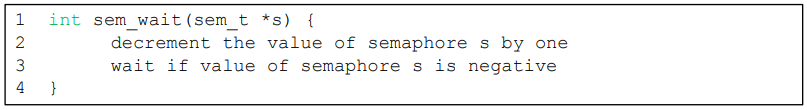
  - 호출됐을 때 semaphore의 값이 1보다 크거나 같으면 바로 return
  - 호출자의 실행을 멈추고, 다음 post를 기다리게 함
  - 음수일때는, semaphore의 값이 wait하고 있는 스레드의 숫자와 동일
- sem_post()
  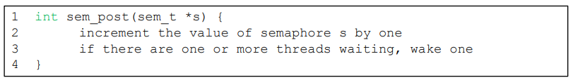
  - semaphore의 값을 1 증가시킴
  - 깨워야 하는 스레드들이 있으면 해당 스레드 중 하나를 깨움

## Binary Semaphores(Locks)

- Mutual Exclusion을 위해 초기값을 1로 설정
  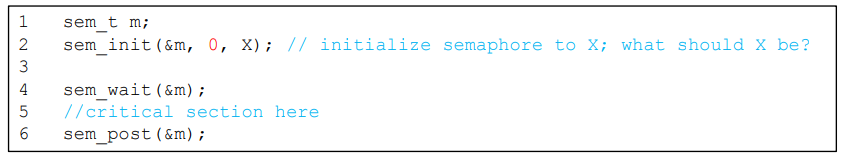
  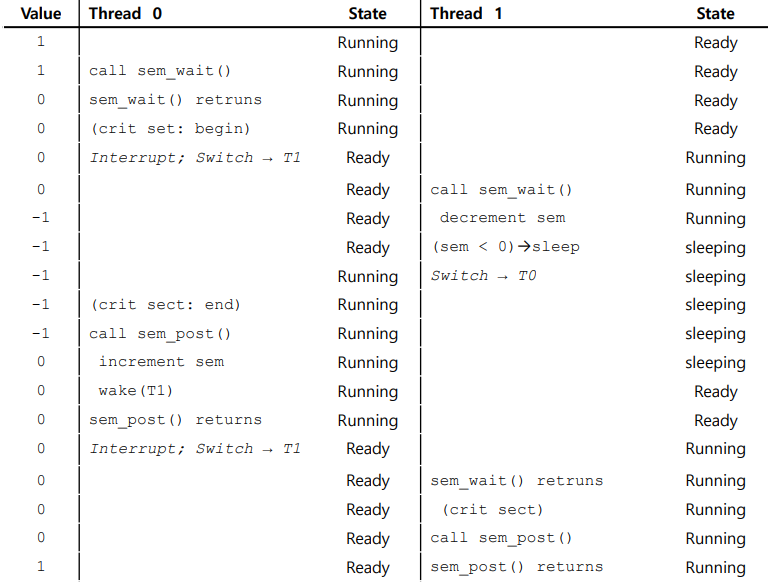

## Semaphore as Condition Variables

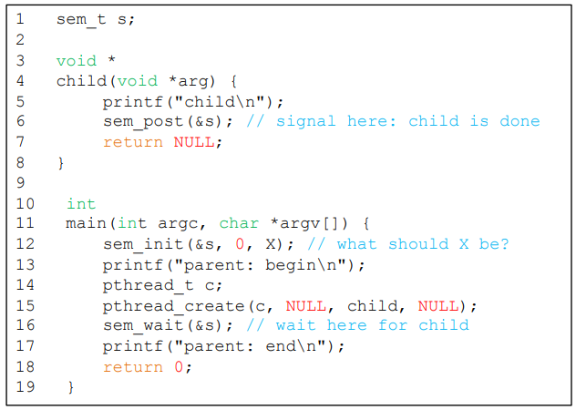

- X의 값은 0이 됨
  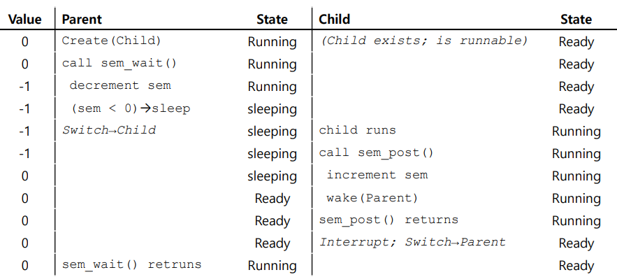
- 자식이 sem_post()를 호출하기 전에 부모가 sem_wait()를 호출하는 경우
  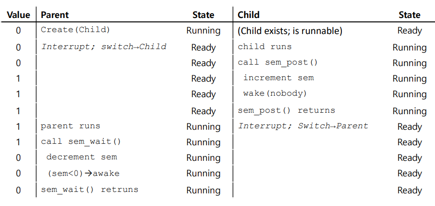
- 부모가 sem_wait()를 호출하기 전에 자식이 모든 실행을 끝마치는 경우

### Producer/Consumer Problem 

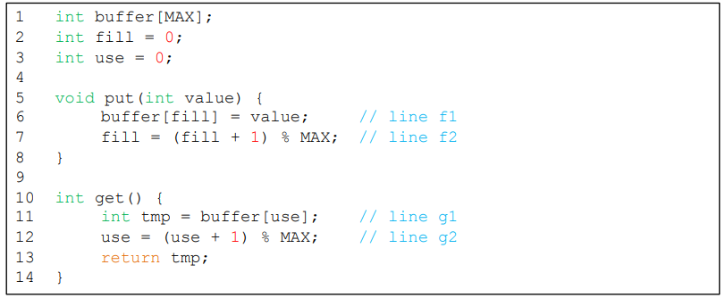

- Producer의 put : 데이터를 넣기 위해 버퍼가 empty될 때까지 기다림
- Consumer의 get : 데이터를 사용하기 위해 버퍼가 fill될 때까지 기다림

- Full과 Empty condition을 사용하는 방법
  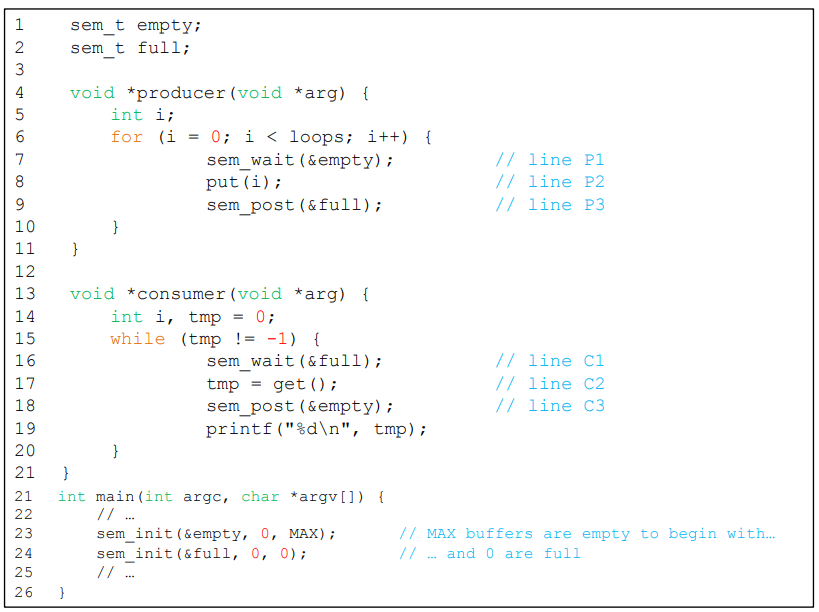
  - MAX값이 1보다 클 경우
    - producer가 다수일 경우, f1 line에서 경쟁조건 발생
    - 데이터가 **덮어쓰기** 됨
  - Mutual Exclusion : 버퍼를 채우는 것 / 인덱스의 증가하는 부분이 Critical Section이여야 함

- Adding Mutual Exclusion(Incorrect)
  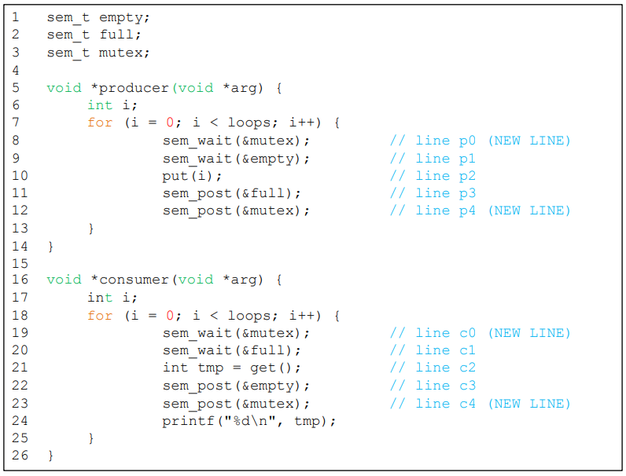
  - Consumer가 mutex를 획득
  - Consumer가 sem_wait()호출, Block되어서 CPU 양보(mutex는 계속 가지고 있음)
  - Producer가 mutex를 가지고 오기위해 대기 시작
  - 서로 영원히 대기함 (**Deadlock**)

- Working Solution
  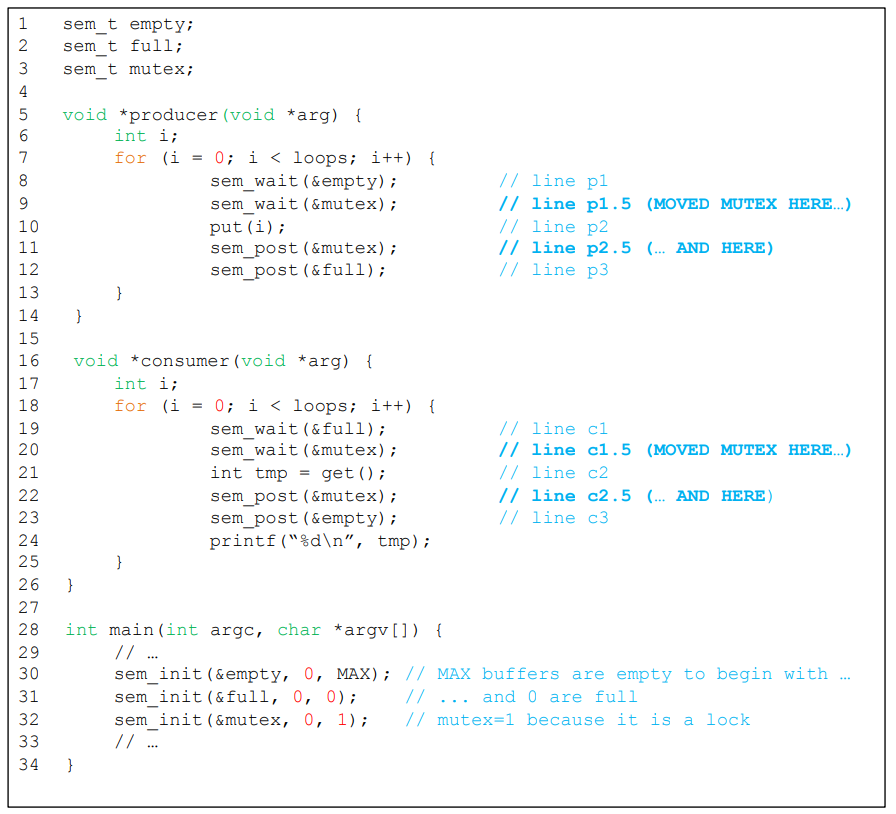
  - sem_wait의 위치를 살짝씩 조정해준 형태

## Reader-Writer Locks

- Insert
  - List의 상태를 바꿈
  - 전통적인 Critical Section
- Lookup
  - 자료구조를 읽어옴
  - 진행하고 있는 Insert작업이 없음을 확인해야 함
  - 여러개의 Lookup 작업을 Concurrent하게 실행
- 하나의 Writer만 Lock을 얻을 수 있음
- Reader가 Lock을 얻으면
  - 다른 Reader들도 Lock을 얻을 수 있음
  - Writer는 모든 Reader들이 끝낼때까지 기다려야 함

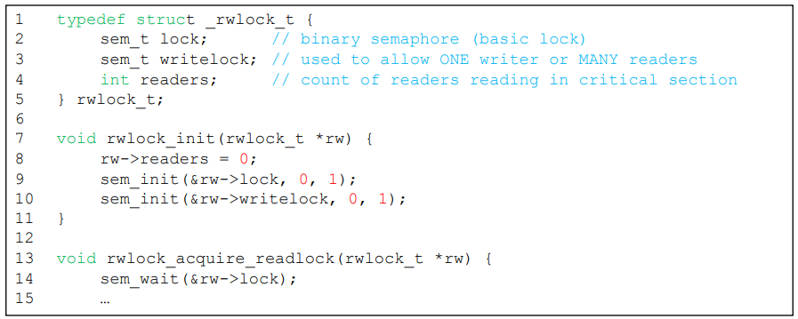

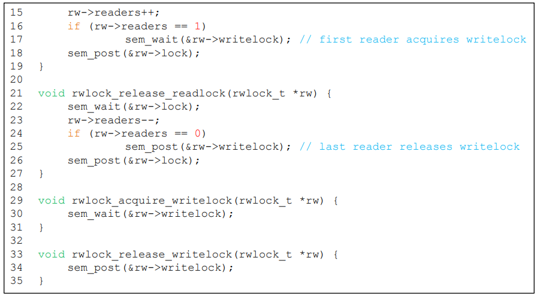

