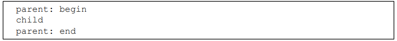
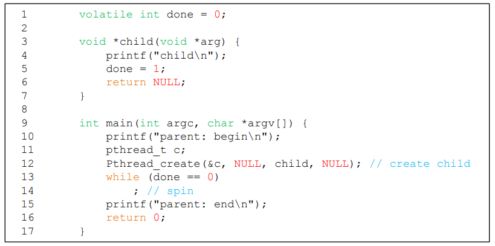
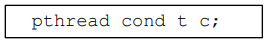
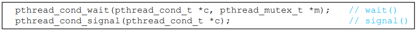
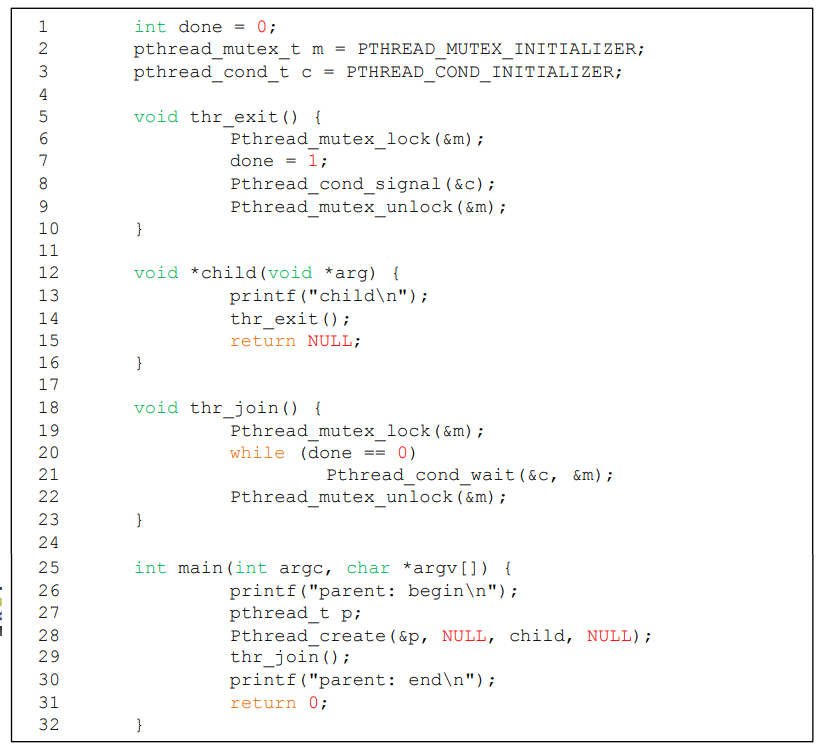
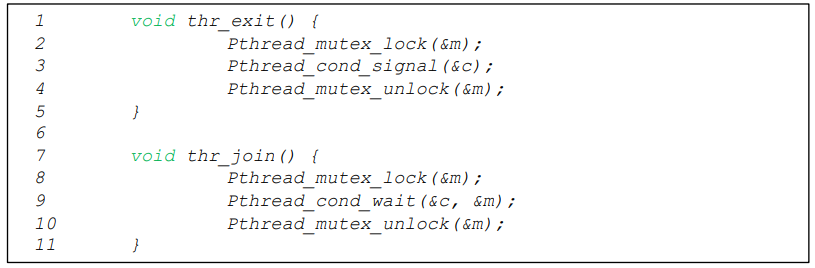
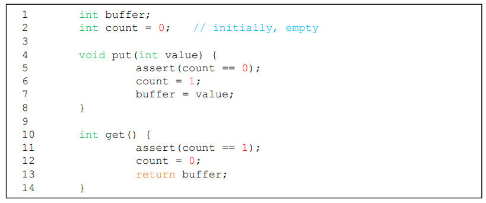
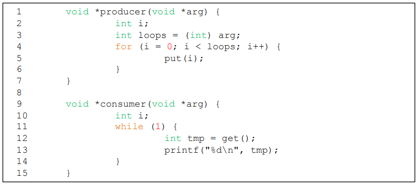
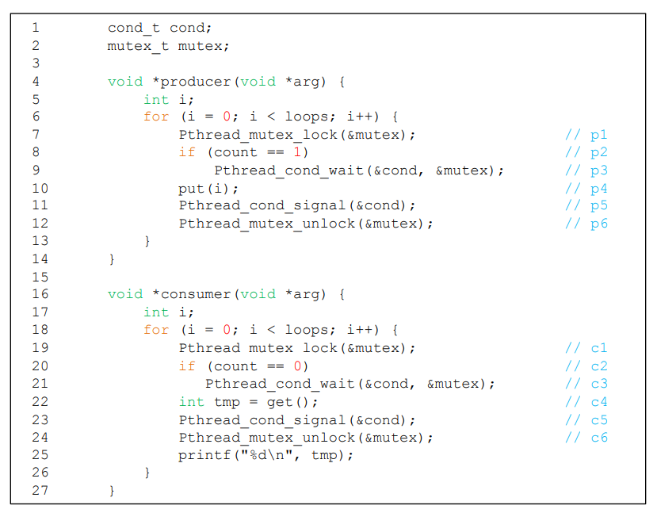
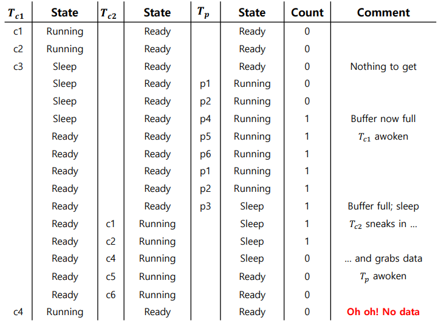

# Condition Variables

- 실행 전 조건이 참인지 확인해야하는 스레드가 많음
  - 부모 스레드가 자식 스레드가 끝났는지 확인해야하는 경우
  - join()

- 비효율적임(계속해서 Spin을 해 CPU 시간을 낭비함)

## Using Condition Variable

- Waiting : 실행 대기
- Signaling : 다른 기다리고 있는 스레드를 깨워주는 것

- Condition Variable 선언
  
- 연산
  
  - wait() : mutex를 인자로 받음, lock을 release 한 뒤 호출한 스레드를 sleep상태로 만듬
    - 다시 깨어날려면 lock을 얻어야 함
- 사용예시
  
  - Parent
    - Child를 만들고, 계속 실행
    - thr_join()을 호출해서 Child가 끝날때까지 기다림
      - lock을 받아서, child가 끝난지 확인하고, wait()를 호출해서 sleep으로 들어가서 lock을 release
  - Child
    - thr_exit()를 호출해서 Parent 스레드를 깨움
      - lock을 받아서, done을 바꾼 뒤, Parent에게 signal

- Done 변수의 중요성
  

  - done이 없으면, child가 호출 즉시 작업을 완료해 signal하는 케이스에서 부모가 이를 받지 못한 뒤 나중에 sleep에 들어가면 stuck됨 -> 절대 못깨어남

  

  - 미묘한 Race Condition 발생
    - 부모쪽에서 join 호출 중 done의 상태를 체크하고  wait를 호출하기전, 인터럽트 발생으로 자식으로 흐름이 넘어가버리면
    - done을 그때서야 자식이 1로 바꾸고, 시그널보냄
    - 아까랑 똑같이 부모 스레드가 stuck됨

## Producer / Consumer (Bound Buffer) Problem

- Producer : 데이터 아이템을 만드는 역할, 버퍼에 데이터 아이템을 넣고싶어 함
- Consumer : 버퍼에서 데이터 아이템을 가져와 자신의 방식대로 소비하길 원함

### Bounded Buffer

- 한 프로그램의 아웃풋을 pipeout해서 다른 프로그램으로 보내는 것
-  공유자원이기 때문에, 동기화된 접근이 필요함
  

- Put
  - count값이 0일때만 버퍼에 데이터를 넣음
- Get
  - count값이 1일때만 버퍼에서 데이터를 가져옴

- Producer / Consumer Threads (Version 1)
  
  - Producer는 루프를 돌면서 정수를 버퍼에 여러번 넣고
  - Consumer는 버퍼에서 데이터를 가져옴
- Single C/V and If Statement
  
  - 하나의 Condition Variable, lock mutex
  - 하나의 Producer / 하나의 Consumer를 대상으로는 코드가 잘 작동함

- Multiple Producer/Consumer
  
  - T_c1이 데이터를 받아야하는데, 중간에 T_c2가 받아버림
  - Mesa Semantics : 깨워진 스레드가 원하는 값을 받는다는 확신이 없음
  - Hoare Semantics : 깨워진 스레드가 원하는 값을 받을 가능성이 높아짐(깨운 스레드를 바로 실행)