# Condition Variables

- 실행 전 조건이 참인지 확인해야하는 스레드가 많음
  - 부모 스레드가 자식 스레드가 끝났는지 확인해야하는 경우
  - join()

- 비효율적임(계속해서 Spin을 해 CPU 시간을 낭비함)

## Using Condition Variable

- Waiting : 실행 대기
- Signaling : 다른 기다리고 있는 스레드를 깨워주는 것

- Condition Variable 선언
  
- 연산
  wait() : mutex를 인자로 받음, lock을 release 한 뒤 호출한 스레드를 sleep상태로 만듬
  
  - - 다시 깨어날려면 lock을 얻어야 함
- 사용예시
  
  
  - Parent
    - Child를 만들고, 계속 실행
    - thr_join()을 호출해서 Child가 끝날때까지 기다림
      - lock을 받아서, child가 끝난지 확인하고, wait()를 호출해서 sleep으로 들어가서 lock을 release
  - Child
    - thr_exit()를 호출해서 Parent 스레드를 깨움
    - lock을 받아서, done을 바꾼 뒤, Parent에게 signal
  
- Done 변수의 중요성
  

  - done이 없으면, child가 호출 즉시 작업을 완료해 signal하는 케이스에서 부모가 이를 받지 못한 뒤 나중에 sleep에 들어가면 stuck됨 -> 절대 못깨어남

  

  - 미묘한 Race Condition 발생
    - 부모쪽에서 join 호출 중 done의 상태를 체크하고  wait를 호출하기전, 인터럽트 발생으로 자식으로 흐름이 넘어가버리면
    - done을 그때서야 자식이 1로 바꾸고, 시그널보냄
    - 아까랑 똑같이 부모 스레드가 stuck됨

## Producer / Consumer (Bound Buffer) Problem

- Producer : 데이터 아이템을 만드는 역할, 버퍼에 데이터 아이템을 넣고싶어 함
- Consumer : 버퍼에서 데이터 아이템을 가져와 자신의 방식대로 소비하길 원함

### Bounded Buffer

- 한 프로그램의 아웃풋을 pipeout해서 다른 프로그램으로 보내는 것
-  공유자원이기 때문에, 동기화된 접근이 필요함
  

- Put
  
  - count값이 0일때만 버퍼에 데이터를 넣음
- Get
  
- count값이 1일때만 버퍼에서 데이터를 가져옴
  
- Producer / Consumer Threads (Version 1)
  
  - Producer는 루프를 돌면서 정수를 버퍼에 여러번 넣고
  - Consumer는 버퍼에서 데이터를 가져옴
- Single C/V and If Statement
  
  - 하나의 Condition Variable, lock mutex
  - 하나의 Producer / 하나의 Consumer를 대상으로는 코드가 잘 작동함

- Multiple Producer/Consumer
  
  - T_c1이 데이터를 받아야하는데, 중간에 T_c2가 받아버림
  - Mesa Semantics : 깨워진 스레드가 원하는 값을 받는다는 확신이 없음
  - Hoare Semantics : 깨워진 스레드가 원하는 값을 받을 가능성이 높아짐(깨운 스레드를 바로 실행)

- Single C/V and While
  
  - 조건문에 while 구문을 사용하는 것
  - 여전히 버그가 있음
    
    - Consumer가 Consumer를 깨우는 일이 없어야함(Producer만이 깨울 수 있음)
- Single Buffer P/C
  
  - Producer는 empty 컨디션일때 wait, fill 컨디션일 때 signal
  - Consumer는 fill 컨디션일때 wait, empty 컨디션일 때 signal

- Final Producer/Consumer
  

  

  - 버퍼 슬롯을 더해서, Concurrency / Efficiency를 향상
    - 동시에 Producing / Consuming을 가능하게 함
    - Context Switch를 줄임
  - Proucer는 모든 버퍼가 fill 일때만 sleep
  - Conusmer는 모든 버퍼가 empty 일때만 sleep

## Covering Conditions

- 남은공간이 0바이트라고 가정
  - 스레드 T_a가 allocate(100) 호출
  - 스레드 T_b가 allocate(10) 호출
  - 두 스레드 모두 wait, sleep에 들어감
  - 스레드 T_c가 free(50) 호출
    - 어떤 스레드가 깨워져야 할까?

- Lampson / Redell이 제안한 해결법
  - pthread_cond_signal을 pthread_cond_broadcast()로 변경
    - wait하고 있는 를 **모든 스레드를** 깨움
    - 비용 : 너무 많은 스레드가 일어날 수 있음
    - 일어나면 안되는 스레드들은 일어나서 조건을 확인한뒤 다시 sleep할 것임 

# Semaphore

- 정수값을 가지는 객체
- 초기화
  
  - semaphore s를 선언하고 1으로 초기화
  - 두번째 인수 0은 Semaphore가 같은 프로세스 내의 스레드들 간에 공유된다는 것을 뜻함
  - 초기화는 딱 한번만

- sem_wait()
  
  - 호출됐을 때 semaphore의 값이 1보다 크거나 같으면 바로 return
  - 호출자의 실행을 멈추고, 다음 post를 기다리게 함
  - 음수일때는, semaphore의 값이 wait하고 있는 스레드의 숫자와 동일
- sem_post()
  
  - semaphore의 값을 1 증가시킴
  - 깨워야 하는 스레드들이 있으면 해당 스레드 중 하나를 깨움

## Binary Semaphores(Locks)

- Mutual Exclusion을 위해 초기값을 1로 설정
  
  

## Semaphore as Condition Variables

- X의 값은 0이 됨
  
- 자식이 sem_post()를 호출하기 전에 부모가 sem_wait()를 호출하는 경우
  
- 부모가 sem_wait()를 호출하기 전에 자식이 모든 실행을 끝마치는 경우

### Producer/Consumer Problem 

- Producer의 put : 데이터를 넣기 위해 버퍼가 empty될 때까지 기다림
- Consumer의 get : 데이터를 사용하기 위해 버퍼가 fill될 때까지 기다림

- Full과 Empty condition을 사용하는 방법
  
  - MAX값이 1보다 클 경우
    - producer가 다수일 경우, f1 line에서 경쟁조건 발생
    - 데이터가 **덮어쓰기** 됨
  - Mutual Exclusion : 버퍼를 채우는 것 / 인덱스의 증가하는 부분이 Critical Section이여야 함

- Adding Mutual Exclusion(Incorrect)
  
  - Consumer가 mutex를 획득
  - Consumer가 sem_wait()호출, Block되어서 CPU 양보(mutex는 계속 가지고 있음)
  - Producer가 mutex를 가지고 오기위해 대기 시작
  - 서로 영원히 대기함 (**Deadlock**)

- Working Solution
  
  - sem_wait의 위치를 살짝씩 조정해준 형태

## Reader-Writer Locks

- Insert
  - List의 상태를 바꿈
  - 전통적인 Critical Section
- Lookup
  - 자료구조를 읽어옴
  - 진행하고 있는 Insert작업이 없음을 확인해야 함
  - 여러개의 Lookup 작업을 Concurrent하게 실행
- 하나의 Writer만 Lock을 얻을 수 있음
- Reader가 Lock을 얻으면
  - 다른 Reader들도 Lock을 얻을 수 있음
  - Writer는 모든 Reader들이 끝낼때까지 기다려야 함

- Fairness 문제 존재
  - reader가 writer를 starve시킬 가능성이 높음
  - writer가 대기중일때 다른 새로운 reader들이 못들어오게 해야함

### Basic Solution(Using Condition Variable)

- 여기서 시험문제 하나 나옴
- Writer가 없을 때 Reader가 데이터베이스에 접근 가능
- Writer는 Reader/Writer가 없을 때 데이터베이스에 접근 가능
- 한번에 하나의 스레드만 상태 변수를 조종할 수 있음

#### 기본구조

- Reader() 
  - Writer가 없을때까지 기다리고
  - 데이터베이스에 접근한뒤
  - Check Out하면서 기다리고 있는 Writer를 깨움
- Writer()
  - Active Reader/Writer가 없을때까지 기다리고
  - 데이터베이스에 접근한뒤
  - Check Out하면서 기다리고 있는 Readers/Writer를 깨움

- State Variables
  - AR : Active Reader의 수 / 초기값 0
  - WR : Wating Reader의 수 / 초기값 0
  - AW : Active Writer의 수 / 초기값 0
  - WW : Waiting Writer의 수 / 초기값 0
  - 상태 okToRead = NIL
  - 상태 okToWrite = NIL

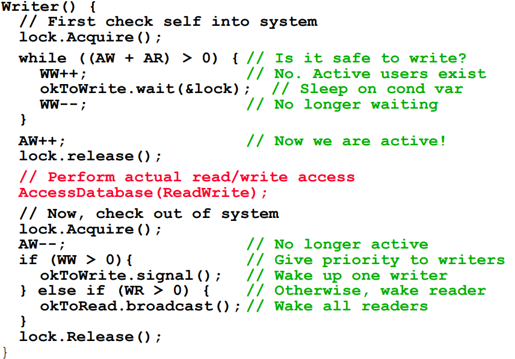

- R1, R2, W1, R3 순으로 온다고 가정
  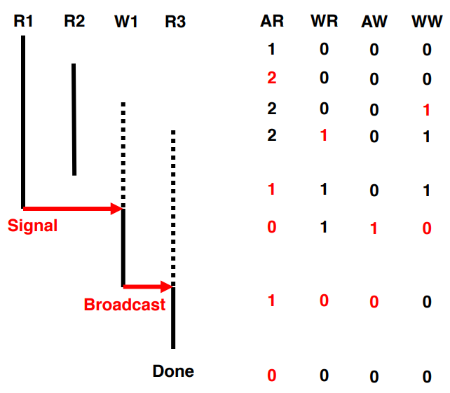

### The Dining Philosophers

- 5명의 철학자가 테이블을 둘러싸고 있다고 가정

  - 2명의 철학자 사이에는 하나의 포크가 존재(총 5개)
  - 각 철학자는 생각할때(포크 필요없음), 먹을때(포크 2개 필요)가 있음
  - 이 포크를 위한 투쟁

- Key Challenge

  - Deadlock은 없어야 함

  - 어떤 철학자도 Starve하는 일은 없어야 함

  - Concurrency가 높다
    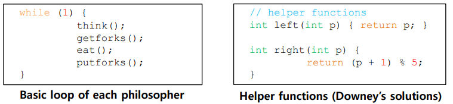

    - 왼쪽의 포크를 요청할 때 left, 오른쪽은 right 호출

    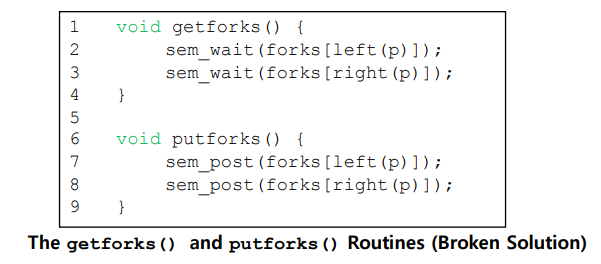

- 포크 하나별로 Semaphore 하나가 필요함

  - 데드락 발생
    - 모든 철학자가 자신 왼쪽의 포크를 집었을경우, 모두 영원히 데드락
  - 포크를 얻는방법을 바꿔야 함
    - 4번째 철학자는 포크를 얻는방법을 다르게 바꿈(오른쪽 먼저)
    - 데드락 발생 가능성이 없어짐
      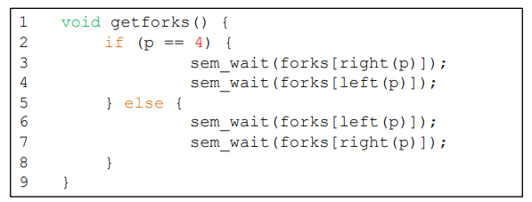

## How to Implement Semaphores

- Zemaphore 라는걸 만듬
  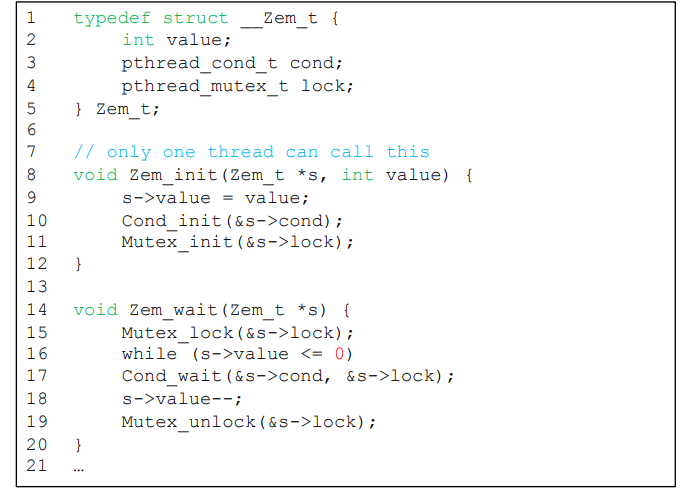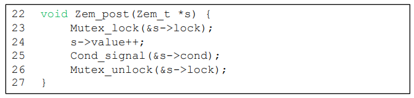
- 값이 0보다 작아질 수 없음
- 구현하기 쉽고, 현재의 리눅스 구현과 일치

## Semaphore에서 Monitor를 만들수 있을까?

- 보기에는 쉬움 : Mutex 사용하기

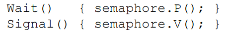

- Wait가 Lock을 가진채로 Sleep에 들어갈 가능성이 있음

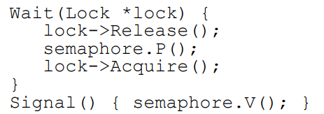

- 상태변수는 History가 없고, Semaphore는 있다
  
- 스레드 하나가 Signal하고, 아무도 안기다리고 있으면?
  
- 슬라이드 참조 너무 어려움 ㅅㅂ;

- 결론

  - 모니터는 프로그램의 로직을 뜻함

    - 필요하면 Wait
    - 뭔가 바꾸면 Signal, 다른 스레드가 일하도록

  - Monitor-Based 프로그램의 기본 구조

    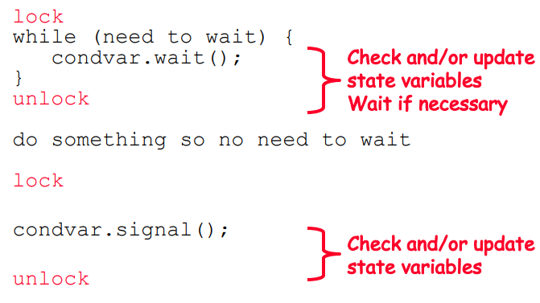

  - Lock + 하나 이상의 Condition Variables

    - 공유 데이터에 접근할때 lock을 꼭 획득하고
    - Critical Section 안에서 대기해야할때 Condition Variable 사용
      - Wait(), Signal(), Broadcast()
  
- 임시노트

- P. 33
  Reader() {
      lock.Acquire();

      while(AW + WW) > 0 ==> 누가 쓰고 있다는 것임
          WR++;
          okToRead.wait(&lock); // Sleep on cond var 
          WR--;

  

  ….

  AR--; // No longer active 
  if (AR == 0 && WW > 0) // AR이 0이라는 것은 마지막 리더라는 뜻
      okToWrite.signal(); // Wake up one writer 
  lock.Release();

  

     P. 36

  lock.Acquire(); ==> 크리티컬 섹션

  R1, R2 모두 읽음
  W1 도착 ==> Active Reader가 두명이나 존재하기 때문에 대기
  R3  도착 ==> W1때문에 대기
  R2가 끝남 ==> 마지막 리더가 아니기 때문에 그냥 통과
  R1이 끝남 ==> 마지막 리더임, W1이 있기 때문에 신호를 보내서 깨움
  W1 신호를 받아 깨어남 ==> W1이 ACTIVE해짐, W1이 진행
  W1이 끝남 ==> Writer가 있으면 writer를 깨우는데 reader밖에 없음
                       대기중인 reader를 모두 꺠움
  R3 실행
  R3 끝남

  

  만약 마지막 리더인지 확인도 안하고 그냥 깨운다면?
  Writer가 okToWrit.wait에서 깼다가 다시 잠듬

  마지막 리더가 여러 writer를 다 깨운다면?
  Lock.acquire();에서 서로 경쟁, 하나만 통과 (lock.release();)
  어차피 또 writer가 okToWrit.wait 에서 걸러짐

  마지막 리더가 Reader를 깨운다면?
  While (AW+WW) 에서 걸러짐 ==> writer와 reader가 모두 잠들게 되는 상황

  

  모니터 = 락 1개와 컨디션 변수 여러개를 써서 기다리는 상황을 연출하면 됨

     P. 80

  세마포어로 컨디션 조건을 만들어보자
  Wait() 함수(잠들게)
  Signal() 함수(깨움)

  잠들때 락을 풀어줘야함
  깨어났을때 락을 가지고 있어야 함

  

     P. 82

# Common Concurrency Problems

- 실제 상황에서 발생하는 Concurrency Problem에 주목

## Non-Deadlock Bugs

- 대부분의 Concurrency Bug를 차지함

### Atomicity Violation

- 다양한 메모리 접근 요청으로부터 요구되는 Serializability가 위반됨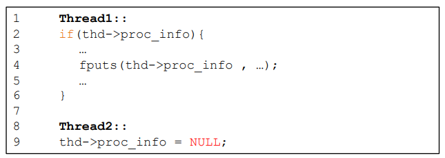
- 두개의 스레드가 동시에 thd->proc_info에 접근
- 해결법 : 해당 부분에 Lock을 더한다

###  Order Violation

- 메모리 접근의 순서가 요구한대로 안되고, 뒤바뀜

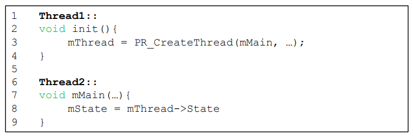

- Thread2에서 실행되는 문장은 초기화 된 후 실행 돼야함
- 해결법 : Condition Variable을 사용해서 Ordering을 강제함

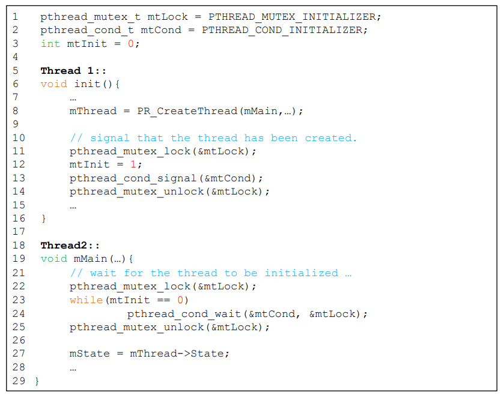

## Deadlock Bugs

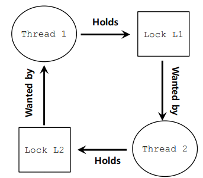

- 사이클의 존재
  - Thread1이 L1을 가지고있고, Thread2는 L2를 가지고 있고, 서로 기다리는 상황
- 발생하는 이유
  - 큰 코드 베이스의 경우, Component들 사이에 복잡한 의존성이 존재
  - Encapsulation의 특성 때문
    - 모듈화를 위해 구체적인 구현을 숨기려함
    - locking과는 잘 맞지 않음
- 예시) 자바 벡터 클래스
  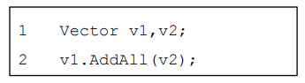
  - v1, v2를 위한 lock이 각각 필요함
  - 다른 스레드가 v2.AddAll(v1)을 거의 동시에 실행하게 되면, Deadlock 발생
- Deadlock의 발생조건
  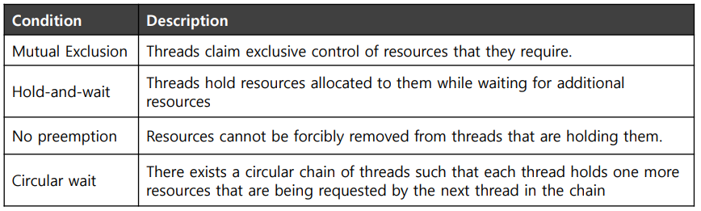
  - 위 4가지 조건중 하나라도 만족이 안되면, 데드락은 발생할 수 없음

### Circular Wait

- Lock의 획득에 Total Ordering을 제공
  - Global Locking Strategy에 조심스러운 디자인이 필요함
- 예시
  - 시스템에 락이 2개 (L1, L2) 있음
  - L2를 얻기 전 항상 L1을 얻게 함으로써 데드락 예방 가능

### Hold-and-Wait

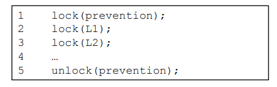

- 모든 락을 한번에 획득하게 함(Atomically)
  - Lock을 획득할 때 스레드 스위치가 없게 해야 함
- 문제점
  - 어떤 락이 필요한지 확인하고, 미리 획득해놔야 함
  - Concurrency 하락

### No Preemption

- 여러개의 Lock을 한번에 얻으려할때 문제점이 하나의 Lock을 기다릴 때 다른걸 들고있기 때문
- trylock()
  - deadlock-free, ordering-robust lock acqusition protocol을 만들기 위해 사용
  - 가용하면 락을 가져옴
  - 아니면 -1 리턴 (나중에 다시 해야함)

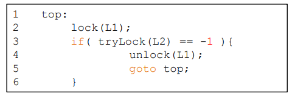

- livelock
  - 계속해서 특정 코드를 일정하게 시도하지만 **성과가없는 경우**(반복)
  - 해결법 : loop back하기전에 랜덤시간 딜레이를 추가함

### Mutual Exclusion

- Wait-Free
  - 강력한 하드웨어 명령을 사용
  - 명백한 Locking이 필요없는 자료구조를 만듬
    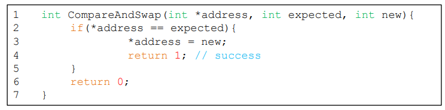
- 특정값을 일정량만큼 Atomic하게 증가시키고 싶을 때
  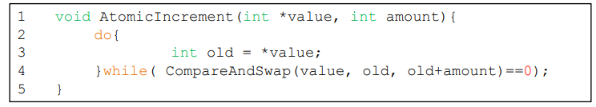
  - 획득하는 Lock이 없고
  - 데드락 가능성도 없음
  - livelock은 발생가능
- 더 복잡한 예시(리스트 삽입)
  
  - 여러 스레드가 동시에 호출할 시, 경쟁 조건 발생
  - 해결법
    - Lock Acquire/Release로 감싸기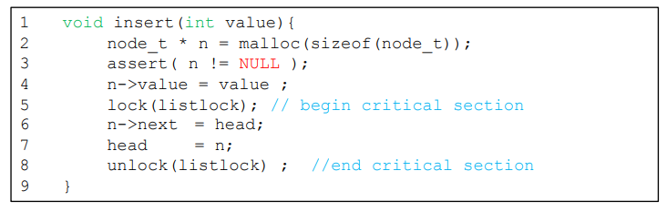
    - Wait-Free 방법(Compare-and-Swap)
      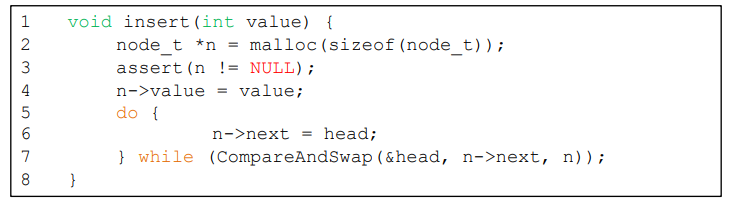

### Deadlock Avoidance via Scheduling

- Global Knowledge가 필요함

  - 각 스레드가 실행될 때 필요로 할 lock들
  - 스레드를 데드락 발생 가능성이 없는 순서로 실행시킴

- 2개의 프로세서 / 4개의 스레드가 있다고 가정
  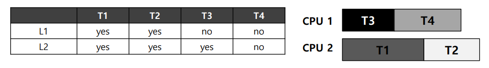

  - 똑똑한 스케쥴러는 T1/T2가 동시에 실행되지 않는다면 데드락 발생하지 않는다는걸 암

  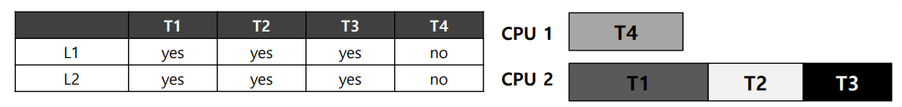

  - 비슷한 상황, T3도 동시에 실행되면 안되기 때문에 전체 실행 시간이 늘어남

#### Banker's Algorithm

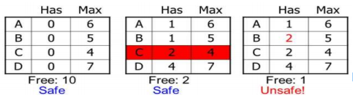

- ABCD를 다 도와주자
- Safe : 망하기 전
- Unsafe : 다 망함
- 안전상태를 유지할 수 있는 요구만을 수락하고, 불안전 상태를 초래할 요구는 나중에 만족될 수 있을때까지 계속 거절

### Detect and Recover

- 데드락이 가끔은 발생하도록 허용하고, 발생할 시 특정 행동 수행
  - 예시)  운영체제가 멈추면, 재부팅
- 다수의 데이터베이스 시스템이 이 방식 채용
  - Deadlock Detector가 주기적으로 실행
  - Resource Graph를 만들어 사이클이 생기는지 확인
  - 데드락 발생시 시스템 재시작