# File System

## Hard Disk Drives

- 컴퓨터 시스템에서의 메인 데이터 저장공간
  - 많은 수의 Sector들로 구성 (512 바이트 블록)
  - Address Space : N개의 섹터로 구성된 디스크 = Sector의 배열 (인덱스 0 ~ n-1)

### Interface

- 512 바이트의 Write 작업이 Atomic하다
- Multi-Sector Operation이 가능함
  - 많은 파일시스템이 한번에 4KB씩 Read/Write
  - Torn Write : 파워가 갑자기 나가면 큰 Write 중 일부만 완료됨
- 연속적인 덩어리에 있는 블럭에 접근하는것이 가장 빠른 방법
  - Sequential read/write
  - 그 어떤 Random Access Pattern보다 훨씬 빠르다

### Basic Geometry

- Platter(얇은 Magnetic Layer로 코팅된 알루미늄)
  - Circular hard surface
  - Magnetic Change를 유도해서 데이터를 영구적으로 저장
  - 각 Platter는 2개의 사이드를 가짐(Surface)

- Spindle
  - Platter를 돌리는 모터에 연결됨
  - 돌아가는 속도가 RPM(Rotations Per Minute)으로 측정됨
    - 보통 7200 ~ 15000 RPM
- Track
  - 섹터들로 구성된 동심원들
  - Track의 각 Surface에 데이터가 인코딩됨
  - 하나의 Surface : 많은 트랙을 포함

- Disk Head(Surface 하나당 Head 하나)
  - 읽기 / 쓰기 작업을 Disk Head가 수행함
  - 하나의 Disk Arm에 달린채로 Surface 위를 돌아다님

- Rotational Delay : 찾고있는 Sector가 Rotate 해야하는 시간
- Seek : Disk Arm을 알맞은 트랙으로 옮기는것
  
  - Seek time : Seek 작업에 걸린 시간
  - 가장 비용이 높은 디스크 Operation 중 하나
  - Phases
    - Acceleration : Disk Arm이 움직임
    - Coasting : Arm이 최대속도로 움직임
    - Deceleration : Disk Arm이 느려짐
    - Settling : Head가 올바른 Track에 조심스럽게 자리함
      - Settling Time이 매우 중요 (0.5 ~ 2 ms)
- Transfer : I/O의 마지막 페이즈
  - 데이터를 읽어오거나 Surface에 쓰기
  - Complete I/O Time : Seek, Waiting for the Rotational delay, Transfer

- Track Skew : Track Boundary를 횡단해야할때도 Sequential Read가 똑바로 이뤄져야함

- Cache(Track Buffer)
  - 디스크에 읽기/쓰기 할 데이터를 Hold
    - 드라이브가 요청에 빠르게 응답할 수 있도록 함
    - 적은양의 메모리(8~16MB)
  - Writeback(Immediate Reporting)
    - Write가 끝났음을 알림(데이터를 **메모리에 넣었을때**)
    - 빠르지만 위험함
  - Write Through
    - Write가 끝났음을 알림(데이터가 **디스크에 써졌을때**)

- I/O Time

  - I/O Time
    
  - Rate of I/O
    
  - SCSI VS SATA
    
  - Random Workload : 디스크의 랜덤 위치에 4KB Read명령 수행
  - Sequential Workload : 디스크에서 연속적인 100MB 읽기 작업 수행

  

### Disk Scheduling

- 어떤 I/O 요청을 다음으로 스케쥴할지 판단함
- SSTF(Shortest Seek Time First) 
  - Track을 기준으로 I/O 요청을 줄세움
  - 가까운 트랙먼저 완료시킴
  - Problems
    - 운영체제가 Drive Geometry를 모름
      - OS가 NBF(Nearest Block First)순으로 작업 수행
    - Starvation
      - 안쪽 트랙에 꾸준한 요청이 있다면, 다른 트랙에 있는 애들은 Starve
- Elevator 
  - Sweep : A Single pass across the disk
    - 이미 한번 Sweep 한 Track에서 요청이 오면, 다음 Sweep차례까지 기다리게 함
  - Scan (Elevator)
    - 바깥쪽에서 안쪽으로 Sweep 한 다음 안쪽에서 바깥쪽으로 Sweep 반복
  - F-SCAN
    - Sweep 하고 있을때는 요청을 받지않음(Queue를 Freeze)
    - 멀리있는 요청의 Starvation을 방지
  - C-SCAN (Circular SCAN)
    - 바깥쪽에서 안쪽으로 Sweep, 다시 바깥쪽으로 가서 똑같이 Sweep
    - Inner / Outer 트랙에게 조금 더 공평
- SPTF(Shortest Positioning Time First)
  
  - Rotation이 Seek보다 빠른 경우 : 16 -> 8 순
  - Seek보다 Rotation이 빠른 경우 : 8 -> 16 순
  - 현대의 드라이브들은 Seek/Rotation시간이 거의 동일함 -> **SPTF**가 유용함

- I/O Merging
  - 디스크로 가는 요청의 숫자를 줄여서 Overhead를 줄임
  - Example : Read blocks 33, 8, 34
    - 스케쥴러가 33,34를 읽으라는 하나의 명령으로 줄여서 디스크에게 전달함

## File System Basic

### Files and Directories

- File
  - 연속적인 Byte의 배열, 영원히 저장됨
    - 각 파일은 다양한 자료구조를 가짐
    - OS는 파일의 내용에 신경쓰지않음, 바이트의 스트림으로 취급
  - 각 파일은 이름을 가짐(절대경로 / 상대경로)
  - OS에서의 low-level 이름을 가짐(ex : inode)
    - ex) 각 프로세스는 unique한 pid를 가짐
  - 파일 헤더에 파일에 대한 다양한 메타데이터를 저장(파일의 종류 - file, directory 등)
- Directory
  - 디렉토리 Hierarchy를 만드는 특수한 파일
    - Root Directory
    - Home Directory
    - Working Directory
  - <file name, inode> 포함
    - 또는 low-level name / 첫번째 디스크 블럭
  - 
- 장비, 파이프, 소켓 또한 프로세스도 파일로 취급

### File System Interfaces

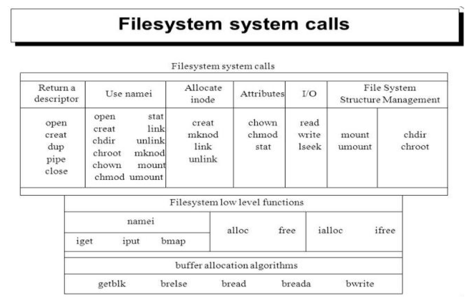

- Create, Access, Delete Files / Directories
- 단순한 명령도 있고 복잡한 명령도 있음

#### Create

- open() with create flag
  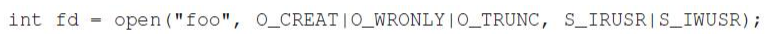
  - 인수 : 1) 이름 2) Flags 3) 권한
  - 리턴값 : fd(File Descriptor)
- creat() : 덜 사용됨
  

#### Read/Write

- read_size = read(fd, buf, request_size)
- writeen size = write(fd, buf, request_size)
  - 인수 : 1) fd 2) 데이터의 메모리 공간을 가리키는 버퍼 3) 요청 크기
  - 리턴값 : read or written size
- Example
  - Command Line
    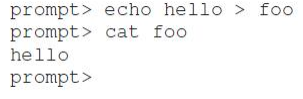
  - System Call
    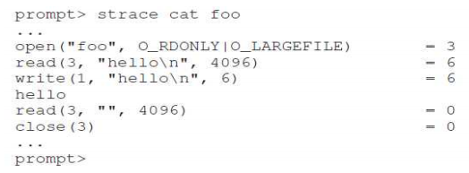

- Not Sequentially
  - 관습적파일 접근방법 : 파일이 Sequential하게 저장되어있다고 생각하고, offset을 늘림으로써 read/write
  - 랜덤 포지션에 접근하는 법 (NOT SEQUENTIAL)
    - lseek() 
      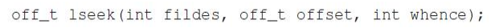
      - 인수 : 1) fd 2) 상대적인 offset 3) reference point
      - 현재 offset을 update
      - disk seek와 헷갈리면 안됨
- fsync()로 바로 쓰기
  - DRAM에 쓰는 속도 : 100ns
  - DIsk에 스는 속도 : 10,000,000ns
  - Delayed Write
    - 데이타를 DRAM(버퍼, 페이지 캐시)에 쓴 후 , dirty로 set
    - 나중에 dirty한 애들을 한꺼번에 디스크에 씀 (5~30초에 한번 주기적으로)
    - write grouping/reordering도 성능을 향상시킴
    - 내구성 : 사용자가 자신의 데이터가 영속적이라 생각하지만 사실 아님
      - 보장하는법
        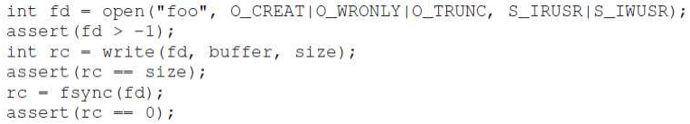

#### Rename

- CL viewpoint
  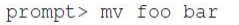
- System Call viewpoint
  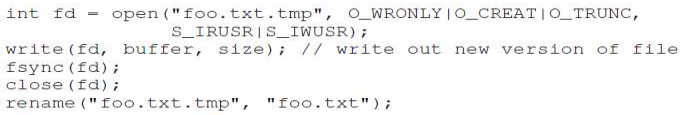
  - rename(old, new)
  - Atomic 하게 진행됨

#### Remove

- API
  - unlink(filename)
    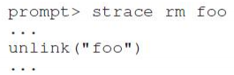

#### Getting information about files

- User Data : 사용자가 쓴 데이터
- Metadata : 파일 / 파일시스템 관리를 위해 파일 시스템이 작성한 데이터(inode 형식)
  - stat(filename, struct stat)
  - fstat(fd, struct stat)

#### Make Dir

- mkdir(name, permission)
  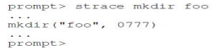
- 만들고 난 후 : 두개의 엔트리(부모 디렉토리 / 자기자신)
  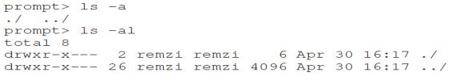

#### Delete Dir

- rmdir(file_name)
- 조심스럽게 사용해야함(잘못지우면 컴퓨터 큰일남)

#### Read Dir

- opendir(dp), readdir(dp), closedir(dp)

- ls

- 관용적인 디렉터리 이름
  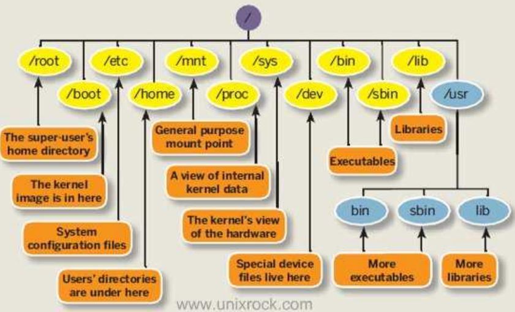

#### Hard Links

- Link
  - 이미 있는 파일을 접근하기 위한 새로운 파일을 만드는 것
    - 파일 이름과 inode를 연결
  - CL viewpoint
    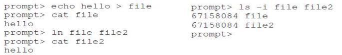
  - API : link(old, new)
  - 삭제하고 난 후
    - unlink()를 사용해 원래 파일을 삭제해도, 복사한 파일은 여전히 존재
  - 링크 Count
    - link count가 0일 때 실제로 데이터가 삭제됨

#### Symbolic Links(Soft)

- 다른 inode number를 가짐, 가지고 있는 데이터가 link된 파일의 이름
  - 파일, inode를 각각 하나씩 새로만듬
  - 다른 파일 시스템에 있는걸 링크하거나, 디렉토리에 링크 할 수 있음
    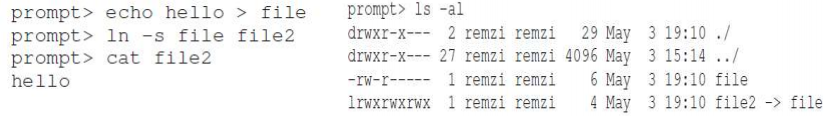

- 다른 파일로 향하는 링크 정보가 들어있음 : 윈도우 바로가기
- 원본이 삭제되면, 복사본도 삭제됨

#### Making and Mounting a File System

- Making
  - 정해진 방식으로 새로운 파일 시스템 생성
  - mkfs : make an empty file system
  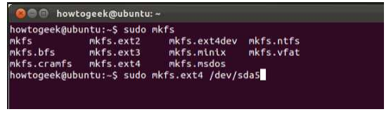
- Mounting
  - 파일시스템을 사용자들이 볼 수 있도록 만듬
  - 한 시스템 내에서 여러 종류의 파일 시스템을 하위에 구성하는 것이 가능
    - mount point는 mount된 FS의 root가 됨
  - mount 예시
    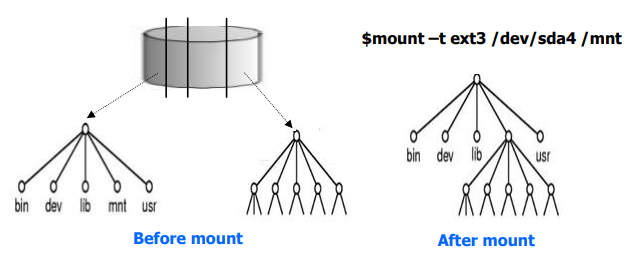

### File System Implementation

- 디스크

  - 파티션들로 구성
  - 각 파티션에 파일 시스템이 생성됨

- 파티션

  - 디스크 블록들로 구성

  - 데이터가 디스크 블록에 저장됨(보통 페이지와 같은 사이즈)

  - 64개의 디스크 블록으로 이루어진 파티션을 가정

    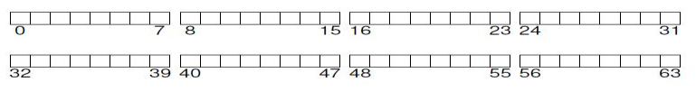

#### 파일 시스템 레이아웃

- 유저 데이터 : 8 ~ 63 블럭(동적으로 수정 가능)

  - 사용자에 의해 쓰여진 데이터

- Inode : 3 ~ 7 블럭

  - 파일 관리를 위한 메타데이터 (파일별로 하나씩)
  - 크기 = 256B, 한 블록에 16개의 inode(총 80개의 inode / 파일 생성 가능)
  - 인덱스 = inumber

- Bitmap : 1 ~ 2 블럭

  - 빈공간 관리를 위한 메타데이터 (할당 구조)
  - 1 : 데이터 블럭을 위해 사용, 2 : inode를 위해 사용

- Superblock : 0 블럭

  - 파일 시스템 관리를 위한 메타데이터 (파일 시스템 별로 하나씩)
    - 데이터 블럭이 몇개인지, inode가 몇개인지, 어디부터 시작하는지 등
  - mount시 사용됨

  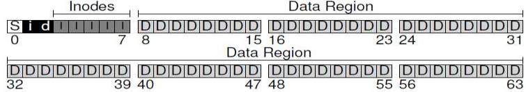

#### 파일 정리 : inode

- 파일의 메타 데이터를 저장하는 방법(index node - inode)

  - 파일의 정보(mode, uid, time, link, count, blocks 등)

  - 유저 데이터 블럭의 위치 : 멀티레벨 인덱스로 저장

    - **Direct** block pointers (10, 12, 15)

    - Single/Double/Triple **indirect** block pointers (1/1/1)

    - ##### 짧은 파일은 빨라지고, 큰 파일도 지원함

  - 다른 접근법 ; FAT(linked based), Extent-based, log-based

- inode 찾기
  - inode : 디렉토리 엔트리 = <file_name, i_number>
  - 전체 inode수 / 한 블럭에 들어가는 inode 수를 offset으로 활용
  
- User Data
  - inode를 찾는다
  - 현재 오프셋 / 디스크 블럭 사이즈
    - 몫은 inode를 포인터를 찾을때, 나머지는 오프셋으로 사용

#### 디렉토리 정리

- 디렉토리
  - <file name, inode number>
  - 빠른 검색을 위해 파일 이름 길이, 레코드 길이를 추가
    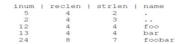
  - 더 복잡한 구조를 쓸 수도 있음(XFS의 B-tree 등)
- Free Space
  - 비트맵 : 하나의 디스크 블럭(또는 inode)당 하나의 비트, free인지 아닌지 표시
  - 다른 접근법 : free-list, tree 등
  - Pre-allocation : batch manner로 free disk 블럭을 할당
    - overhead 줄이고, 인접한 할당

#### 접근경로(읽기/쓰기)

- 디스크에서 파일 읽기 : /foo/bar 파일(12KB)을 열어 읽은 뒤, 닫기
  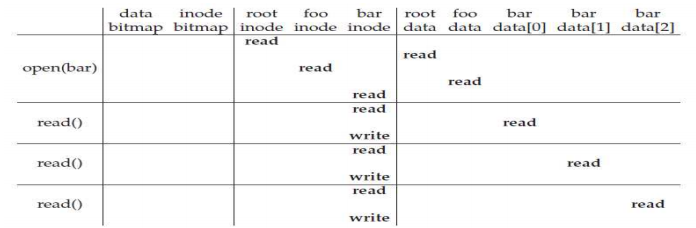
  - Open : 디렉토리 트리 순회, fd를 inode에 연결
  - Read : inode를 사용해서 디스크 블럭의 위치를 찾아 읽기, 최근접근 시간을 inode에 업데이트
  - Close : fd, 관련 자료구조를 할당해제 (디스크에서의 활동은없음)
  - bar의 inode를 반복적으로 읽어오는 작업 : 캐싱하면 효율상승
- 디스크에 파일 쓰기 : /foo/bar 파일을 만들고, 데이터를 쓰고 닫기
  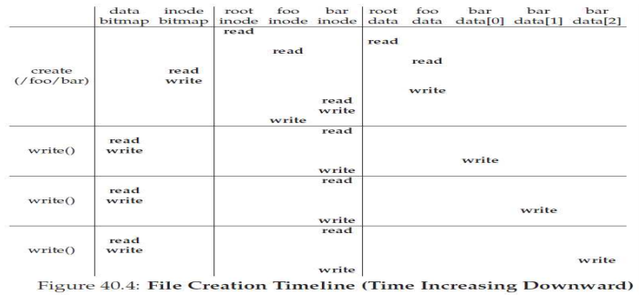
  - Open 
    - bar를 위한 inode를 새로 만들고, i-bitmap을 업데이트
    - foo의 데이터 블럭에 새로운 엔트리 추가(파일 생성을 위해 10번의 I/O)
  - Write
    - 쓰기 위해 5번의 I/O (d-bitmap 읽기/업데이트, inode 읽기/업데이트, 실제 데이터 쓰기)

#### 캐싱 / 버퍼링

- 문제점 : 각각의 open / read / write가 너무많은 I/O작업을 요구함
- 캐싱
  - DRAM에 주요 디렉토리(/inode, /data, current directory 등)를 캐싱
  - DRAM에 최근 사용한 파일의 inode, data를 캐싱
  - LRU Replacement policy, dynamic cache size management 등으로 관리

- 버퍼링(Delayed Write)
  - 쓰기 작업을 여러개 한번에 함
    - seek overhead를 줄임
  - 쓰기를 피함 (임시파일 활용)
  - power fault / crash로 인한 power loss -> fsync() 또는 직접적인 I/O

## 프로그래머스

- File descriptor table
  per process open file table
  reserve 0,1,2 for stdin, stdout, stderr
- File table
  system wide open file table
  Offset이 있는 곳
- vnode table
  file function table
  inode 내용 포함