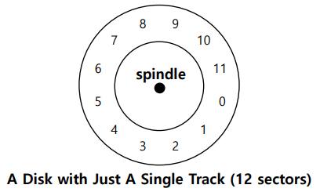
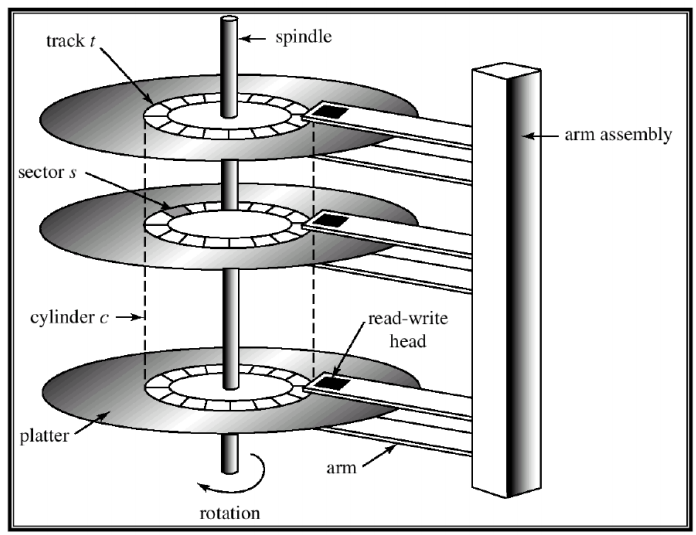
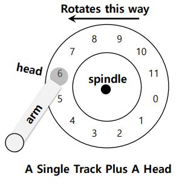
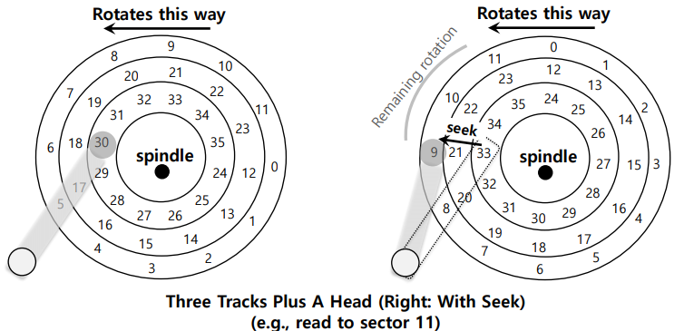
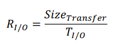
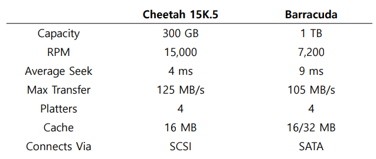
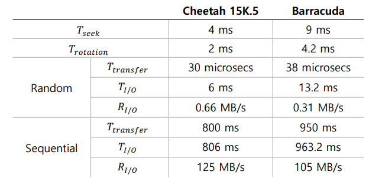
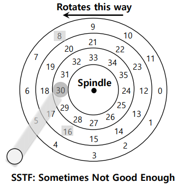

# File System

## Hard Disk Drives

- 컴퓨터 시스템에서의 메인 데이터 저장공간
  - 많은 수의 Sector들로 구성 (512 바이트 블록)
  - Address Space : N개의 섹터로 구성된 디스크 = Sector의 배열 (인덱스 0 ~ n-1)

### Interface

- 512 바이트의 Write 작업이 Atomic하다
- Multi-Sector Operation이 가능함
  - 많은 파일시스템이 한번에 4KB씩 Read/Write
  - Torn Write : 파워가 갑자기 나가면 큰 Write 중 일부만 완료됨
- 연속적인 덩어리에 있는 블럭에 접근하는것이 가장 빠른 방법
  - Sequential read/write
  - 그 어떤 Random Access Pattern보다 훨씬 빠르다

### Basic Geometry

- Platter(얇은 Magnetic Layer로 코팅된 알루미늄)
  - Circular hard surface
  - Magnetic Change를 유도해서 데이터를 영구적으로 저장
  - 각 Platter는 2개의 사이드를 가짐(Surface)

- Spindle
  - Platter를 돌리는 모터에 연결됨
  - 돌아가는 속도가 RPM(Rotations Per Minute)으로 측정됨
    - 보통 7200 ~ 15000 RPM
- Track
  - 섹터들로 구성된 동심원들
  - Track의 각 Surface에 데이터가 인코딩됨
  - 하나의 Surface : 많은 트랙을 포함

- Disk Head(Surface 하나당 Head 하나)
  - 읽기 / 쓰기 작업을 Disk Head가 수행함
  - 하나의 Disk Arm에 달린채로 Surface 위를 돌아다님

- Rotational Delay : 찾고있는 Sector가 Rotate 해야하는 시간
- Seek : Disk Arm을 알맞은 트랙으로 옮기는것
  
  - Seek time : Seek 작업에 걸린 시간
  - 가장 비용이 높은 디스크 Operation 중 하나
  - Phases
    - Acceleration : Disk Arm이 움직임
    - Coasting : Arm이 최대속도로 움직임
    - Deceleration : Disk Arm이 느려짐
    - Settling : Head가 올바른 Track에 조심스럽게 자리함
      - Settling Time이 매우 중요 (0.5 ~ 2 ms)
- Transfer : I/O의 마지막 페이즈
  - 데이터를 읽어오거나 Surface에 쓰기
  - Complete I/O Time : Seek, Waiting for the Rotational delay, Transfer

- Track Skew : Track Boundary를 횡단해야할때도 Sequential Read가 똑바로 이뤄져야함

- Cache(Track Buffer)
  - 디스크에 읽기/쓰기 할 데이터를 Hold
    - 드라이브가 요청에 빠르게 응답할 수 있도록 함
    - 적은양의 메모리(8~16MB)
  - Writeback(Immediate Reporting)
    - Write가 끝났음을 알림(데이터를 **메모리에 넣었을때**)
    - 빠르지만 위험함
  - Write Through
    - Write가 끝났음을 알림(데이터가 **디스크에 써졌을때**)

- I/O Time

  - I/O Time
    
  - Rate of I/O
    
  - SCSI VS SATA
    
  - Random Workload : 디스크의 랜덤 위치에 4KB Read명령 수행
  - Sequential Workload : 디스크에서 연속적인 100MB 읽기 작업 수행

  

### Disk Scheduling

- 어떤 I/O 요청을 다음으로 스케쥴할지 판단함
- SSTF(Shortest Seek Time First) 
  - Track을 기준으로 I/O 요청을 줄세움
  - 가까운 트랙먼저 완료시킴
  - Problems
    - 운영체제가 Drive Geometry를 모름
      - OS가 NBF(Nearest Block First)순으로 작업 수행
    - Starvation
      - 안쪽 트랙에 꾸준한 요청이 있다면, 다른 트랙에 있는 애들은 Starve
- Elevator 
  - Sweep : A Single pass across the disk
    - 이미 한번 Sweep 한 Track에서 요청이 오면, 다음 Sweep차례까지 기다리게 함
  - Scan (Elevator)
    - 바깥쪽에서 안쪽으로 Sweep 한 다음 안쪽에서 바깥쪽으로 Sweep 반복
  - F-SCAN
    - Sweep 하고 있을때는 요청을 받지않음(Queue를 Freeze)
    - 멀리있는 요청의 Starvation을 방지
  - C-SCAN (Circular SCAN)
    - 바깥쪽에서 안쪽으로 Sweep, 다시 바깥쪽으로 가서 똑같이 Sweep
    - Inner / Outer 트랙에게 조금 더 공평
- SPTF(Shortest Positioning Time First)
  
  - Rotation이 Seek보다 빠른 경우 : 16 -> 8 순
  - Seek보다 Rotation이 빠른 경우 : 8 -> 16 순
  - 현대의 드라이브들은 Seek/Rotation시간이 거의 동일함 -> **SPTF**가 유용함

- I/O Merging
  - 디스크로 가는 요청의 숫자를 줄여서 Overhead를 줄임
  - Example : Read blocks 33, 8, 34
    - 스케쥴러가 33,34를 읽으라는 하나의 명령으로 줄여서 디스크에게 전달함