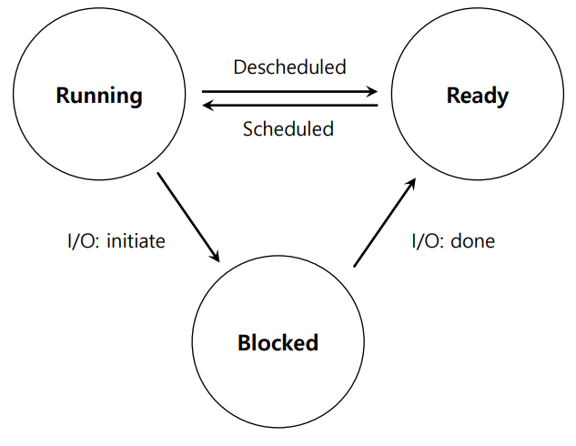

# Process - The Abstraction
- CPU Virtualizing : 많은 CPU가 존재하는 것처럼 보이게 하는 것
  Time sharing : 하나의 프로세스를 실행하다가, 잠시 멈추고 다른 프로세스를 실행하는 것 / 잠재적 비용은 성능
## Process
- Memory(Address Space) : Instructions, Data Section
- Registers : Program Counter, Stack Pointer
### API
- Create : 프로그램 실행을 위해 새 프로세스를 만듬
- Destroy : 제어가 안되는 프로세스를 중지
- Wait : 프로세스가 작동을 멈출 때까지 대기
- Miscellaneous Control : 프로세스를 유예하고 다시 재개시키는 방법
- Status : 프로세스에 관한 상태 정보 받아오기
### Creation
1. 프로그램 코드를 메모리로부터 Address Space로 읽어온다(LOAD)
  - 원래는 디스크에 실행가능한 형태로 존재
  - OS가 무조건 한번에 다 불러오는것이 아니라, 코드/데이터 조각을 필요할 때 불러옴(Lazy Loading)
2. 프로그램의 런타임 스택이 할당됨
  - 지역 변수, 함수 인수, 반환 주소를 저장 할 때 사용
  - main 함수의 argc, argv로 초기화
3. 프로그램의 Heap이 생성됨
  - 동적요청으로 할당된 데이터를 위해 사용 ex) malloc/free, new
4. 다른 초기화 작업 진행
  - I/O 셋업 : 각 프로세스는 처음에 3개의 open file descriptors(stdin, stdout, error)를 가짐
5. 프로그램 시작 - 주로 main 함수, OS가 CPU의 제어권을 새로 생성된 프로세스에 넘김
### States
- Running : 현재 프로세스가 프로세서에서 실행 중이다
- Ready : 프로세스가 실행준비를 완료했지만, 모종의 이유로 OS가 현재는 실행하지 않기로 함
- Blocked : 프로세스가 특정 연산을 수행중이다. 프로세스가 디스크에 입출력 요청을 했을 때

### Data Structures
- Process List : Ready / Blocked / Running 각 상태의 리스트
- Register Context
- PCB(Process Control Block) : 프로세스에 관한 정보를 가지고 있는 구조

# Process API
- fork() : 새로운 프로세스를 만듬 / 별도의 Address Space, Registers, PC를 가짐
- wait() : 시스템 콜은 Child가 실행완료 후 종료 될 때까지 return 하지 않음
- exec() : 다른 프로그램을 실행

# Mechanism : Limited Direct Excecution
- OS는 time sharing 전략을 통해 물리적인 CPU를 공유해야 함
- 문제점 : 성능 - overhead없이 virtualization 어떻게?, 컨트롤 : CPU control을 유지하면서 프로세스를 효율적으로 실행하는 법?
## Direct Excecution
- 그냥 CPU에서 바로 프로그램 실행
- 실행중인 프로그램에 Limit이 없으면, 운영체제는 아무 Control이 없음
### Problem 1 : Restricted Operation
- 프로세스가 디스크에 입출력 요청을 할 경우
- CPU / Memory와 같은 시스템 자원에 접근권한을 얻으려 할 때
- Solution : Protected Control Transfer를 사용
  -> user mode : 프로그램들이 하드웨어 자원에 모든 접근 권한은 없음
  -> kernel mode : OS가 machine의 모든 자원에 접근 권한이 있음
#### System Call
- 커널이 조심스럽게 핵심 기능을 프로그램에게 오픈하는 것
  ex) 파일 시스템 접근, 프로세스 생성/제거, 다른 프로세스와 소통, 더 많은 메모리 할당
- Trap Instruction : 커널안으로 들어가서 Kernel Mode로 바꿈
- Return-From-Trap Instruction : System Call을 했던 프로그램으로 돌아감, User Mode로 바꿈
- OS측에서 Trap Table을 가지고 있음 -> 프로그램에서 Trap하는지 검사
### Problem 2 : 프로세스간의 Switching
- OS가 process switching을 하기 위해 CPU 제어권을 가져오는 법
    Cooperative Approach : 시스템 콜을 기다림
    Non-Cooperative Approach : OS가 제어권을 가져옴
#### Cooperative Approach
- 프로세스들이 시스템 콜을 할 때 잠깐 CPU 제어권을 포기함
- 이 때 OS가 다른 프로세스가 일하게 할 수 있음
- 해서는 안될 짓을 할 때 OS로 넘기기도 함(0으로 나누기, 접근권한이 없는 메모리에 접근)
- 무한루프가 발생하면, 재부팅 하는 수 밖에 없음
#### Non-Cooperative Approach
- Boot Sequence 때, OS가 타이머를 시작함
- 타이머는 ms단위로 interrupt 발생시킴 -> 현재 실행중인 프로세스를 중지시키고, 상태를 저장한 뒤,
  미리 정의 된 OS의 interrupt handler를 실행시킴
### Saving / Restoring Context
- 스케쥴러가 결정 : 현재 실행중인 프로세스를 계속 실행 할지, 다른 프로세스로 바꿀지
  -> 바꾸기로 결정하면 **Context Switch** 발생
#### Context Switch
- 어셈블리 코드의 low-level piece
- 현재 프로세스의 register value 몇개(PC, 일반목적 Register, Kernel stack pointer)를 커널스택에 저장
- 다음으로 실행 할 프로세스의 register value 몇개를 커널 스택에서 받아옴
- 다음으로 실행 할 프로세스를 위해 해당 커널스택으로 switch
#### Concurrency
- Interrupt / Trap Handling 도중 다른 Interrupt가 발생하면?
  -> Interrupt Processing에 들어갈때 해당 작업 도중 Interrupt가 발생하지 못하게 하고, 복잡한 locking scheme으로 접근을 막는다
