# Thread & Lock

- Thread : 하나의 실행흐름
- Lock : 접근 못하도록 하는 것

## Concurrency

### Thread

- Code, Data, Heap, Files를 공유하는 실행흐름들(즉, Address Space를 공유함)

- 스레드 별로 Ready / Running / Blocked 상태가 각각 있음
  - 리스트 형태로 스레드들의 상태 표현
  - 리스트의 노드는 TCB(Thread Control Block) / 레지스터,스택 포함
    - 프로세스 리스트의 PCB(Process Control Block)과 비슷한 개념
  - 스레드 차원에서의 Context Switch가 일어남
    - T1 -> T2 : T1의 레지스터를 저장하고, T2의 레지스터를 불러옴(Address Space는 유지)
  
  
- 스레드끼리 소통하는 법
  - 공유 자원인 전역변수로 소통
  - 프로세스끼리는 파일로 소통해야됨(느림)

#### 장점

- 생성이 빠름
  - 프로세스 하나 : 무거움, 스레드 하나 : 가벼움
- I/O로 넘어갈 것 같을 때, 즉 Blocked 상태가 될 것 같을 때 다른 스레드로 넘기도록 할 수 있음

#### 스레드 생성

- 스레드를 언제 생성할지는 코딩 단계에서 표현
  - 특정 함수 시작시 스레드 시작하도록 코딩
    - 어떤 함수를 호출하는지로 스레드 구분 가능

- 스케쥴러에 따라 그때그때 실행 흐름/순서가 달라짐

#### Shared Data 문제

- 지역변수에 static을 선언해주면 수명이 전역으로 길어짐 -> 인스턴스가 하나
- **비결정적**인 결과를 낳게됨(결과가 그때그때달라짐)

- 발생 이유

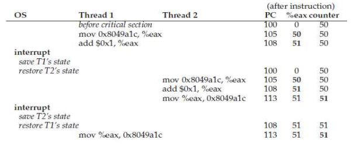

- 두 스레드가 동시에 같은 공유 데이터에 접근 했을 때 문제 발생(**경쟁 상태**)
  - 실행 할 때마다 **결과가 달라짐**
  - Critical Section : 경쟁 상태가 나타날 수 있는 코드부분
- 해결법
  - **Atomicity** : 한번에 다 하거나 아예 안하거나
  - **Critical Section**이 쪼개지지 않도록 해야함
  - **Mutual Exclusion** : Critical Section에 하나의 스레드만 접근 허용하는 것

#### Atomicity

- Super Instruction 만들기
  - 해당 코드를 **Atomic한 Instruction**으로 만들어버리는 것
  - 현실적이지 못함 : 경우의 수가 너무많고, 더 Generic한 Form이 필요
- **인터럽트** 꺼버리기
  - Context Switch를 못하게 하는 것
  - 간단하지만 **너무 오래동안 꺼버리면 문제** 발생
- Mutual Exclusion API 사용하기
  - **Lock**, Semaphore, Conditional Value

#### Thread API

- **Process** 'fork' : **Thread** 'pthread_create'

### Locks

- Critical Section을 하나의 명령을 수행하는 것처럼 보이도록 하는 장치
  - lock 변수(전역 변수) : Available(unlocked, 0) / Acquired(locked, 1) 두가지의 상태 표시

#### API

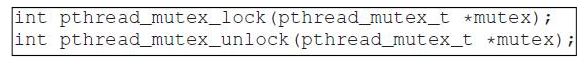

- lock : 매개변수로 주어진 변수를 lock하는 개념
  - 여기서 lock을 못 얻으면 대기상태로 들어감
- unlock : 매겨변수로 주어진 변수를 unlock하는 개념
  - 다른 스레드는 대기하도록 함

- trylock : lock을 못 얻으면 에러 발생

#### Building a Lock

- 하드웨어 / 운영체제 지원의 콜라보레이션으로 만들어야함
- 문제점 : Lock의 크기
  - Coarse-grained lock : 큰 critical section, lock 하나 사용
    - 간단하지만, parallelism 문제
  - Fine-grained lock : 작은 critical section, lock 여러개 사용
    - parallelism 지원하지만, 복잡함

#### Evaluating a Lock

- Mutual Exclusion : Lock이 제대로 작동하는지
- Fairness : 계속해서 **오래동안 기다리는** 스레드가 있는지
- Performance : Lock을 사용함으로써 생기는 Overhead의 양
- Progress(deadlock-free) : 동시에 여러 요청을 받았을때 한 스레드만 허가받아야함
- Bounded Wait : 대기하고 있는 스레드들 모두 결과적으로 enter해야함

#### Controlling interrupts

##### Disable Interrupt

- lock 할 때 인터럽트를 끄고, unlock 할 때 인터럽트를 켜는 방법
- 장점 : 간단함
- 단점
  - 하나의 CPU에서만 작동함(Context Switch일때만 경쟁조건 발생, Concurrent Execution일 때는 **발생X**)
  - 긴 시간동안 disable할 경우 lost interrupt 발생
  - 비효율적(느림)
  - 독점 / 무한루프에 빠질 가능성

##### SW-Only Approach

- Dekker's algorithm, Peterson's algorithm
- 장점 : 소프트웨어적 해결법임
- 단점
  - 이해하기 쉽지않음
  - 비효율적임
  - Relaxed memory consistency model을 사용하는 현대 시스템에서 틀림

##### Using HW atomic operations

- Simple Flag : Flag가 0이면 1로 바꿈, 1이면 0으로 변할때까지 기다림
  - 동시에 Critical Section 진입 가능 => Mutual Exclusion X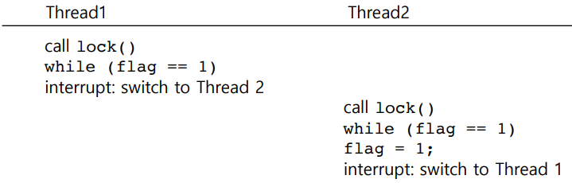
  - Spin-Waiting 시간때문에 시간낭비 발생
    - 계속해서 flag의 값을 확인하는 것 : CPU가 쓸데없는 일을 하고있는 것
  - 하드웨어가 지원하는 **Atomic Instruction** 필요
- **Naive Approach**
    - ./x86.py -p flag.s -t 1 -M count,flag -R ax -a bx=2 -c : 스레드가 하나일때 = 이상없음
    - ./x86.py -p flag.s -t 2 -i 2 -r -M count,flag -R ax -c : 결과는 맞지만 Critical Section 동시에
    - ./x86.py -p flag.s -t 2 -P 0011011 -M count,flag -R ax -c : 결과와 과정 다 틀림
  
- Test-and-Set Instruction(Atomic Exchange), spin lock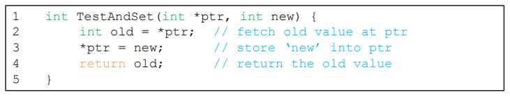
  - ptr에 있던 값을 리턴하고, 동시에 new값으로 업데이트
  - atomic하게 수행됨

  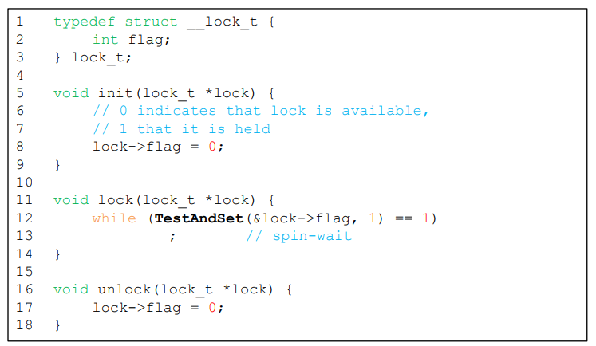

  - CPU 하나에서 정상적으로 돌아가려면 **선매권 있는**(preemptive) 스케쥴러 필요
  - Spin Lock의 평가
    - Correctness : **Yes**
      - 한번에 하나의 스레드만 Critical Section 진입 가능
    - Fairness : **No**
      - 공평성을 제어할 장치가 없음
      - Spin하고 있는 스레드는 평생 Spin할 수도 있음
    - Performance
      - **하나의 CPU**에서는 Overhead가 큼
      - **스레드의 수가 CPU의 수와 비슷**할 때는 좋은 편
- **Test&Set**
    - ./x86.py -p test-and-set.s -t 4 -R ax -M count -c -i 2 -r -S -v -a bx=100 -s 2000 | grep '1006 mov'
      - 결과는 맞지만 **Unfair**함(들쑥날쑥)
  
- Compare-and-Swap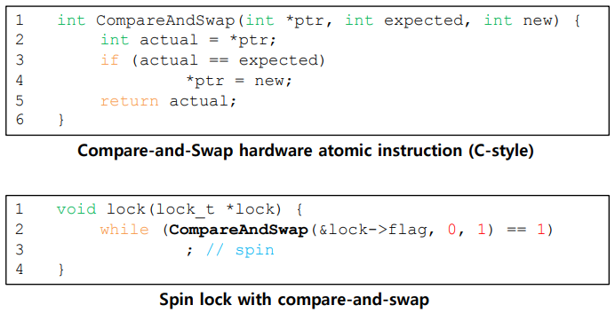
  - ptr의 값이 expected와 같은지 확인
    - 같으면 ptr의 값을 new로 교체
    - 같던 안같던 ptr의 주소에 있던 값 반환
  
- Load-Linked / Store-Conditional
  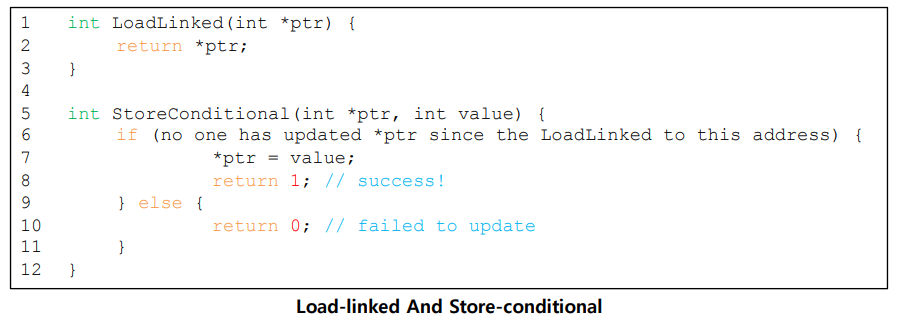
  - Store-Conditional : ptr의 주소가 **loadlinked** 된 후 ptr이 업데이트가 된 적이 없을 경우에만 진행
    - 성공하면 1 반환, ptr을 value값으로 변경
    - 실패하면 0 반환, ptr을 업데이트 하지 않음
      
  
- Fetch-and-Add
  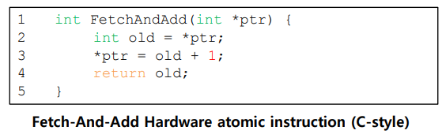
  
- ptr의 값을 반환하는 동시에 값을 1 증가시킴
  
- Ticket Lock
  - Fetch-and-Add로 구현 가능
  - **Fairness**를 고려한 방법, 모든 스레드가 진행하는 것을 확인
    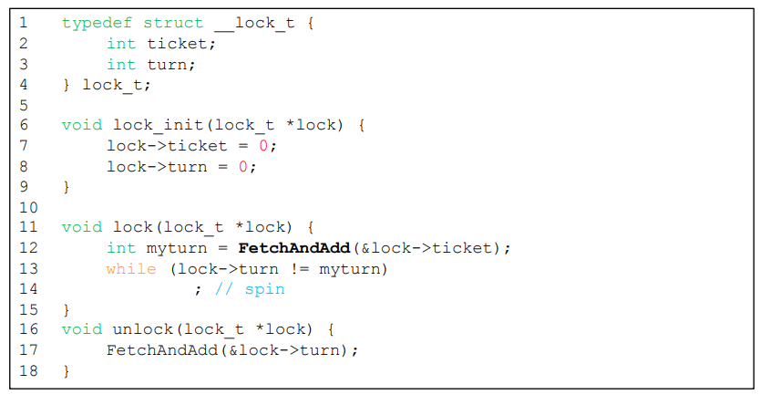
  - **Fetch&Add**
    - x86.py -p ticket.s -t 4 -R ax -M count,ticket,turn -c -i 2 -r -S -v -a bx=100 -s 2000 | grep '1007 mov'
      - 결과가 똑바로 나오고, Fair하게 진행됨
  - Yield(CPU 포기하기)
    - 내 차례가 아니면 바로 CPU 양보(Spin 최소화)
    - 낭비하는 시간이 존재하긴 하지만(Yield를 판단하는 시간), Time Slice 전체를 낭비하진 않음
  - 평가
    - Mutual Exclusion : O
    - Fairness : O
    - Performance : 전보다 효율적이지만, **여전히 overhead가 너무많음**
  
- Blocking Locks

  - Lock Spin을 하지말고, Block해버리자

  - park() : 스레드를 Run Queue에서 제거

  - unpark() : 스레드를 Run Queue로 되돌려놓음
    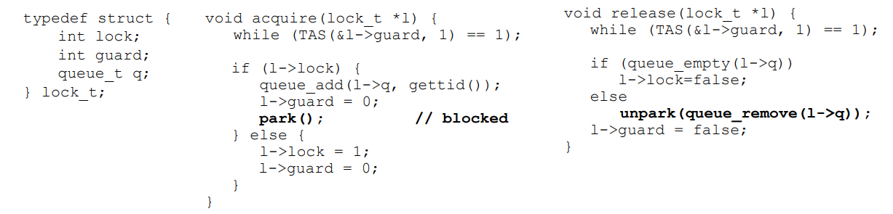

  - park() / unpark() 행위를 atomic 하게 만들기 위해 **guard**라는 작은 lock을 추가

    - guard를 풀지 않고 park하게 되면, 경쟁조건 발생

      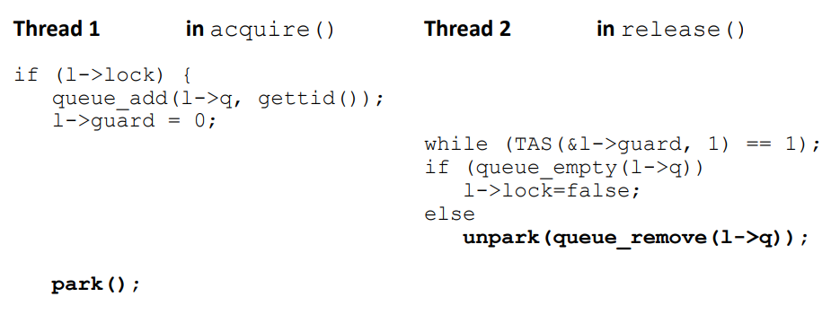

    - t1이 큐에는 스레드를 넣었지만 park 하기전에 t2에서 큐에있는 스레드를 unpark해버림

    - setpark()를 사용해 해결해야함 : park할 때 이미 unpark됐으면 block 안함
      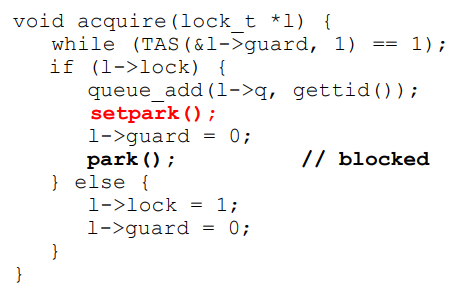

  - guard도 작은 lock이기 때문에 spin이 발생하지만, 
    그 길이를 프로그래머가 알 수 있고, **짧기 때문에 무시가능**