# Introduction To Network Layer

## Network Layer Services

- 네트워크 레이어 프로토콜들의 역할

### Packetizing

- 네트워크 레이어의 제 1 역할
- Source Host : Encapsulation
  - 위쪽의 프로토콜로부터 Payload를 받음
  - src, dst 주소를 헤더에 추가하고, 다른 추가적인 정보를 넣음
  - datalink layer에 이를 전달
  - SAR(Segmentation and Reassembly)
    - Payload의 내용을 변경하는건 허용되지 않음(전달하기에 용량이 너무 큰 경우를 제외하면)
    - 용량이 너무 큰경우 Fragmentation(Segmentation)을 거쳐야함
- Destination Host : Decapsulation
  - 데이터 링크 레이어로부터 패킷을 전달받음
  - 패킷을 Decapsulate하고, Payload를 위쪽 프로토콜로 넘긴다
  - SAR
    - 패킷이 조각난 상태면, 모든 조각이 도착할때까지 기다리고, 재조립해서 위쪽 프로토콜로 전달함
- Routers in the path
  - 패킷을 Decapsulate하는 것이 **허용되지 않음**
    - 패킷의 조각내야 하는 경우는 가능
    - 패킷을 조각내고 같은 헤더를 각각의 조각에 넣고, 추가적인 변경을 거친 후 보냄
  - src / dst를 바꾸는것도 허용 안됨
  - 패킷을 올바른 다음 네트워크로 보내기 위해 주소를 참고하기만 함

- 네트워크 레이어는 우체국의 역할을 한다고 보면 됨, 패키지를 Sender에서 Receiver로 **내용 변화 없이 무사히 전송**하는 것을 목적으로 함

### Routing and Forwarding

- Routing : Destination으로 가는 최적의 길을 찾아야 할 책임이 있음

- Forwarding 

  - Unicast Routing : 라우터가 Attached Network로 부터 패킷을 받으면, 해당 패킷을 다른 Attached 네트워크로 보내야 함
  - Multicasting Routing : 라우터가 Attached Network로 부터 패킷을 받으면, 해당 패킷을 **여러** Attached 네트워크로 보내야 함
  - 이 결정을 위해서 라우터가 목적지 주소와 헤더의 라벨을 사용해서 routing table에서 다음 output interface 을 결정함
  - Forwarding Table / Routing Table : 다음 목적 네트워크를 결정하는 테이블

  

### Other services

- Error Control
  - 직접적으로 에러 컨트롤을 제공하지 않음(CRC 등)
  - 패킷이 조각 난 경우가 있을 수 있기 때문에, 이 단계에서의 오류 검사는 비효율적
  - 그러나 datagram에 Checksum Field가 추가됨(손상 탐지)
  - ICMP : 에러 컨트롤 제공
- Flow Control
  - Receiver를 과부화시키지 않는 선에서 Source가 보낼 수 있는 데이터 양을 규제
  - 위쪽 레이어가 Flow Control Service를 제공, 따라서 네트워크 레이어에서의 추가적인 Flow Control은 전체 시스템을 비효율적으로 만듬
- Congestion Control
  - Source가 보내는 datagram의 수가 네트워크/라우터의 한계용량 이상일 경우 발생
  - 라우터가 datagram 몇개를 잃어버릴 수도 있음
    - Sender가 똑같은 packet을 보내는 경우가 생길 가능성이 높음
  - Congestion이 누적되면 시스템이 털썩해버려서 아무 Datagram도 전달 안되는 정도까지 이어질 수도 있음
- Quality Of Service(QoS)
  - 통신 서비스의 질이 점점 더 중요해짐
  - 네트워크 레이어를 건드리지 않기 위해, 위쪽레이어에서 다룸
- Security
  - Security Provision 없이 설계됨

## Packet Switching

- 네트워크 레이어에서 Switching이 발생
- 라우터는 Input Port와 Output Port 사이의 연결을 만드는 스위치임
  - 전달하는 역할

### Datagram Approach : Connectionless Service

- 초기 인터넷 디자인에서는 네트워크 레이어가 Conectionless Service로 디자인 됐음
- 패킷 하나하나를 독립적으로 보며, 패킷 간의 관계가 없는것으로 취급
- 패킷을 운송하는데에만 역할이 있다고 봄 (SRC -> DST)
- 메세지 안의 패킷이 Destination 방향으로 같은 Path를 이용 할 수도 안할 수도 있음

- 어디로 보낼지는 패킷의 목적지 주소가 결정

### Virtual-Circuit Approach : Connection-Oriented Service

- 메세지에 속하는 패킷들이 모두 관계가 있다
- 데이터그램의 모든 메세지가 전송되기전에, Datagram들의 이동경로가 설정하기 위해 Virtual Connection이 이뤄져야 함
- Connection Setup이 끝나면, 해당 데이터그램들은 같은 이동경로를 이용
- 패킷은 소스와 목적지의 주소는 물론 해당 패킷의 Virtual Path를 정의하는 Flow Label(Virtual Circuit Identifier)도 가지고 있어야 함

- CO Service를 만들기 위해서 3단계가 프로세스가 필요함

#### Setup Phase

- 라우터가 Virtual Circuit을 위해 Entry를 만듬

- 두개의 예비 패킷이 Sender와 Receiver 사이에서 교환되어야 함

  - Request Packet
    - 소스 -> 목적지
    - 소스와 목적지 주소 포함
    - 라우터들은 outgoing part를 정해주고, 최종목적지에서 Label을 지정해줌

  

  - ACK Packet
    - Switching Table에서 Entry를 마무리 지음
    - 라우터 별로 Incoming/Outgoing Label이 달라짐

  

#### Data-Transfer Phase

- 모든 라우터가 특정 Virtual Circuit을 위한 Forwarding Table을 만든 후에, 한 메세지에 속하는 네트워크 레이어 패킷들을 보낼 수 있게 됨

#### Teardown Phase

- 모든 패킷을 다 보내고 난 뒤, 소스가 Teardown Packet을 보냄
- 목적지는 이를 받고 Confirmation Packet을 보냄
- 이를 확인한 라우터들은 해당하는 Entry들을 테이블에서 삭제함

## Network-Layer Performance

- 네트워크 프로콜을 사용하는 위쪽의 프로토콜에서는 이상적인 서비스를 원하지만 네트워크 레이어는 완벽하지 못함
- 성능을 Delay, Throughput, Packet Loss로 측정 가능
- Congestion Control은 성능을 향상시킬 수 있는 요소

### Delay

- 네트워크로부터 즉각적인 응답을 원하지만, 소스에서 목적지로 이동하며 딜레이 발생
- 4개의 type으로 구분
  - Transmission Delay = packet length / transmission rate
  - Propagation Delay = distance / propagation speed
  - Processing Delay = 라우터/목적지 호스트에서 패킷을 가공하는데에 소모되는 시간
  - Queuing Delay = 패킷이 라우터의 Input/Output 큐에서 기다리는 시간
- Total Delay : 라우터 수를 알면 계산 할 수 있음
  - (n+1) (Delay_tr + Delay_pg + Delay_pr) + (n) (Delay_qu)
  - n개의 라우터가 있으면 n+1개의 링크가 있음

### Throughput

- 1초안에 특정 지점을 지나가는 비트의 수

- 패킷은 Path를 지나며 각자 다른 링크, 다른 Transmission Rate를 겪음

- 전체 Path의 Throughput 측정

  - Throughput = min {TR_1, TR_2, ... , TR_n}

  - 평균 Throughput은 Bottleneck으로 결정됨

    

  - 메인 링크의 Transmission Rate는 200, 3개로 나눠지기 때문(18.12)

    

### Packet Loss

- 통신 성능에 심각한 영향을 미치는 문제점
  - 통신 도중 잃어버리는 패킷의 수
- 라우터가 하나의 패킷을 가공하는 도중 다른 패킷을 받으면, 버퍼에 임시로 저장해둬야 함
  - 버퍼의 크기가 제한적임
  - 버퍼가 가득차면 다음 패킷은 DROP
  - 재송신을 해야하고, 오버플로우 발생에 따른 더 많은 Packet Loss로 이어짐

### Congestion Control

- 성능을 향상시키기 위한 메커니즘

- 인터넷 모델에서는 명쾌하게 다뤄지지 않음

- Throughput, Delay와 관련됨

  

- 네트워크의 용량보다 Load가 훨씬 작으면, 딜레이가 최소화
  
  - Propagation Delay, Processing Delay으로 구성(무시해도 될 정도)
  
- Load가 네트워크의 용량을 채우게 되면, 딜레이가 확 늘어남(Queuing Delay 추가)
  
  - Load가 네트워크의 용량을 넘어서면 딜레이가 무한대가 됨
  
- 네트워크의 용량보다 Load가 작으면, Throughput이 Load에 비례해서 상승

- 네트워크의 용량보다 Load가 커지면, Throughput이 급락
  - 라우터가 패킷을 버려야 함
  - 소스는 계속해서 재송신하기 때문에, 패킷 수를 줄여주지 않음

- Congestion Control : Congestion을 예방하거나, 생겼을때 없애는 것

#### Open-loop Congestion Control (Prevention)

- Congestion이 발생하기 전에 방지
- 소스 또는 목적지가 이를 Handle

##### Retransmission Policies

- Sender가 보낸 데이터가 없어지거나 손상되었다고 생각되면 재송신
- retx policy / timer 설계로 효율성 최적화 해야함

##### Window Policies

- Sender쪽에서의 window type
- Selecetive Repeat Window가 Go-Back-N window보다 나음

##### Acknowledgement Policies

- ACK또한 네트워크에서 Load의 한 부분임
- 적은 ACK -> 적은 Load
- Piggybacking

##### Discarding Policies

- 잘 버리기
- 덜 예민한 패킷을 버려야 함

##### Admission Policies

- QoS Mechanism
- Virtual-Circuit Network의 Congestin을 예방
  - Flow에 포함된 Switch들이 Requirement를 먼저 체크함
  - 잠재적인 Congestion이 있거나 이미 Congestion이 있는 경우 Virtual-Circuit Connection을 Deny

#### Close-loop Congestion Control (Removal)

- Congestion이 발생한 이후 이를 완화하는것이 목표

##### Backpressure

- 더이상의 데이터를 받는 것을 중지함
- Node-to-Node로 시작해서 source까지 전송됨
- **Virtual Circuit Network에만** 적용가능(Upstream Node가 누군지 아는애들)
- Pressure가 Source쪽으로 옮겨지는 것(시간이 지나면서 Congestion 완화)

##### Choke Packet

- Congestion이 발생했다고 알리는 패킷
- 라우터에서 직접 소스로 보냄
- 이전 단계의 노드들은 정보를 받지 못함

##### Implicit Signaling
- Congested Node, 다른 노드들, 소스간에 통신은 없음
- 소스가 Congestion 발생 여부를 Guess

- ACK가 한동안 없으면 Congest 됐다고 생각 -> 속도 늦춤
  - TCP Congestion Control

##### Excplicit Signaling

- Congested Node가 명료하게 소스 또는 목적지에 시그널을 보낼 수 있음
- Choke-Packet Method와 다른 개념, 다른 패킷이 사용됨
- Congested 시그널이 데이터와 함께 보내짐(Piggybacking)
- Forward/Backward 양쪽에서 발생 가능함

## IPv4 Addresses

- 호스트/라우터의 **연결을 정의**하는 32비트 주소
- 장치가 다른곳으로 이동하면, IP 주소가 바뀔 수 있음
- 전세계적으로 Unique

### Address Space

- 프로토콜이 사용하는 **총 주소의 수**
- 프로콜이 주소 정의를 위해 b개의 비트를 사용하면,  address space는 2^b

- IPv4는 32비트 주소, 따라서 address space의 크기가 2^32
  - 제한사항이 없을시 , 40억개 이상의 장치를 인터넷에 연결시킬 수 있음

#### Notations

- binary (base 2)

  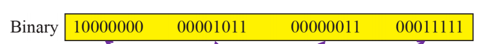

- dotted-decimal (base 256)

  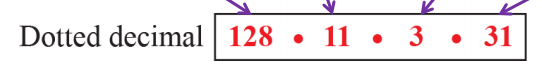

- hexadecimal (base 16)

  

### Hierarchy

- prefix : **네트워크**를 정의
  - Classful Addressing
  - Classless Addressing
- suffix : **노드**를 정의(장치의 인터넷 연결)

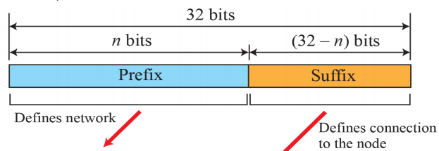

#### Classful Addressing

- 초기 디자인은 **길이가 고정된 Prefix** 사용

  - 크고 작은 네트워크를 모두 수용하기 위해 3개의 길이가 채용(8, 16, 24)

  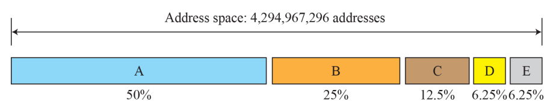

- 전체 Address Space가 5개의 Class로 나눠짐

  - Class A : 8비트, 첫 비트는 Class 구분(**0**)  / 나머지 7비트로 **네트워크 ID**
  - Class B : 16비트, 첫 2비트는 Class 구분(**10**) / 나머지 14비트로 **네트워크 ID**
  - Class C : 24비트, 첫 3비트는 Class 구분(**110**) / 나머지 21비트로 **네트워크 ID**
  - Class D : 첫 4비트는 Class 구분(**1110**), Prefix/Suffix 구분이 **없음**
    - **Multicast** address에 사용
  - Class E : 첫 4비트는 Class 구분(**1111**), Prefix/Suffix 구분이 **없음**
    - **Reserve**용

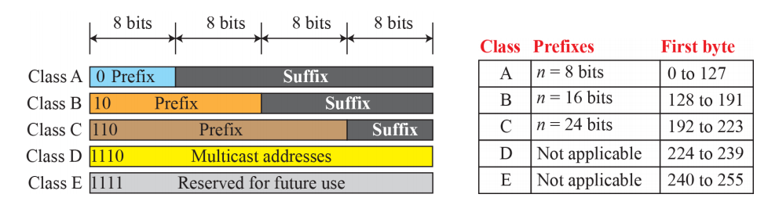

- 현재는 잘 안쓰임

##### Address Depletion 

- 주어진 주소를 다 사용해 더 이상 사용할 주소가 없는 상황

- Class A : **128개의 네트워크만** 사용가능 / 한 네트워크에 2^24개의 노드를 필요로 함
- Class C : 2^21개의 네트워크에서 사용가능 / 한 네트워크에 **2^8개의 노드만** 수용 가능

##### Subnetting & Supernetting

- Subnetting : Class **A / B**가 여러개의 subnet으로 **나눠짐**
- Supernetting : Class **C** 블록 여러개를 **합쳐** 256개의 주소 이상을 필요로 하는 네트워크에서 사용
- 장기적으로 봤을 때, 더 큰 Address Space가 필요하다는 결론이 남
  - IP 주소의 길이가 더 길어져야 함
  - IP packet의 포맷을 바꿔야 함

#### Classless Addressing

- 장기적으로 IPv6라는 대안이 있지만, 단기적 솔루션으로 **같은 Address Space를 사용**하는 솔루션

- Class Previlege가 사라짐

- 전체 Address Space가 Variable Length 블록들로 이루어짐

- Prefix : 블럭(네트워크)를 뜻함, Suffix : 노드를 뜻함

- Prefix Length

  - CIDR(Classless inter-domain routing)
  - / 이후에 prefix의 길이 **n**을 전달
    - ex) 12.24.76.8/**8**, 23.14.67.92/**12**, 220.8.24.255/**25**

  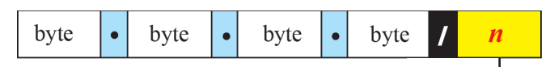

  

- 주소 하나에 3가지의 정보가 들어있음

  - 블록안의 주소의 수 : N = 2^32-**n**

    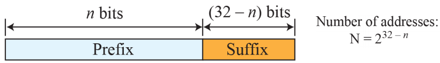

  - **첫번째** 주소 : n개의 왼쪽비트는 유지(prefix), **32-n개의 비트는 0**으로(suffix)

    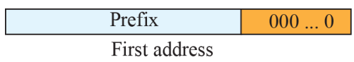

  - **마지막** 주소 : n개의 왼쪽비트는 유지(prefix), **32-n개의 비트는 1**으로(suffix)

    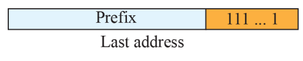

- 주소 그 자체만으로는 해당 주소가 어디 블록에 속하는지 알수가 없음

##### Address Masking 

- 마스크로 주어진 수와 주소를 비교해보는 형식
  - 마스크의 예시 : FF FF FF E0

- 주소의 수 : N = NOT(mask) + 1
- 첫번째 주소 : (address) and (mask)
- 마지막 주소 : (address) or (NOT mask)

##### Network Address

- 어떤 주소든 그 주소값으로 블럭에 대한 정보를 알 수 있음
- 첫번째 주소인 Netowrk Address는 **패킷을 라우팅** 할 때 사용
  - m개의 네트워크, m개의 interface를 가진 라우터가 있다고 가정
  - 라우터는 패킷을 어느 네트워크로 보내야 하는지 알아야 함
  - 네트워크 주소를 찾으면, 라우터가 포워딩 테이블에 따라 대응하는 interface를 찾아서 보냄
- 네트워크 주소는 **네트워크의 ID**역할

##### Block Allocation

- **ICANN** (Internet Corporation for Assigned Names and Numbers)이 하는 일
  - 보통 ICANN이 **개인 인터넷 유저**에게 주소를 할당해주지는 않음, **ISP**가 함
- 제약사항
  - 요청받은 주소의 숫자 N이 power of 2이여야 함
    - prefix의 갯수를 의미하는 n이 정수여야하기 때문
  - 요청받은 블록이 **충분한 숫자의 가용한 연속적인 주소**를 가지고 있어야 함
  - 블럭의 첫번째 주소는 블럭안의 총 주소의 개수(**N**)로 Divisible해야 함
    - prefix 뒤의 32-n개의 0으로 구성되기 때문
    - 첫번째 주소의 십진수 값 = prefix * 2^32-n = prefix * **N**
- 예시) ISP가 1000개의 주소를 할당 할 수 있는 블록을 요청
  - 2^10 = 1024개의 주소를 할당 받을 수 있는 블록을 줌(prefix len = **22**)
  - 가용한 블럭 18.14.12.0/**22**을 제공
  - 1024로 나눠지는 주소임

##### Subnetting

- 일정 범위의 주소를 허가받은 단체(ISP)는 해당 범위를 **작은 범위로 쪼개서** subnetwork에 assign 가능

- subnetwork를 subnetwork로 쪼갤 수 있음

- Steps

  1. 각 subnetwork안의 주소의 수는 2의 몇승이여야 함
  2. 각 subnetwork의 prefix의 길이는 32 - log_2 N_sub
  3. 각 subnetwork의 시작주소는 해당 subnetwork안의 주소의 수로 divisible해야함

- 예시) 14.24.74.0/24 를 각각 10개/60개/120개 주소를 필요로하는 subnetwork로 쪼개기

  - 큰것부터 작은거순서로 나눠줌
    - 120 : 128만큼 필요 -> 14.24.74.0/25 ~ 14.24.74.127/25
    - 60 : 64만큼 필요 -> 14.24.74.128/26 ~ 14.24.74.191/26
    - 10 : 16만큼 필요 -> 14.24.74.192/28 ~ 14.24.74.207/28
  - 남은 공간은 48, 미래에 사용(prefix의 길이는 아직 모름)

  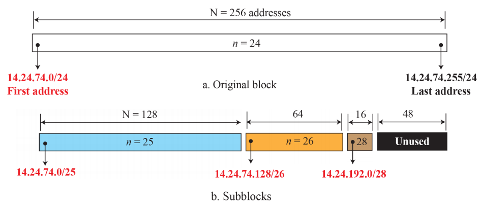

##### Address Aggregation

- Address Summarization, Route Summarization과 같은 의미
- 주소의 블럭들이 합쳐져서 큰 블럭을 형성하면, 큰 블럭의 prefix에 따라서 routing이 이뤄질 수 있음
- ICANN이 ISP에게 큰 블럭을 할당
- 각각의 ISP가 할당된 블럭을 작은 subblock으로 나눔, 고객들에게 제공

##### Special Addresses

- This-host Address
  - 0.0.0.0/32
  - 호스트가 IP datagram을 보내고자 하는데, 자신의 IP주소를 모를 때 source address로 사용
- Limited-broadcast Address
  - 255.255.255.255/32
  - 라우터/호스트가 해당 네트워크에 있는 모든 장치에 datagram을 보내야 할 때 사용
  - 해당 패킷은 네트워크 밖으로 못나감
- Loopback Address
  - 127.0.0.0/8
  - 호스트를 절대 떠나지 않음
  - 클라이언트-서버 프로그래밍에서 서버의 주소로 쓰임 (**Localhost**)
- Private Address
  - 10.0.0.0/8
  - 172.16.0.0/12
  - 192.168.0.0/16
  - 169.254.0.0/16
  - NAT에서 사용 
- Multicast Address
  - 222.0.0.0/4

### DHCP

- 어떤 단체에게 주소의 블럭이 할당된 뒤, 네트워크 관리자가 **개인 호스트/라우터에게 주소를 할당** 할 수 있음
- DHCP(Dynamic Host Configuration Protocol) : 주소 할당을 자동으로 할 수 있다
- 클라이언트-서버 패러다임을 사용하는 **Application-Layer 프로그램**으로, Network Layer의 TCP/IP를 도와줌

#### Plug and Play Control

- 네트워크 관리자가 DHCP를 Configure해 **영구적**으로 호스트/라우터에게 IP주소를 할당 해줌
- 임시적 / 수요에 따라 호스트에게 IP주소를 제공하는것도 가능

#### Message Format

- DHCP는 클라이언트가 request를 하고, 서버가 이에 response message를 보내는 클라이언트-서버 프로토콜이다

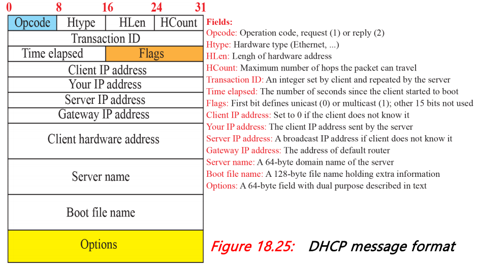

- 64바이트 옵션 필드

  - 추가적인 정보를 포함하거나, 특정 Vendor 정보를 포함
  - 3개의 필드로 구성 : Tag(1 byte), Length (1 byte), Value(variable)
    - 태그가 53이면, 8개 중 하나의 메세지 타입을 뜻함

  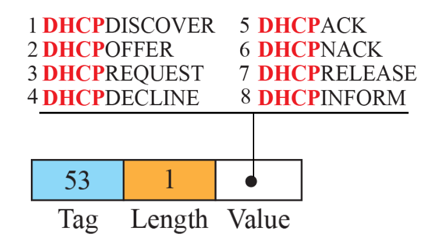

##### Operation

1. Joining Host에서 **DHCP**DISCOVER 메시지를 만듬

   - Application : transaction ID가 랜덤숫자로 지정됨, 다른 필드는 안건드림
   - UDP : source port  = 68, dest port = 67
   - IP : Source address = 0.0.0.0 (This Host), Dest address = 255.255.255.255(Broadcast)
     - 자신의 주소 / 목표 주소가 어딘지 모르기 때문

   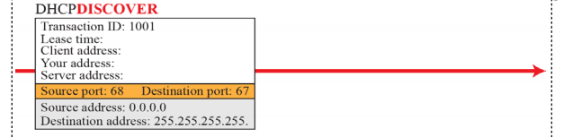

2. DHCP 서버(들)이 **DHCP**OFFER 메시지로 응답

   - Application : Lease time = 3600, Your address = 181.14.16.182, Server Address = 181.14.16.170
   - UDP : source port = 67, dest port = 68
   - IP : Source address = 181.14.16.170(서버), Dest Address = 255.255.255.255(**Broadcast**)
     - 다른 DHCP 서버들도 이 메시지를 받고, 더 좋은 오퍼를 보낼 수 있는지 확인 위함

   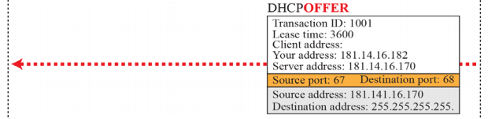

3. Joining Host가 1개 또는 여러개의 Offer를 받아 그중 하나를 선택하고 **DHCP**REQUEST를 해당 서버에 보냄

   - Application : Lease time = 3600, Client Address = 181.14.16.182, Server Address = 181.14.16.170
   - UDP : source port = 68, dest port = 67
   - IP : Source address = 181.14.16.182, Dest address = 255.255.255.255(**Broadcast**)
     - 다른 DHCP 서버들이 이 메세지를 받고 자신들의 Offer가 거절된 것을 알리기 위함

   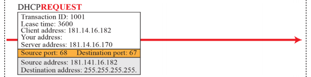

4. 선택된 DHCP 서버가 **DHCP**ACK/**DHCP**NACK로 응답

   - Application : Lease time = 3600, Your Address = 181.14.16.182, Server Address = 181.14.16.170

   - UDP : source port = 67, dest port = 68

   - IP : Source address = 181.14.16.170, Dest Address = 255.255.255.255(**Broadcast**)

     - 다른 DHCP 서버들에게 요청이 허용되었는지/아닌지 알리기 위함

     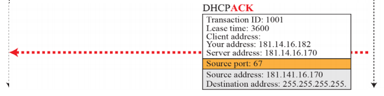

   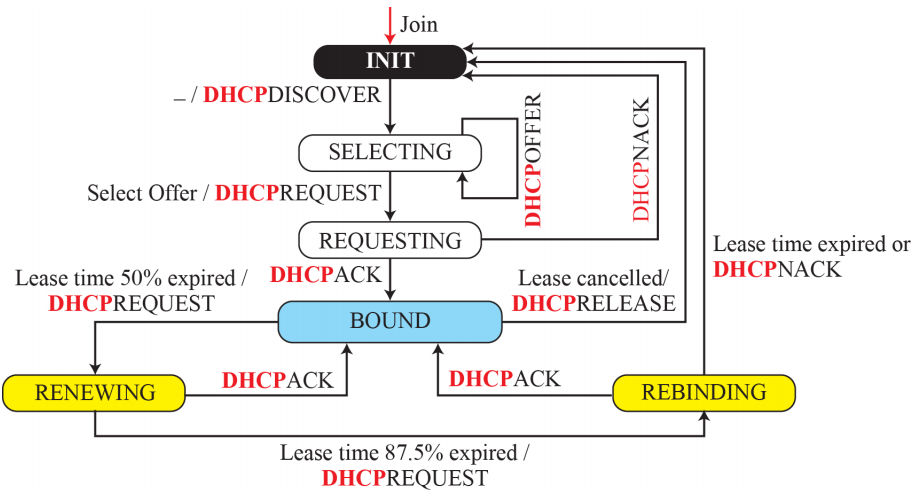

   