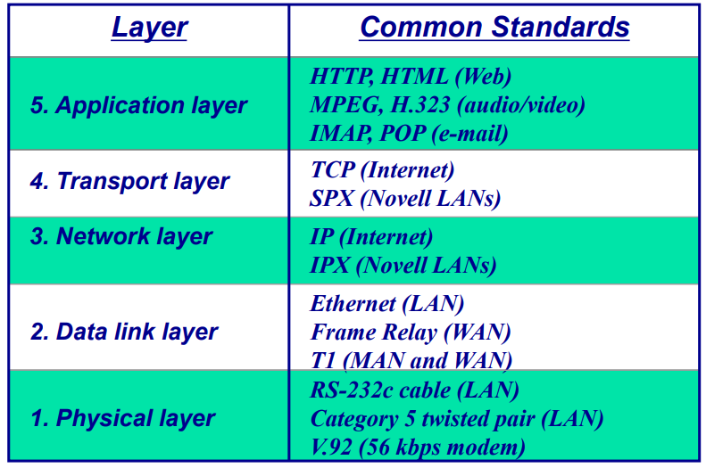

# Protocol
- Sender와 Receiver가 의사소통을 위해 지키는 규칙
- 대화가 쉬울때는 하나의 프로토콜만 있으면 되지만, 어려운 경우 다양한 레이어가 필요함
## Protocol Layering
- 어떻게 의사소통 할지와, 인접한 레이어와 interface 할 지를 정함
- Single-Layer implementation : 크기가 큰 요소들과 네트워킹하는 것이 이해하거나 구현하기 어렵다
- Multiple-Layer implementation : 작은 요소들로 파트를 쪼개서 구현하기 쉬운 편
- 위의 프로토콜에서 밑 프로토콜으로 데이터가 이동하면서 프로토콜이 데이터에 각각 헤더를 추가 함
- OSI : ISO에 의해 개발 됨, 실제로 구현 된 적은 없음, 7레이어
- Internet : DAPRA에 의해 개발, internetworking의 문제를 해결하기 위해 개발, 5레이어, TCP/IP 기반
### 5 Layer Model -> Protocol Suite
- Application : 최종 사용자의 네트워크에 대한 접근, 응용프로그램에서 사용되는 utility set 제공
              ex) HTTP, SMTP/POP(E-mail), FTP, CoAP(IoT), Streaming
- Transport : End-to-End sender와 receiver간의 연결 유지, 메세지 보내기 역할
              Sender/Receiver 사이의 연결을 담당, 큰 데이터를 작은 패킷으로 쪼개는 역할,
              중복 패킷 삭제, 흐름 제어, 도메인 이름을 숫자 주소와 세그먼트 메세지로 변환
              ex) TCP(실패시 재전송), UDP(실패시 신경안씀, 주로 스트리밍이기 때문)
- Network : routing 결정을 담당, 메시지가 전달되어야 하는 route 결정, 가장 효율적인 루트 탐색
            ex) IP
- Data Link : 설정, 오류 컨트롤, MAC(Media Access Control)등을 담당 - 에러 발생할 시 처리
              MAC - Conflict 방지를 위해서 해당 장치가 언제 메시지를 보낼지 결정
              ex) Ethernet
              Control-Based, Polling : watch-dog (timer) 일정 시간이 지나도 ACK가 안오면 실패로 생각 -> 재전송
              데이터가 제대로 온건지 확인하는법 : CRC, ParityBit, CheckSum 등
              ALOHA : 겹칠걸 생각해서 각 노드별로 지연시간을 랜덤 시간으로 설정해 보냄 -> 성공율은 낮은편
              CSMA : CD(Collision Detection) - wired(가격 낮음), CA(Collision Avoidance) - wireless(가격 높음)
- Physical : Communication Circuit에서 데이터 비트 송수신 담당,
              1/0이 어떻게 송신되는지(전압, bps, 케이블/커넥터의 물리적 포맷) 관리
### 7 Layer Model : Open Systmes Interconnection model(OSI)
- Presentation : 사용자에게 보여주기 위해 데이터를 가공, 다양한 실행환경에서 다양한 인터페이스를 수용
- Session : sender와 receiver간의 논리적 세션 관리(시작,유지,종료)
### Network Layer View
- 레이어들이 네트워킹을 간단하게 만들어줌 : 해당 레이어들에 맞는 소프트웨어 개발, 유지보수가 쉬움
- 컴퓨터들 사이에서 대응하는 레이어끼리 의사소통 함
- 다소 비효율적임 : 많은 소프트웨어와 패킷 포함, 패킷 오버헤드로 인해 느린 통신, 실행 시간
                  perfectly streamlined communication일 때 정보처리상호운용 가능
### Principles
- 1 : 레이어를 만들 때, 위/아래 방향으로 가는 각각의 작업을 수행 할 수 있어야 함
- 2 : 같은 Layer 아래에 있는 각각의 객체가 같아야 함

## Standards
- 하드웨어/소프트웨어 시스템들이 의사소통하는 고정된 방법을 제공함
- 가격을 낮추고, 경쟁을 도모하는 결과
- Formal Standards : 산업/정부에 의해서 생성
- De-facto Standards : 시장에서 발생, 넓게 사용됨, 공식적인 지원이 없음
### Process
- Specification : 명명법을 정하고, 처리 할 문제들을 식별
- Identification of choices : 문제들에 대한 해결법을 찾아내고, 최적의 해결법을 도출
- Acceptance : 해결법을 정의, industry에게 인지시키고 하나의 해결법이 받아들여지도록 함
### Major Standard Bodies
- ISO(International Organization for Standardization)
  : 정보 통신 인터페이스를 위한 기술적인 권유
    각각 나라들의 standard 단체들로 구성
    스위스 제네바가 근거지
- ITU-T(International Telecommunications Union-Telecom) Group
  : 전화, 전신, 정보 통신 인터페이스를 위한 기술적인 권유
    UN 소속 국가들의 대표들로 구성
    스위스 제네바가 근거지
- ANSI(American National Standards Institute) : 미국의 Coordinating 단체(standards-making body 아님)
- IEEE(Institue of Electrical and Electronic Engineers) : 프로 사회, LAN 표준도 개발
- IETF(Internet Engineering Task Force) : 인터넷 표준 개발, 공식적인 멤버쉽이 없음(아무나 환영)

## TCP/IP Protocol Suite
- Transmission Control Protocol / Internet Protocol
- Protocol Suite : 특정 의사소통 서비스를 지원하는 다양한 레이어에 정리 된 프로토콜들의 집합
- 스위치는 메시지를 변화시키지 않는다
- Encapsulation : 위에서 아래로 헤더를 추가하면서 이동, Decapsulation : 반대
- Applcation레이어가 OSI 모델의 App + Presentation + Session급이라고 봄
### Addressing
- 두개의 주소가 필요함(Source Address, Destination Address)
- 4개의 주소쌍이 필요함(각 레이어 별 하나씩, Physical Layer 제외 - 비트를 사용하기 때문)
- Application(Names), Transport(Prot numbers), Network(Logical Address), Data-Link Layer(Link-layer Address)
### Multiplexing / Demultiplexing
- 다양한 프로토콜을 사용하기 때문에, 어떤 프로토콜을 사용하는건지 알아야 함
- Source : MUX(Encapsulate a packet from higher layers), Destination : DEMUX(Decapsulate a packet to higher layers)
