# Introduction to Transport Layer

- Application / Network Layer 사이에 위치

- 두개의 Application Layer 사이 Process-to-Process Communication 제공

  - Local Host + Remote Host
  - Logical Connection

## Services

### Process-to-Process Communication

- Process : Transport Layer의 서비스를 사용하는 Application Layer Entity(작동하는 프로그램)
- Host to Host : 네트워크 레이어
  - Incomplete Delivery, 메시지가 **올바른 Process**에 정확히 전달돼야 함 -> Transport Layer
- Process-to-Process : Transport 레이어
  - 맞는 Process에게 메시지 전달

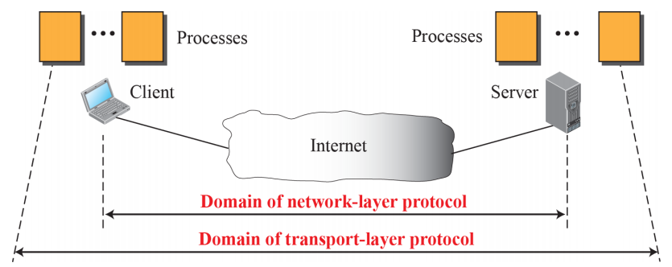

### Addressing : Port Numbers

- 가장 흔한 Process-to-Process Commucation : Clinet-Server Paradigm
  - Local Host = Client, Remote Host = Server
- Local Host와 Remote Host는 **IP 주소**로 정의
- Local Process와 Remote Process는 **포트 번호**로 정의

- TCP/IP 프로토콜에서 포트 번호는 정수(0~65,535 : 16비트)
- IP 주소가 목적 **호스트**를 선택하고, 그 다음 포트번호가 해당 호스트의 **프로세스**를 선택

#### Ephemeral(수명이 짧은) 포트 번호

- 클라이언트 프로그램이 자기자신을 이 번호로 정의
- 클라이언트의 프로세스는 수명이 짧은 편 => Ephemeral

#### Well-known 포트 번호

- 서버 프로그램의 포트 번호는 랜덤으로 **정해질 수 없음**
- 이 번호가 랜덤이면 클라이언트의 프로세스가 서버 프로세스에 **접근하는 것이 불가능**
- 현재의 해결책 : **Universal(Well-known) 포트 번호** 사용

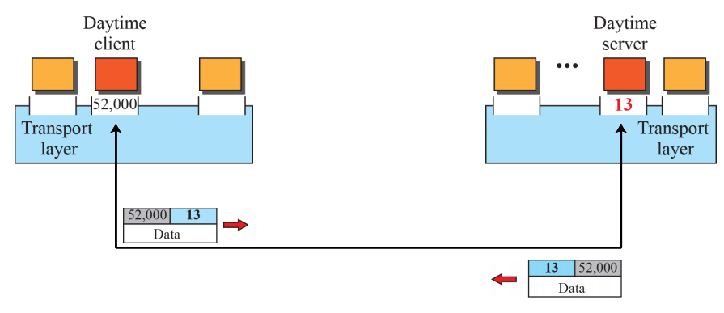

#### ICANN Ranges

- Well-Known Ports : 0 ~ 1023
  - ICANN에 의해 지정 / 통제
- Registered Ports : 1024 ~ 49151
  - ICANN이 지정 / 통제 하지 **않음**
  - ICANN을 이용해 등록 가능(**중복 방지**)
- Dynamic Ports : 49152 ~ 65535
  - 통제되거나 등록되지 않음
  - Temporary / Private 포트 번호로 사용

#### Socket Addresses

- IP 주소와 포트 번호를 합친 것
- Client/Server 소켓 주소는 Client/Server Process를 Unique하게 정의

### Encapsulation and Decapusulation

- 인터넷 Transport Layer에서 패킷들의 이름 : User Datagram, Segments, Packets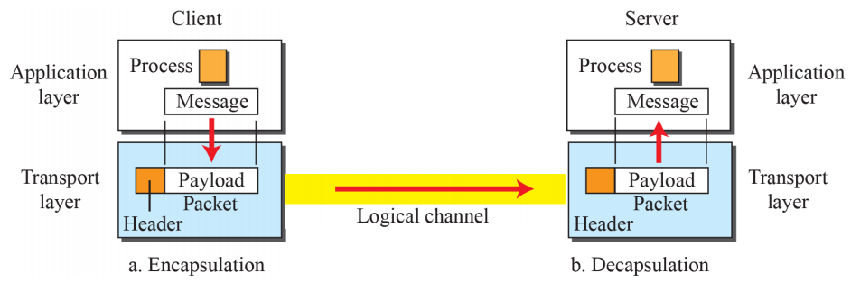

### Multiplexing and Demultiplexing

- Source 측 : Multiplexing	
  - Messages -> Packets 
- Destination 측 : Demultiplexing
  - Packets -> Messages

### Flow Control

- Sender가 Recever가 받기 힘들 정도로 너무 빨래 보내지 않도록 확인
  - Rate of **Produced** Frames @Sender > Rate of **Consumed** Frames @Receiver 
    - 대기시간 동안 버퍼에서 대기, Frame이 버려질 수 있음

- Pushing and Pulling

  - Item의 Producer => Consumer 전송방식은 두가지로 나뉨

  - Pushing

    - Consumer의 **요청 전**에 Sender가 item을 생산하는대로 보내는 것
    - Flow Control **필요**

    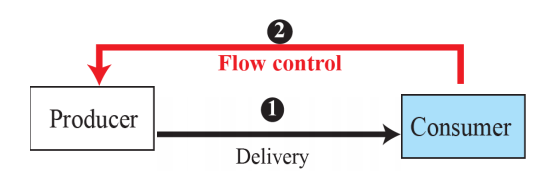

  - Pulling

    - Consumer의 **요청 후**에 Sender가 item을 그에 맞게 보냄
    - Flow Control **필요 없음**

    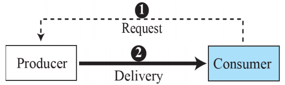

- 두 가지 Flow Control로 나뉨

  - Transport Layer **@Sender** => Application Layer **@Sender**
  - Transport Layer **@Receiver** => Transport Layer **@Sender**

### Error Control

- 네트워크 레이어는 신뢰성이 떨어지기 때문에, Transport 레이어가 신뢰성이 있어야 함

- 책임
  - 손상된 패킷을 탐지하고 버리는 것
  - 잃어버린 / 버린 패킷을 추적하고 재송신하는 것
  - 중복 패킷을 인지하고 버리는 것
  - out-of-order 패킷을 나머지 패킷들이 오기 전까지 버퍼링하는 것
- Sequence Number
  - Sender 측 Transport Layer가 어떤 패킷을 재송신 해야하는지 안다
  - Receiver 측 Transport Layer가 어떤 패킷이 중복인지 안다
  - Receiver 측 Tranport Layer가 어떤 패킷이 Out-of-Order인지 안다
    - 패킷에 번호가 있으면 가능함 => Sequence Number
    - Sequence Number에 m개의 비트 사용 => 범위 = 0 ~ 2^m -1
- ACK
  - Receiver 측에서 패킷이 안전하고 믿을만하게 왔다는 것을 Sender에게 보냄
  - 손상된 패킷은 그냥 버리기 가능
  - Sender 측에서는 Timer 시간 내에 ACK가 도착하지 않으면 패킷 재송신

### Combination of Flow and Error Control

#### Sliding Window

- 버퍼가 a set of slices로 표현됨(= Sliding Window)
  - Sender 측에서 패킷을 보낼 때, 대응하는 Slice를 mark
  - 모든 Slice가 mark되면, 버퍼가 가득찼다는 의미가 되며, 더이상 Application layer로부터 메세지를 받을 수 없다는 의미가 됨
  - ACK가 도착하면 Slice를 unmark
    
    

### Congestion Control

- 네트워크로 보내진 패킷의 수가 네트워크의 수용가능량을 넘어서면 Congestion 발생
  - 라우터 / 스위치가 큐(버퍼)를 가지고 있기때문에 발생
  - 각 라우터는 각각의 Interface별로 Input / Output 큐를 가지고 있음
  - 라우터가 도착하는 패킷의 속도만큼 가공하는것이 불가능할경우, 큐가 Overload 됨 -> Congestion
- Transport Layer에서의 Congestion은 네트워크 레이어의 Congestion의 결과를 의미

### Connectionless and Connection-Oriented Protocols

- 네트워크 레이어와 마찬가지로 Connectionless / Connection-Oriented로 나뉨
- 구체적인 내용은 다름

#### Connectionless Protocols

- 네트워크 레이어에서는 같은 메세지에 속하는 다른 데이터그램이 각각 다른 Path를 지닐 수 있다는 뜻
- Transport 레이어에서는 패킷의 물리적인 Path에 대해 신경쓰지않음
  - Transport 레이어간의 논리적인 연결에 대해 신경 씀
- 패킷간의 **독립성**을 의미, 반대로 Connection Oriented는 **의존성**을 의미

- Connection Establishment / Release 필요없이, 패킷이 한 파티에서 다른 파티로 보내짐
  - 패킷에는 번호가 안 붙여짐, Delay / Lost / Out of Sequence 상태로 도착할 수 있음
  - UDP

- Source 프로세스 쪽에서, 보내고자 하는 메세지를 Transport 레이어가 수용할 수 있는 작은 크기의 덩어리로 쪼깨서 하나씩 Transport 레이어로 보냄
  - Transport 레이어는 이 덩어리들간에 관계가 없다고 생각하고 대함
  - 받은 덩어리는 패킷으로 Encapsulate 한 뒤 보냄
  - Connectionless Transport Protocol로 보내짐
- 패킷들간의 관계가 없다고 보기 때문에, Destination 쪽에서 패킷들이 out-of-order로 도착할 수 있음
  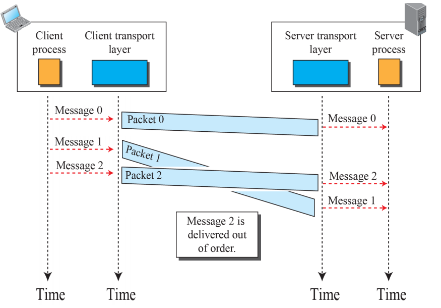
- 문제점
  - 받은 3개의 데이터가 같은 메세지에 속하지만, 서버 프로세스가 이상한 메세지를 받았을 수 있음
  - 패킷 하나가 LOST되면, 패킷에 시퀀스가 없기 때문에 받는 쪽에서 어떤 부분이 사라진건지 알 길이 없음
  - 원인 : 양 쪽의 Transport 레이어를 위한 Coordination mechanism이 없기 때문, Flow/Error/Congestion Control이 없음

#### Connection-Oriented Protocol

- Sender - Recevier 사이에 연결이 Establish 된 후, 데이터 전송이 시작됨. 모두 끝난 후 Release
- TCP
- Flow / Error / Congestion 컨트롤 존재
  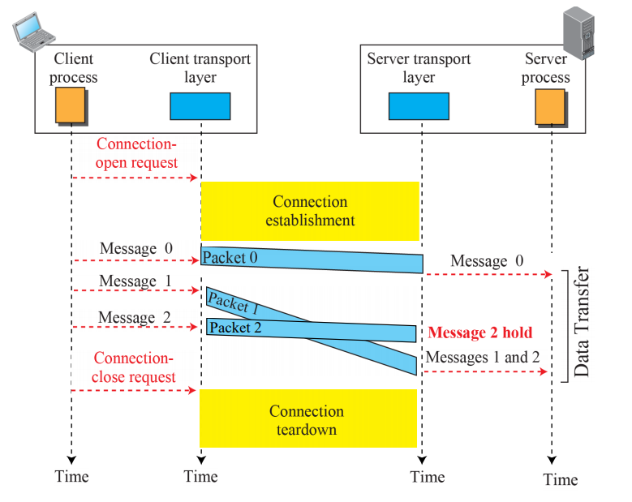
- Finite State Machine
  - Unidirectional Connection Establishment
    - 연결이 없는 상태에서는 Closed State로 취급
    - Local Process로부터 연결 요청이 오면 상대쪽 Transport 레이어에 Open Request Packet을 보내고, open-wait-I State로 이동
    - 상대쪽으로부터 ACK가 도착하면, open-Wait-II State로 이동
    - Unidirectional Connection Established
  - Bidirectional Connection Establishment
    - 반대쪽에서 연결 요청이 올때까지 Unidirectional 상태로 대기
    - 반대쪽에서 요청을 받으면 ACK를 보내고, Established 상태로 전환
  - Tear Down a connection
    - Local Application Layer가 Close Request 메세지를 Transport Layer에 보냄
    - Transport Layer는 반대쪽 Transport 레이어에 Close-Request 패킷을 보내고 close-wait-I State로 전환
    - 반대쪽으로부터 ACK를 받으면, close-wait-II State로 전환, close-request 패킷을 기다림
    - Close-Request 패킷을 받으면, ACK를 보내고 Closed State로 전환
      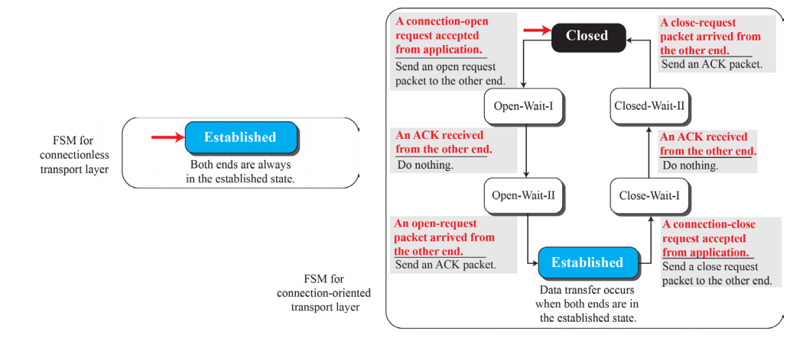

## Transport Layer Protocols

### Simple Protocol

- Connectionless(Flow / Error 컨트롤 없음)
- Receiver가 패킷을 받는 즉시 바로 처리할 수 있다고 가정
  
  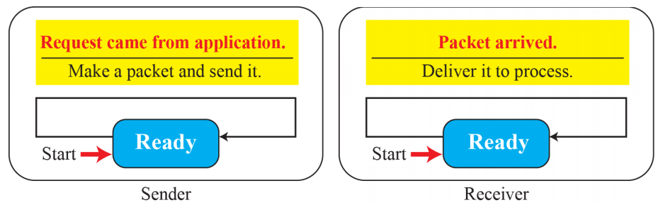
  

### Stop-and-Wait Protocol

- Connection-Oriented(Flow / Error 컨트롤 있음)

- Sender/Receiver 양측에서 사이즈 1의 Sliding Window 사용

- Sender가 패킷 하나를 보내고, ACK를 기다림

  - 패킷을 보낼때마다 타이머 시작, ACK가 타이머가 만료되기 전 도착하면 멈추고 다음 패킷 보냄
  - 타이머가 먼저 만료되면, 이전 패킷을 재송신함(파손되거나 Lost 된걸로 간주)
    - 이를 위해 ACK를 받기 전까지 복사본 패킷을 들고있어야 함

- 손상된 패킷을 탐지하기 위해 각 패킷에 Checksum 추가

  - Receiver는 이 체크썸을 확인하고, 틀리면 손상된걸로 간주하고 버림
    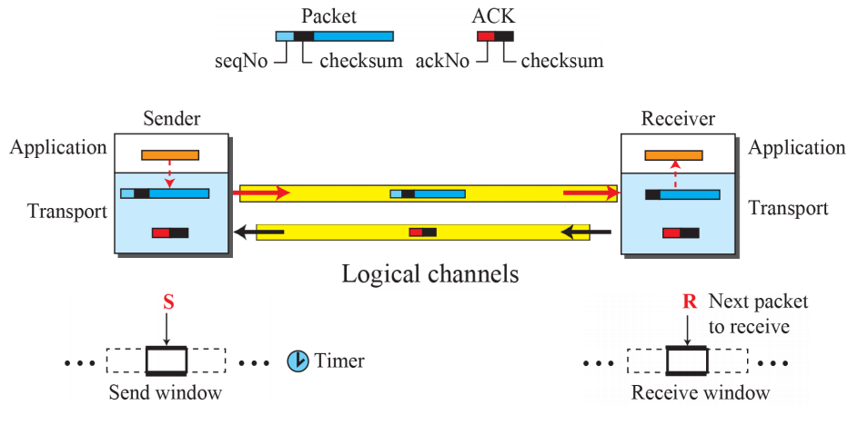

- Sequence Numbers : 0, 1, 0, 1, 0 ... (modulo 2 arithmetic)

- Acknowledgement Numbers : 다음으로 받기를 기대하는 패킷의 Sequence Number (modulo 2 arithmetic)

  - SeqNo 0 패킷을 받으면 AckNo 1 ACK를 보냄
    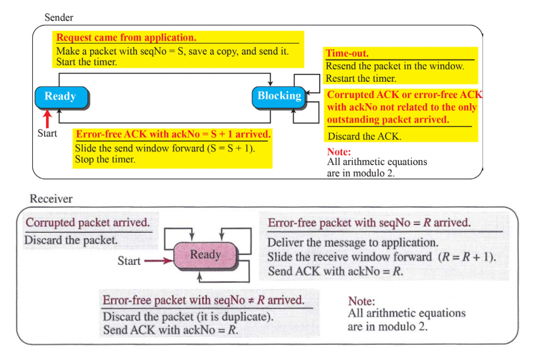

    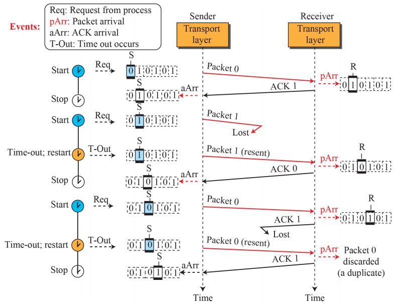

- 효율성

  - 채널이 굵고 길면 매우 비효율적(Bandwidth-Delay Product)
  - 채널은 큰데, ACK를 기다리는 시간동안 통신이 1도 안이뤄짐
  - 효율성을 생각하면 여러개의 패킷이 한번에 전송되어야 함
    - ACK를 기다리는 동안, 다른 패킷도 보내야 함 -> GBN Protocol

- Pipelining

  - 이전 일이 끝나기전, 다음일을 먼저 하는 것
  - Stop-and-Wait Protocol에는 없음, Sender가 ACK를 기다려야 하기 때문

### Go-Back-N Protocol (GBN)

- ACK를 기다리는 동안 여러 패킷을 보내지만, Receiver는 하나의 패킷만 버퍼할 수 있음
- 보낸 패킷들의 복사본은 Sender쪽에서 ACK받기 전까지 저장
- Sequence Numbers : modulo 2^m (m = sequence number field의 사이즈(비트))
- Acknowledgement Numbers : Cumulative, 다음으로 받아야 할 Sequence Number
  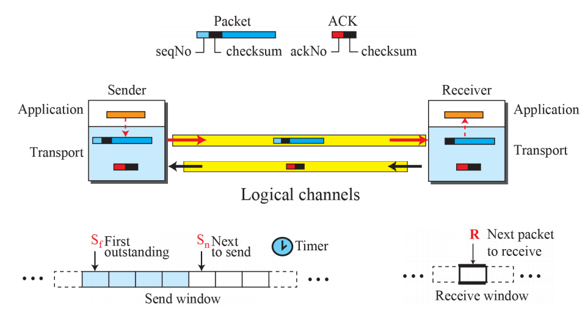
- Send Window : 보내진/보내질 수 있는 패킷들의 SeqNo을 저장하고 있는 가상의 박스
  - 각각의 Window에 SeqNo하나씩 들어감, 보낸 패킷/보낼수 있는 패킷 모두
  - 최고 사이즈 = 2^m -1
    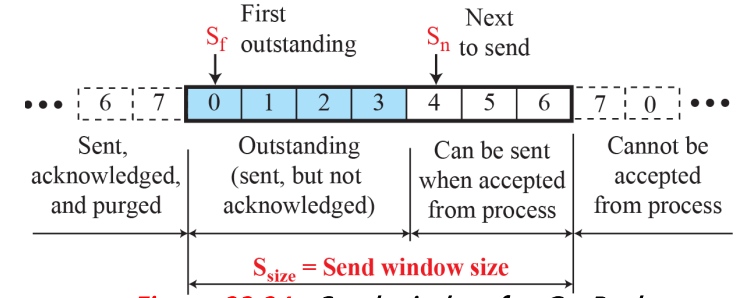
  - 여기서는 고정 사이즈로 생각, 몇몇 프로토콜은 변할 수 있는 사이즈로 
  - Architecture
    - 가능한 SeqNo를 4개의 구역으로 나눔
      - 1(좌측) : 이미 ACK를 받은 SeqNo들, 복사본 유지 X
      - 2(색칠된것) : 보냈지만 아직 상태를 모르는 SeqNo들(Outstanding Packets)
      - 3(하얀곳) : 보낼 수 있는 SeqNo들, Application 레이어로부터 아직 데이터를 안받았을수도 있음
      - 4(우측) : Window가 슬라이드 되기 전까지는 사용 불가능한 SeqNo들
    - S_f : 첫번째(가장 오래된, 좌측) Outstanding Packet
    - S_n : 다음으로 보낼 패킷
    - S_size : Window의 사이즈
  - Send Window의 크기
    - 항상 2^m보다 작아야 함
    - 그래야 모든 ACK가 lost된다고 해도, 중복패킷이 삭제됨
      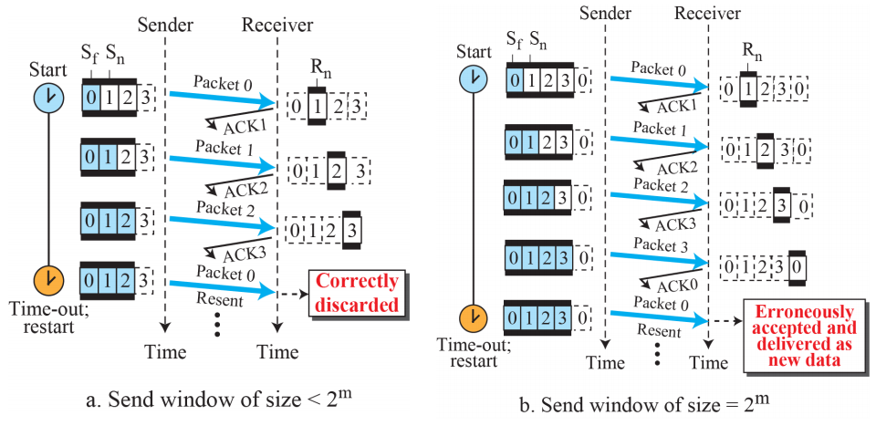
  - Sliding the send Window
    - 받은 ACK를 기준으로 Slide함 -> 6을 받으면 6쪽으로 S_f를 이동
      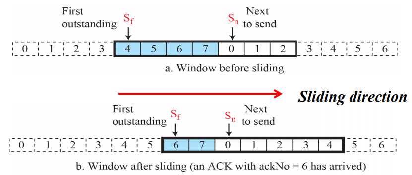
- Receive Window
  - 맞는 데이터 패킷이 오고, 맞는 ACK가 보내지는지 확인하는 역할
  - 사이즈가 1로 고정
  - 하나의 특정 패킷만을 기다림 => 다른 패킷이 오면 버림(재송신 돼야함)
  - Architecture
    - R_n : 다음으로 받기를 기대하는 패킷(이 패킷만 받을 수 있음)
    - R_n 왼쪽 : 이미 받았고 ACK를 보낸 패킷들
    - R_n 오른쪽 : 아직 받을 수 없는 패킷들
  - R_n에 해당하는 패킷을 받으면, R_n = (R_n+1) Modulo 2^m로 슬라이드
- Resending Packets
  - 타이머가 만료되면, Sender는 모든 Outstanding packet을 재송신
  - N(S_f)만큼 앞으로가서, 재송신 (Go-Back-N)
    

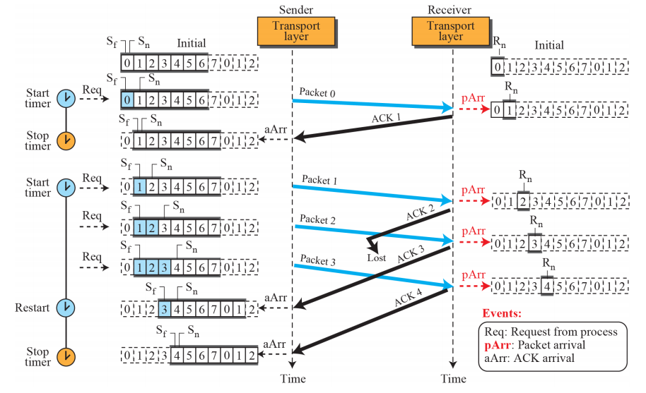

- 딜레이되거나 로스트된다고 해도 정상작동 (Cumulative ACK 덕분)

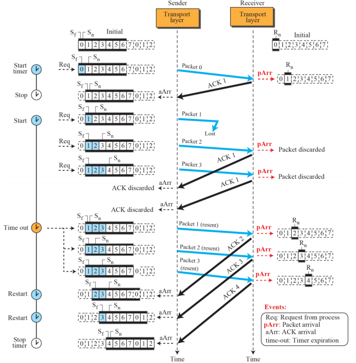

- 1이 Lost되었지만, 나머지 패킷들은 discard되고 똑바로 타임아웃 -> 재송신이 이뤄짐

###  Selective-Repeat Protocol

- GBN은 Receiver입장에서의 받는 과정을 간소화시켜줌
  - 하나의 패킷만 지정해서 받을 수 있고, 나머지는 받으면 버림
  - 많은 패킷이 lost될 경우 매우 비효율적, time out 발생시 모든 Outstanding Packet 을 다시 보내기 때문
  - Congestion 발생으로 인해 패킷이 lost된 경우 Outstanding Packet 전체 재송신으로 인해 Congestion이 더욱 심각해짐, 더 많은 패킷이 lost됨
    - Avalanche(눈사태) 효과 발생 -> 네트워크 전체가 먹통이 될 수 있음
- SR 프로토콜은 실제로 lost된 패킷만 재송신하도록 하는 프로토콜
  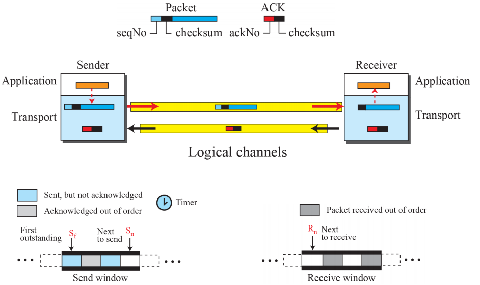
- Windows
  - Send Window
    - Size : 최대 2^(m-1)
      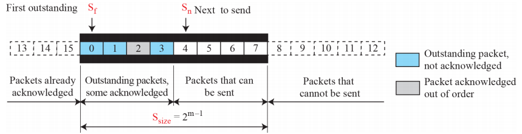
  - Receive Window
    - Size : Send Window와 같음
    - Application Layer로 보낼 만한게 나올때 까지, size만큼의 패킷을 킵해둘수있음
      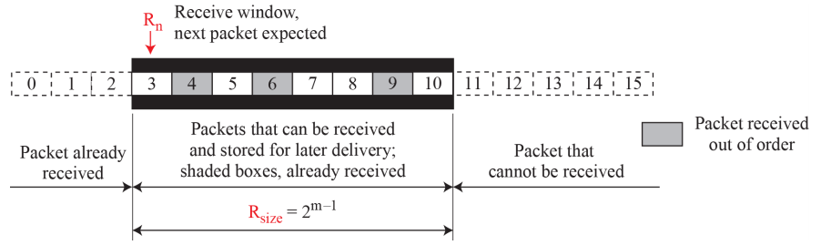
- 타이머
  - 이론상으로 하나의 패킷당 하나의 타이머 사용
  - 타이머가 만료되면, 해당하는 패킷들만 재송신
  - GBN은 단체로 묶어서 생각, SR은 독립적으로 하나씩 생각
  - 실제로는 하나의 타이머만 사용
- Acknowledgement
  - GBN에서는 Cumulative, 이전 패킷들은 모두 안전하게 잘 도착했다고 알림
  - SR에서는 독립적인 **하나의** 패킷을 의미 -> 해당 번호의 패킷이 잘 도착했다고 알림

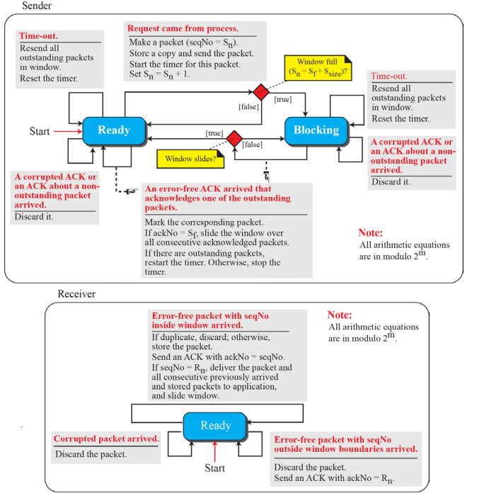

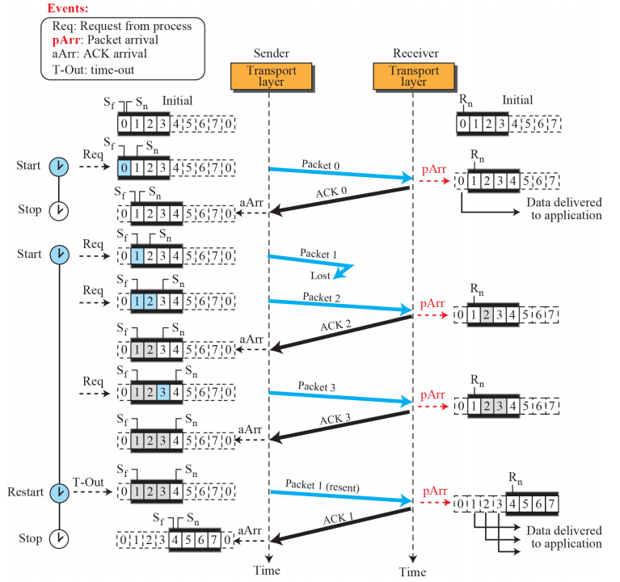

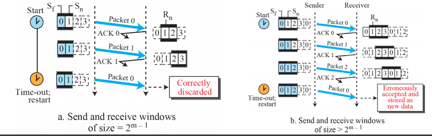

### Bidirectional Protocols

- 앞의 4가지 프로토콜은 모두 단방향
  - 한쪽에서는 패킷만, 한쪽에서는 ACK만 보냄
- 실생활에서는 양방향으로 왔다갔다 하는 경우가 많음(ACK, 패킷 모두)
  - Piggybacking을 이용해 효율 상승
  - 패킷과 ACK를 동시에 보내는 방법

