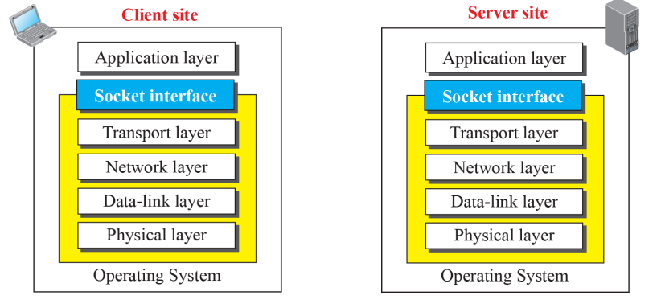
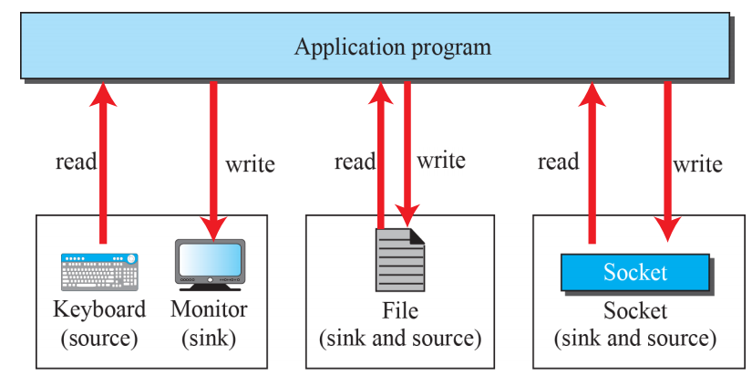
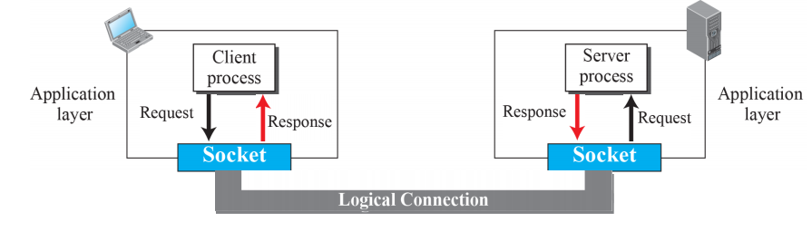

# Introduction to Application Layer

## Introduction

### Providing Services

- Application Layer는 제일 높은 레벨의 레이어
- 하위 레이어에게 제공하는 서비스는 없음, 서비스를 받기만함
- 인터넷 사용자에게 서비스를 제공하는 유일한 레이어
- Application 레이어의 유연성이 새로운 Application Protocol이 인터넷에 쉽게 적용될지 말지를 좌우함

### Application-Layer Paradigms

#### Client - Server Paradigm

- 가장 많이 쓰이는 패러다임
- Server Process (Service Provider) - Client Process
  - Connection through Internet
- 서버는 항상 돌아가고 있어야 됨, 클라이언트는 서비스가 필요할때만 돌아감
  - 문제점 : 서버의 부하가 너무 크다
  - 해결법 : 클라우드 컴퓨팅
- WWW, HTTP, FTP, SSH, e-mail

#### Peer - Peer Paradigm 

- 서버 프로세스가 항상 돌아갈 필요 없음
- 피어 사이에 책임을 나눔

- 인터넷에 연결된 컴퓨터가 어쩔때는 서비스를 제공할수도, 어쩔때는 받을 수도 있음
  - 동시에 하는것도 가능
- ex) BitTorrent, Skype, IPTV, Internet Telephony

##### Application Area

- Internet telephony : 폰을 통한 통신이 P2P임
- 인터넷에 연결된 컴퓨터가 다른 누군가와 공유할 것이 있을 때

##### Advantages

- 확장성 있음
- 가성비가 좋음 : 서버가 항상 돌아갈 필요없음

##### Weak Points

- 보안
  - 피어 투 피어이기 때문에, 보안 보장이 어려움
- 활용성
  - 모든 어플리케이션이 이 컨셉을 사용할 수 있는건 아님

#### Mixed Paradigm

- 두 패러다임을 짬뽕한 것
  - 가벼운 클라이언트-서버 통신을 피어의 주소를 찾기위해 사용
  - 실질적인 통신은 P2P로 이루어짐

## Client - Server Programming

### Application Programming Interface (API)

- 클라이언트가 서버와 어떻게 통신할 것인지
- 다른 프로세스와의 통신을 위해, TCP/IP Suite의 4가지 하위 레이어에게 연결을 열고, 반대쪽과 데이터를 주고 받고, 연결을 닫는 명령의 집합이 필요함
- 인터페이스 : 두 Entity 사이의 명령어의 집합
  - Entity 1 : Application Layer의 프로세스
  - Entity 2 : 하위 4개 레이어를 Encapsulate 하는 Operating System
- 컴퓨터 제조사가 OS를 만들때 하위 4개 레이어를 위한 API도 만들어야 함
  - 인터넷을 사용할 때 프로세스가 OS와 통신할 수 있게 됨
- ex ) Socket Interface, Transport Layer Interface, STREAM

#### Socket Interface

- OS와 Application Layer 사이의 통신을 제공하는 명령의 집합

- 프로세스가 다른 프로세스와 통신하기 위하여 사용하는 명령의 집합
- 다른 Sources / Sinks에서 읽기/쓰기를 할 수 있게 다양한 프로그래밍 언어에서 명령어 제공

#### Socket

- Physical Entity가 아님
  - Application Program이 만들고 사용하는 Abstraction
- Application Layer가 관여돼있는 한,  Client-Server Process 간의 통신은 양쪽에서 생성된 소켓간의 통신임

