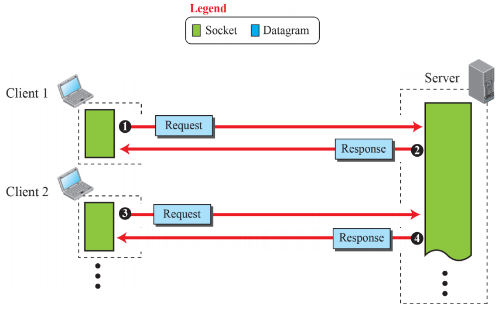
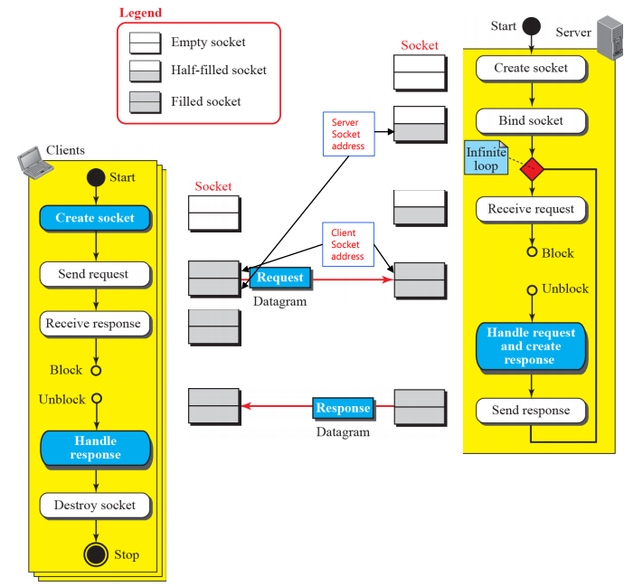
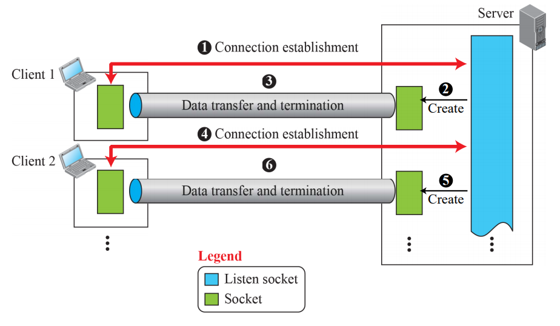

# Introduction to Application Layer

## Introduction

### Providing Services

- Application Layer는 제일 높은 레벨의 레이어
- 하위 레이어에게 제공하는 서비스는 없음, 서비스를 받기만함
- 인터넷 사용자에게 서비스를 제공하는 유일한 레이어
- Application 레이어의 유연성이 새로운 Application Protocol이 인터넷에 쉽게 적용될지 말지를 좌우함

### Application-Layer Paradigms

#### Client - Server Paradigm

- 가장 많이 쓰이는 패러다임
- Server Process (Service Provider) - Client Process
  - Connection through Internet
- 서버는 항상 돌아가고 있어야 됨, 클라이언트는 서비스가 필요할때만 돌아감
  - 문제점 : 서버의 부하가 너무 크다
  - 해결법 : 클라우드 컴퓨팅
- WWW, HTTP, FTP, SSH, e-mail

#### Peer - Peer Paradigm 

- 서버 프로세스가 항상 돌아갈 필요 없음
- 피어 사이에 책임을 나눔

- 인터넷에 연결된 컴퓨터가 어쩔때는 서비스를 제공할수도, 어쩔때는 받을 수도 있음
  - 동시에 하는것도 가능
- ex) BitTorrent, Skype, IPTV, Internet Telephony

##### Application Area

- Internet telephony : 폰을 통한 통신이 P2P임
- 인터넷에 연결된 컴퓨터가 다른 누군가와 공유할 것이 있을 때

##### Advantages

- 확장성 있음
- 가성비가 좋음 : 서버가 항상 돌아갈 필요없음

##### Weak Points

- 보안
  - 피어 투 피어이기 때문에, 보안 보장이 어려움
- 활용성
  - 모든 어플리케이션이 이 컨셉을 사용할 수 있는건 아님

#### Mixed Paradigm

- 두 패러다임을 짬뽕한 것
  - 가벼운 클라이언트-서버 통신을 피어의 주소를 찾기위해 사용
  - 실질적인 통신은 P2P로 이루어짐

## Client - Server Programming

### Application Programming Interface (API)

- 클라이언트가 서버와 어떻게 통신할 것인지
- 다른 프로세스와의 통신을 위해, TCP/IP Suite의 4가지 하위 레이어에게 연결을 열고, 반대쪽과 데이터를 주고 받고, 연결을 닫는 명령의 집합이 필요함
- 인터페이스 : 두 Entity 사이의 명령어의 집합
  - Entity 1 : Application Layer의 프로세스
  - Entity 2 : 하위 4개 레이어를 Encapsulate 하는 Operating System
- 컴퓨터 제조사가 OS를 만들때 하위 4개 레이어를 위한 API도 만들어야 함
  - 인터넷을 사용할 때 프로세스가 OS와 통신할 수 있게 됨
- ex ) Socket Interface, Transport Layer Interface, STREAM

#### Socket Interface

- OS와 Application Layer 사이의 통신을 제공하는 명령의 집합

- 프로세스가 다른 프로세스와 통신하기 위하여 사용하는 명령의 집합
- 다른 Sources / Sinks에서 읽기/쓰기를 할 수 있게 다양한 프로그래밍 언어에서 명령어 제공

#### Socket

- Physical Entity가 아님
  - Application Program이 만들고 사용하는 Abstraction
- Application Layer가 관여돼있는 한,  Client-Server Process 간의 통신은 양쪽에서 생성된 소켓간의 통신임

- 클라이언트는 요청을받고, 응답을 주는걸로, 서버는 응답을 받고, 요청을 주는걸로 소켓을 생각
- src / dest 주소만 똑바로 주면, 소켓이 알아서 할것으로 생각, 나머지는 운영체제 + TCP/IP 프로토콜의 역할

#### Socket Address

- 클라이언트-서버 패러다임에서의 통신은 소켓간의 통신임
  - Local Socket Address - Remote Socket Address
- 소켓주소를 TCP/IP 프로토콜에서 사용하는 Identifier로 생각
  
- 소켓주소 = IP Address + Port Number
  - 인터넷에서 컴퓨터는 IP주소로 구별됨(IPv4 - 32비트)
  - 여러개의 클라이언트/서버 프로세스가 한 컴퓨터에서 동시에 돌아갈 수 있음
    - Application Program은 포트 번호로 구분됨(16비트 정수)

#### Finding Socket Address

##### Server Site

- 서버는 Local(Server) + Remote(Client) 소켓주소를 필요로 함	
- Local 소켓주소는 운영체제가 제공
  - 운영체제로부터 IP주소
  - 서버 프로세스로부터 포트번호
    - 서버 프로세스가 표준일 경우 포트번호가 이미 할당되어있음(Well-Knwon Port : HTTP = 80)
    - 표준이 아닐경우 서버 프로세스의 개발자가 포트 번호를 선택(인터넷 Authority 내의 Range)
  - Lifetime 중 바뀌지 않음
- Remote 소켓주소는 연결을 만드는 클라이언트의 소켓 주소
  - 서버 하나가 여러 클라이언트와 연결될 수 있기 때문에, 연결전에 주소를 알아내는 것은 불가능
  - 클라이언트가 서버에 접속을 시도할 때 주소를 알아낼 수 있음
    - 서버로 보내진 Request Packet에 담겨있음
    - 해당 주소로 응답을 보냄
  - Lifetime 중 클라이언트에 따라 바뀜

##### Client Site

- 클라이언트도 Local(Client) + Remote(Server) 소켓주소를 필요로 함
- Local 소켓주소는 운영체제가 제공
  - 운영체제로부터 IP주소
  - 프로세스가 통신을 시작하려할 때 포트번호가 할당됨
    - Ephemeral (Temporary) 포트 번호
  - 새로 사용되는 포트 번호가 다른 클라이언트 프로세스에 의해 사용되고 있지 않은지 운영체제가 확인
  - 이 포트번호를 기억해놨다가 응답이오면 해당 프로세스에게 Redirect 해줘야함
- Remote 소켓주소
  - 주로 Well-Known Port 번호이기 때문에 클라이언트 프로세스는 알고있는 경우가 많음
  - IP 주소는 **Domain Name System(DNS)**라는 Client-Server Application으로 가져옴

### Using Transport Layer

- 프로세스 한 짝은 인터넷 사용자들(사람 또는 프로그램)에게 서비스를 제공함
- Tranport 레이어가 제공하는 서비스를 사용해야 함(Application 레이어에는 물리적 통신이 없음)
- TCP/IP 프로토콜의 3가지 공통적인 Transporty Layer 프로토콜 : UDP / TCP / SCTP
  - 표준 응용프로그램들은 이 세가지 중 하나의 프로토콜을 사용하도록 설계
  - 새로운 프로그램을 만들때, 어떤걸 사용할지 선택할 수 있음
    - 해당 프로그램의 능력에 크게 영향을 줌

#### Iterative Using UDP - Connectionless

- 메세지를 교환하는 두 호스트 사이에 논리적인 연결이 없다는 뜻
- 각 메세지는 데이터그램으로 Encapsulate 된 독립적인 엔티티
  - UDP는 이 메세지들간의 관계가 없다고 봄
- Unreliable
  - 신뢰성 있는 프로토콜이 아님
  - 통신과정에서 데이터가 손상됐는지는 확인할 수 있지만, Sender에게 재송신을 요청하지 않음
- Iterative Server는 한번에 하나의 클라이언트 요청을 받을 수 있음
- 요청을 받음 -> 가공 -> 응답을 보냄
  - 이 과정이 끝난 뒤 다음 요청을 받을 수 있음
- 한 클라이언트의 요청을 Handle하고있는중에 다른 클라이언트들 요청 / 같은 클라이언트의 다른 요청을 받으면, Queue되어야 함 -> 서버가 Free될 때까지 기다려야 다음 요청으로 넘어감
  - FIFO Queue로 운용

- 여러개의 클라이언트, 하나의 서버
- 서버 프로세스
  - 항상 열려있음, 클라이언트가 연결을 요청하길 기다림
  - 비어있는 소켓을 만듬
  - Server에 소켓을 Bind함(Well Known Port), 소켓이 Half-Filled 상태가 됨(서버의 소켓주소)
  - Receive Request 명령을 받음(클라이언트의 요청이 올때까지 Block)
  - 요청으로부터 받은 정보로 나머지 소켓을 채움
  - 요청의 프로세싱이 끝난 후, 클라이언트에게 응답을 보냄
  -  다른 요청이 오길 기다림(무한루프)
- 클라이언트 프로세스
  - 클라이언트 프로세스가 Active Open
  - 연결을 시작함
  - 비어있는 소켓을 만들어서 보내기 명령을 수행, 소켓을 채우고 요청을 보냄
  - Receiver 명령을 받음, 서버로부터 응답이 올때까지 Block
  - 응답이 Handle되면 소켓이 삭제됨

#### Iterative Using TCP - Connection-Oriented

- 핸드쉐이킹을 통해서 논리적인 연결이 이뤄진 상태에서 통신이 가능함
  - Connection-Establishment Packets
- 신뢰성 있음
  - 보낸 데이터가 lost되거나 손상되면, Receiver가 재송신을 요청할 수 있음
  - Flow Control / Congestion Control 포함
- 두개의 서로다른 소켓을 사용
  - Connection Phase와 데이터 교환 Phase를 구분하기 위해 두개 사용
  - 연결을 Establish하기 위한 소켓 : Listen Socket
    - 서버가 클라이언트의 Connection Establishment를 Listen하기 위해 사용
  - 데이터 전송을 위한 소켓 : Socket
    - 연결이 Establish 된 후 데이터 교환을 위한 소켓을 서버가 새로 만듬
    - 연결을 끝내는 역할도 함
  - 클라이언트는 소켓하나만 사용

- 서버 프로세스
  - TCP 서버가 소켓을 만들고 Bind함
    - Listen 소켓을 만들고, Connection Establishment 대기
  - Listen 프로시져를 호출해 운영체제가 클라이언트의 연결 요청을 받도록 허용
    - 연결을 만들거나, 대기 큐에 넣음
  - 클라이언트를 한번에 하나씩 상대
  - 한바퀴 돌때마다 Accept Procedure 실행 : 대기 리스트에서 클라이언트 하나 제거(Serve를 위해)
    - 리스트가 비어있으면, Serve해야 할 클라이언트가 있을때 까지 Block
  - Accept Procedure가 리턴하면, 데이터전송을 위해 새로운 소켓 생성

68 슬라이드까지