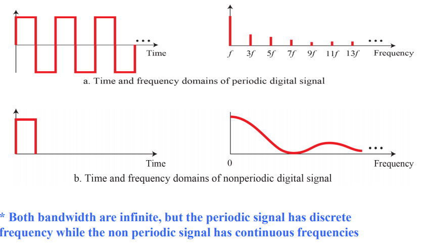

# Physical Layer
## Data and signals
- Data-link layer에서의 데이터는 physical 레이어로 가면 고쳐져야 함
- 데이터와 시그널은 모두 아날로그/디지털 형태
### Data
- Analog : 연속적인 정보
- Digital : 0,1로 이루어진 discrete state의 정보
- 메모리의 디지털 데이터는 0과 1로 이루어짐
  -> 디지털 신호로 변환하거나 아날로그 신호로 변환해야 함
### Signals
- Analog : 특정 시간 안에 무한하게 많은 levels of intensit
  -> 무한한 수의 값들로 구성 됨
- Digital : 제한된 수의 값들로 구성 됨
  -> 보통 1과 0으로 이루어짐
- Periodic : 측정 가능한 하나의 Period안에 패턴이 끝남, 해당 패턴을 계속해서 반복, 하나의 패턴 완료 = Cycle
- Non-Periodic : 패턴이나 사이클이 없는 신호
- Analog/Digital은 모두 Periodic/Non-Periodic 할 수 있음
### Periodic Analog Signal
- Simple : Sine Wave의 형태, 작은 Signal들로 쪼개질 수 없음
- Composite : 여러개의 Sine wave로 구성됨
### Sine Wave
- Periodic Analog Signal의 가장 기본적인 형태
- 사이클 내의 과정이 스무스하고 일정하며, 연속적임
- Peak Amplitude(최대 진폭) : 가장 높은 강도의 절대값, 전자신호는 Volt의 단위로 측정
- Period(T) : 1 사이클 완료에 걸리는 시간(초 단위) T = 1/f
  -> milli, micro, nano, pino
- Frequency(f) : 1초에 몇 Period인지(Hz 단위) f = 1/T
  -> kilo, mega, giga, tera
  -> High Frequency : 짧은 시간에 변화, Low Frequency : 긴 시간에 변화
- Phase : time 0에 파형의 상대적인 위치, degree/radian 단위로 표시(360 = 2파이)
  -> Phase가 0이면 정확히 시간 0, 진폭 0에 사이클 시작, **NOT shifted**
  -> 90이면 시간 0, 최대진폭에 사이클 시작, 왼쪽으로 1/4만큼 Shift
- Wavelength(파장) : Period/Frequency와 / 매체의 전송속도를 묶은 개념
  -> Wavelength(λ) = (propagation speed) * period = (propagation speed)/frequency
- Time Domain Plot : sine wave 표현법, 시간의 흐름에 따른 신호의 진폭 변화를 표현, Phase가 표시 안됨
- Frequency Domain Plot : sine wave 표현법, frequency와 최고값에만 관심 있음, 한 사이클의 값 변화 알 수 없음
  -> 주파수, 최고 진폭을 빠르게 알 수 있지만, 하나의 완전한 sine wave가 선 하나로만 표시 됨
#### Analog Composite Signals
- Sipmle Sine Waves : 일상생활에서 많이 볼 수 있음, 하나의 Sine Wave를 통해 한쪽에서 다른쪽으로 전기에너지를 보냄
- Composite Signals : 데이터 통신에서 사용, 다양한 Simple sine wave로 구성 된 Composite Signal을 보냄
  -> Periodic : discete한 주파수를 가진 simple waves로 구성
  -> Non-Periodic : 연속적인 주파수를 가진 simple waves로 구성(마이크, 전화기, AM라디오, FM라디오, 흑백티비)
      무한한 수의 simple sine wave로 나눌 수 있음
      사람 목소리의 주파수의 수는 무한하지만, 범위가 제한됨(0~4 KHz)
  fundamental frequency/first harmonic : 복합신호의 전체 주파수와 같은 simple wave의 주파수
- Fourier Analysis : 모든 복합 신호는 Frequency/Amplitude/Phase가 서로 다른 simple sine wave로 구성된다
#### Bandwidth
- 복합신호에 포함되는 주파수의 범위, highest frequency - lowest frequency(1000 ~ 5000 = 4000 bandwidth)

### Digital Signals
- 1(양수 Voltage), 0(0 Voltage)로 정보 표현
- 디지털 신호는 2개 이상의 레벨을 가지고, 각 레벨별로 1비트 이상을 보낼 수 있음
- L개의 레벨일 때, 각각의 레벨은 log_2 L개의 비트가 필요함
  -> L이 2의 n승이 아닐 경우 해당 수 보다 큰 가장 가까운 2^n으로 계산
#### Bit Rate
- 대부분의 디지털 신호는 Non-Periodic -> Period, Frequency는 적절한 특징이 안됨 -> Bit Rate 사용
- Bit rate : 1초에 보낸 비트의 수(bps)
- Bit length : wavelength같은 개념으로, 1비트가 통신 매체에서 차지하는 거리를 뜻함
  -> Bit length = propagation speed * bit duration
#### Digital Composite Signal
- 디지털 신호는 복합 Analog Signal이다 (Fourier Analysis)
- 디지털 신호가 Periodic 할 경우(희귀한 상황) -> 무한 Bandwidth, discrete 주파수를 가진 signal
- 디지털 신호가 Non-Periodic할 경우 -> 무한 Bandwidth, 연속적인 주파수를 가진 시그널

# 디지털 시그널의 전송
- 실제상황에서 Non-Periodic 디지털 시그널을 만난경우 src -> dest로 디지털 신호를 보내는 방법
  **디지털 신호는 무한한 대역폭을 가진 복합 아날로그 신호다**
  -> Baseband transmission, Broadband Transmission
## Baseband Transmssion
- 디지털 신호를 아날로그 신호로 바꾸지 않고 전송
- Low-pass channel이 필요함(0으로 시작하는 bandwidth를 가졌고, 하나의 채널로만 구성된 전용선이 있음)
  -> 무한한 대역폭을 가진 channel이 이상적이지만, 현실에 존재하지 않음
- 넓은 대역폭을 가진 Channel : 디지털 신호의 모양을 보존하는 일은 굉장히 넓은 대역폭/무한한 대역폭을 가진 채널만 가능함
- 제한된 대역폭을 가진 채널 : 디지털 신호로 아날로그 신호를 추측함
  -> 추측 레벨은 대역에 따라 다름
### Rough Approximation
- bit rate N의 디지털 신호를 가지고 있다고 가정
- 두개의 비트씩 한 사이클에 보냄
- 최대 주파수 = **N/2**
- 3bit 패턴을 보낸다고 가정하면, 3개의 주파수 가지게 됨(0, N/4, N/2)
- first harmonic 주파수(N/2)를 쓰는 것
### Better Approximation
- 조금 더 디지털 신호와 비슷하게 하기 위해, **고조파를 더 추가(2/N, 3N/2, 5N/2)** -> 대역폭 증가
- bit rate에 따라서 필요한 대역폭이 달라짐 -> 비트를 빠르게 보내기 위해서 더 큰 대역폭 필요
## Broadband Transmission(Modulation)
- 디지털 신호를 아날로그 신호로 바꿔서 전송
- band-pass channel 사용(0으로 시작하지 않는 bandwidth)
  1. 디지털 신호가 아날로그 복합 신호로 변환됨
  2. 하나의 single-frequency 아날로그 신호를 사용(Carrier)
  3. Carrier의 진폭이 디지털 신호처럼 보이도록 바뀜
  4. receiver가 받은 아날로그 신호가 디지털 신호로 변환됨
  5. original 신호와 같은 복제품 탄생
- 0에서 시작하는 저주파 Bandpass Channel = low-pass channel
- ex) 전화선을 통한 컴퓨터 데이터 전송, 전화선(주민과 전화센터를 연결), 폰 통신
## 통신 장애
### Attenuation
- 에너지가 줄어드는 것
- 전선이 뜨거워지는 이유(전기 -> 열)
- Amplifier(증폭기)로 잃어버린걸 다시 증폭시켜야함
- Decibel : 서로 다른 지점 2곳에서 상대적인 신호의 세기를 측정한 것 - 음수일때 lose, 양수일때 gain (10 log_10 P2/P1)
            신호세기를 한 곳에서 측정 할 때(밀리와트)도 사용됨(dB_m = 10 log_10 P_m) ... P_m = 밀리와트단위의 파워
### Distortion
- 신호가 왜곡되는 경우
- 서로 다른 주파수로 만들어진 복합 신호에서 발생 가능
- simple wave별로 전송시간이 다름 -> 신호간의 딜레이 차이 때문에 왜곡 발생
- 도착 했을 때 Phase가 달라짐
### Noise
- 신호를 방해하는 요인
- thermal noise : 전선 안에서의 전자들의 움직임 때문에 발생, 추가적인 신호 발생
- induced noise : 모터에서 발생
- crosstalk : 다른 전선때문에 발생
- impulse noise : 스파크 때문에 발생
- SNR(Signal-to-Noise Ratio) : average signal power / average noise powers - **크면 클 수록** 양질의 신호를 보낼 수 있음
  -> high SNR = less corrupted signal, low SNR = more corrupted signal by noise
  -> SNR_db : 데시벨로 표시되는 SNR ... (10 log_10 SNR)
- 노이즈가 아예 없을 수는 없음(노이즈가 0 일시 SNR은 무한대) -> 이상일 뿐
### Data Rate Limits
- bits per second 단위로 얼마나 데이터를 빨리 보낼 수 있는지
- Bandwidth : 클수록 좋다
- Level of the signals :  클수록 좋음
- Level of the noise : 낮을수록 좋음
#### Nyquist Rate
- 노이즈가 없는(Noiseless) 채널의 이론적인 접근 -> MAX bit rate
- BitRate(bps) = 2 * Bandwidth * log_2 L (L = number of the signal level)
- 이론상으로 L을 조절해서 아무 bit rate를 만들 수 있음
- 실제로는 L을 높이면 리시버에게 부담이 감 -> 신뢰성이 떨어지게 됨
- L은 2^n이 되어야 함
- L이 높아지면 그만큼 시스템의 신뢰성이 떨어지게 됨
#### Shannon Capacity
- 실제로 노이즈가 없는 채널이 없다 -> 항상 노이즈가 있다는 생각 -> 이론상 가장 높은 data rate를 구하는 공식
- Capacity = Bandwidth * log_2 (1+SNR) (Capacity = 채널의 용량(bps))
- 공식에 레벨관련 변수가 없음 -> 레벨이 아무리 많아도 채널의 용량보다 큰 bps를 전달 할 수 없음
- 노이즈가 무한히 많은 경우 SNR은 0이 됨 -> 아무런 데이터도 채널에서 받을 수 없음
- SNR이 너무 큰 경우 SNR+1이랑 SNR이랑 별 다를게 없음 -> C = B*SNR_dB / 3
#### 둘다 사용하는 방법
- Shannon Capacity를 상한선으로 사용
- Nyquist Formula를 필요한 신호 레벨의 수를 구하는 곳에 사용
- 상한선에 무조건 딱 맞춰서 필요한 레벨을 구하지는 말고, 적당선에서 레벨을 구해야함 (ex) 6Mbps일 때 4Mps 기준으로 구함
### Performance
- QoS(Quality of Service)
#### Bandwidth
- Hertz에서의 대역폭 : 복합 신호에 포함 된 주파수의 범위, 채널이 보낼 수 있는 주파수의 범위
- bps에서의 대역폭 : 채널/링크/네트워크가 보낼 수 있는 bps(비트전송의 속도)
#### Throughput
- 실질적으로 네트워크를 통해 얼마나 빨리 데이터를 보낼 수 있는지
- Bandwidth(bps)와 다른 개념, 실질적으로 Bandwidth B보다 작은 T만큼 보낼 수 있음
#### Latency(Delay)
- 모든 메세지가 src 에서 dst로 전달 되는데에 걸리는 시간
- Latency = Propagation time + transmission time + queuing time + processing delay
- Propagation time : 비트 하나를 src에서 dst로 보내는 데에 걸리는 시간
  -> Propagation time = distance(거리) / propagation speed(속도)
  * propagation speed는 빛에서 제일 빠르고, 공기에서는 느려지며, 케이블 안에서는 더 느려짐
- Transmission time : 모든 메세지를 보내는데에 걸리는 시간
  -> Transmission time = message size / bandwidth of channel
- Queuing time : end device가 메세지를 받아서 처리하기 전에 hold하고 있어야 하는 시간
  -> heavy traffic이 있는 상황이면 시간이 늘어남
#### Bandwidth-Delay Product
- link의 performance metric이 둘임
- 둘의 곱이 중요함
- 링크의 길이가 Bandwidth * Delay라고 보면 됨
#### Jitter
- 한 데이터의 다른 패킷들이 각자 다른 딜레이를 만나서 도착하는 시간이 다른데, receiver가 time-sensitive할 때
-
