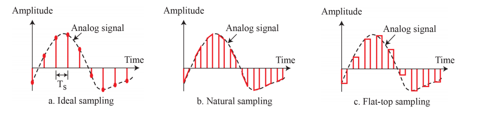

# Digital Transmission
## Digital-To-Digital Conversion
- 신호는 디지털일수도 아날로그일수도있음
- 디지털 데이터를 디지털신호로 보내는법
### Line Coding(항상 필요함)
- 데이터가 비트들로 구성됐다고 가정
- 이 비트들을 디지털 신호로 변환
- Sender(bit) -> 변환 -> 신호 -> receiver -> 변환 -> bit
- Built-in error detection 필요
- 노이즈와 방해에 면역
- 복잡할수록 구현하기 어려움
#### Signal Elements vs Data Elements
- Data Elemetns - Bit : 정보를 표현하는 가장 작은 단위 - carried by signal
- Signal Elements : data elements를 가지고 있는 **디지털 신호중** 가장 작은 단위 - carries data elements
- **r** : 각각의 신호가 데이터를 carry 하는 비율 = (data elem/signal elem)
#### Data Rate vs Signal Rate
- Data Rate(bit rate) : 1초에 보내는 **데이터(bit) 수** - bps
- Signal Rate(pulse rate, modulation rate, baud rate) : **1초에 보내는 시그널 수** - **baud**
- 데이터레이트는 높이고, 시그널 레이트는 낮추는걸(bandwidth 요구량이 낮아짐) 목표
- S(baud) = N(data rate)/r
- S_ave(평균 baud rate) = c(case factor) * N(bps) * (1/r) = c * (N/r)
#### Bandwidth
- 디지털 신호의 bandwidth는 무한하지만, 실제로 효력이 있는 bandwith는 유한하다
- B_min = c * N * (1/r), B_max = (1/c) * B(Bandwidth) * r
#### Baseline Wandering(방황)
- baseline : 받은 신호의 running average power -> receiver가 측정
  -> 이를 활용해 받은 값이 1인지 0인지 판단
- 받은 신호의 값이 오래동안 변하지 않으면, baseline이 바뀜(baseline wandering) -> 정확한 값 판단 불가능
#### DC(Direct Current) Components
- 전압 레벨이 일정시간동안 유지되면, 아주 낮은 주파수를 만듬
- x(t) = A + Bsin(2파이ft)
- 0 근처의 이 주파수들은 낮은 주파수를 보낼 수 없는 시스템에 문제 발생
  -> 왜곡 발생, 오류 발생
- 저주파가 통과 못하는 시스템에서는 왜곡이 일어남
- 이 Component는 쓸모없음
#### Self-Synchronization
- receiver와 sender의 bit interval(clock)을 맞춰줘야 함
- 타이머가 다르면 신호를 서로 다르게 해석 할 수 있음
- 데이터를 보낼 때 시간 관련 정보도 같이 보냄
#### Unipolar schemes
- 모든 신호 레벨이 시간 축의 한쪽에 몰려있음  (위 또는 아래)
- 양수전압 : 1, 0 전압 : 0
- NRZ(Non return to Zero) : 비트 **중간에** 0으로 return 하지 않음
- 매우 비싸고, 잘 안쓰임 1 비트를 보낼려면 polar NRZ의 두배 power가 필요
#### Polar schemes
- 전압이 양쪽 사이드에 퍼짐
- 양수 전압 : 0, 음수 전압 : 1
- NRZ-L(Level) : 전압의 레벨이 bit의 값 결정
- NRZ-I(Inverter) : 전압의 레벨이 변화/변화하지않는것이 비트의 값 결정
  -> 0일 때 변화 X, 1일 때 변화
- Baseline Wandering이 일어날 가능성 높음(특히 NRZ-L)
- Synchronization 문제 (특히 NRZ-L)
- Signal Rate : N/2 Baud
- Bandwidth : 둘다 DC Component문제가 있음
- RZ(Return to Zero) : NRZ의 synchronization문제 해결, receiver가 한 비트가 언제 끝나는지 언제 시작하는지 모름
  -> +(1),-(0),zero 사용
  -> 신호가 비트와 비트 사이가 아니라 비트 중간에 바뀜
  -> 다음 비트가 시작되기 전까지 신호값이 0으로 고정
  -> bit encoding을 위해 2개의 신호가 필요함(더 많은 bandwidth), 더 복잡하고, DC Component가 없음
      -> 더 복잡하지만, DC Component가 없음, 현재는 많이 사용 안함
- **Biphase : Manchester, Differential Manchester**
  -> Manchester : RZ + NRZ-L
      비트의 지속시간이 둘로 나눠짐, 전반부에는 한 레벨에 머물러있고, 후반부에 다른 레벨로 이동함
      NRZ-L의 한계 극복
  -> Differential Manchester : RZ + NRZ-I
      비트의 값이 초반부에 정해짐, 다음값이 0이면 inversion, 1이면 아무것도 안함
      NRZ-I의 한계 극복
  -> baseline wandering, dc components가 없음, 낮은 signal rate(NRZ의 두배수준)
#### Bipolar schemes(Multi-level binary)
- 3개의 voltage level (-,0,+)
- 하나의 데이터 엘리먼트는 0에, 나머지 하나는 +/-중에 하나에 있음
- AMI(Alternative Mark Inversion) : Mark = 1(telegraph)
  -> 0 : netral 0 voltage, 1 : postitive/negative voltage
- Pseudoternary
  -> 1 : 0 voltage, 0 : postitive/negative voltage
- NRZ와 같은 signal rate
- DC components가 없음(+,- 왔다갔다 하거나, 0(dc components가 없는 값))
- AMI는 긴 거리 comms에 사용 -> Synchronization 문제 발생 -> scrambling으로 해결
#### Multi-level schemes
- m개의 data elem을 n개의 signal elem으로 encoding 해서 bits per baud를 늘림 : (mB) 데이터 (nL) 시그널
  -> m : binary pattern의 길이, B : binary data, n : signal pattern의 길이, L : signaling의 레벨의 수
- L의 값 -> B = 2, T = 3, Q = 4
- 2B1Q : Two binary, One Quarternary m = 2, n = 1, L = 4 -> 2bits = 4 data patterns (DSL에서 사용)
- 8B6T : 8 binary, Six Tenary : m = 8, n = 6, L = 3 -> 8 bits
          = 256 data patterns, 3^6 signal patterns (100BASE-4T에서 사용)
- 4D-PAM5 : 4차원 5레벨 Pulse Amplitude Modulation
  -> 4차원 : 데이터가 4개의 와이어를 통해 한번에 전달
  -> 5레벨 : 5개의 전압 레벨 (-2, -1, 0, 1, 2)
    => 4개의 신호 요소가 하나의 그룹으로 4개의 와이어를 통해 전달됨
    => Gigabit LAN에 사용 됨
- MLT-3 : Multiline Transmission, 3-levels
  -> 2레벨 이상의 signal이 있을 경우, 2개 이상의 transition 규칙을 따르는 differential encoding scheme을 쓸 수 있음
  -> +V, 0, -V(3 voltage level, 3 transition rules)
  1. 다음 비트가 0이면, 변화 X
  2. 다음 비트가 1이고 현재 레벨이 0이 아니면, 다음 레벨은 0
  3. 다음 비트가 1이고 현재 레벨이 0이면, 다음 레벨은 제일 최근의 nonzero level의 반대
  -> '1'비트가 시작 될 때 다른 레벨로 변화, '0'비트가 시작 될 때는 변화 X

## Digital-To-Digital Conversion
### Block Coding(mB/nB encoding technique)
- 동기화과 내부 오류 감지를 위해 redundancy가 필요함
- 블럭 코딩을 하면 redundancy를 얻을 수 있고, 라인코딩의 성능을 향상 시킬 수 있음
- m개의 비트로 구성 된 블럭을 n개의 비트로 구성 된 블럭으로 쪼갠다 (n>m)
#### Steps
1. Division : m개 비트의 그룹들로 현재 비트들을 나눈다
2. Substitution : m bits -> n bits로 바꾼다
3. Combination : n bits들이 스트림을 구성하며 합쳐진다
#### 4B/5B
- 4B/5B encoding -> NRZ-I encoding -> LINK -> NRZ-I decoding -> 4B/5B decoding
- NRZ-I과 함께 쓰임(동기화 문제 존재 - 0이 길게 이어지면 동기화 망함)
- 동기화 문제를 해결하기 위해 길게 이어지는 0bit들을 없애기 위해 비트 스트림을 바꿔준다(0연속 없어지도록)
- 장점 : 동기화 문제 해결
- 단점 : signal rate 상승, 20퍼센트 많은 baud, 여전히 DC components 문제 존재
#### 8B/10B
- 4B/5B에 비해 오류 감지 능력 상승
- 5B/6B와 3B/4B의 합친 것
- 5MSB -> 5B/6B, 3LSB -> 3B/4B
- Disparity(차이) Control : 0이나 1이 길게 이어지는 걸 막기 위해서 이를 기록하고 있는다
  -> RD(Running disparity) = 1의 갯수 - 0의 갯수 => RD에 따라서 1/0비트가 밸런스에 맞게 8B/10B에 들어감
- 장점 : 오류 감지 능력이 4B/5B보다 높다, 더 나은 동기화
- 광케이블에 사용
### Scrambling
- Bipolar AMI는 좁은 대역폭을 가지고 있고, DC components를 만들지 않지만, 연속적인 0이 전달 될 경우 동기화를 망침
  -> 연속적인 0을 다른 레벨의 콤비네이션으로 교체 = Scrambling
- Line, Block 코딩이 스크램블링을 포함하도록 수정
- Block Coding과 다르게, 인코딩과 같은 시간에 이루어짐
- 규칙에 따라 필요한 pulse를 삽입
#### B8ZS
- Bipolar with 8-zero Substitution
- 8개의 0레벨 전압을 000VB0VB로 바꿔줌
- V : Violation - 0이 아닌 voltage(이전 0이 아닌(AMI 규칙에 반대되는) voltage) -> - 일시 -
- B : Bipolar - AMI 룰을 따르는 voltage (- 일시 +)
#### HDB3(High-Density Bipolar 3-zeros)
- 4개의 0 voltage가 이어지면 000V(홀수 non-zero pulse) 또는 B00V(짝수)로 바뀜
## Analog-To-Digital Conversion
### Pulse Code Modulation(PCM)
- 가장 많이 쓰이는 기술, 3개의 과정이 있음
- 3가지 단계로 구성(Sampling -> Quantization, Encoding)
#### Sampling : 아날로그 신호가 sample됨
- 연속적인 아날로그 신호를 discrete 한 데이터로 바꾸는 과정
- 3가지 세부적인 방법 : ideal, natural, flat-top

- PAM(Pulse-Amplitude Modulation)
- 결과값은 여전히 불완전한 값으로 이루어진 **아날로그 신호**
- Sampling Rate : f_s = 1/T_s(샘플링 interval 또는 period)
  -> Nyquist Theorem : sampling rate(f_s)는 최소 원래 아날로그 신호의 최고주파수의 2배는 돼야한다
- 중요한 points
  1. infinite bandwidth를 제외하고, band-limited signal만 샘플해도 된다
  2. Nyquist Theorem(Bandwidth의 2배가 아니라 최고주파수의 2배 이상)
  3. 아날로그 신호가 low-pass이면 대역폭과 최대주파수가 같다/bandpass이면 대역폭이 최대주파수보다 작다
- Nyquist rate(2f)로 sampling 할 경우 원래의 sine wave와 비슷하게 만들어진다
- Oversampling(4f)를 할 경우 비슷하게 만들어지지만, 불필요한 정보가 좀 있다
- Nyquist rate보다 밑(f)로 할 경우 원래의 sine wave와 거리가 먼 신호가 만들어진다  
#### Quantization : 샘플된 데이터를 양자화
- 샘플된 신호를 완전히 discrete하게(digital로) 바꾸는 과정
- 시간 기준으로는 discrete, 값 기준으로는 연속적인 시그널(sampling된 시그널)을 값 기준으로도 discrete한 시그널로 만듬
- Steps
  1. 기존의 아날로그 신호가 V_min과 V_max 사이의 즉각적인 amplitude에 있다고 가정
  2. 범위를 △((V_max-V_min)/L)의 높이를 가진 L개의 zone으로 나눔
  3. 양자화된 값을 0~(L-1) zone들의 각 midpoint에 투입
  4. 샘플 amplitude를 양자화된 값으로 근사화
- normalized error : normalize된 PAM 값과 normalize된 양자화 값의 차이
- quantizing levels : L의 낮은 값을 선택하는건 양자화 오류 가능성을 높임
- Quantizing Error : 신호가 quantize 됐을 때 오류 편차(실제 값과 양자화 된 midpoint간의 차이)
  -> SNR_dB = 6.02_nb(bits per sample) + 1.76dB : 레벨이 늘어나면 SNR이 상승
  -> zone이 많아질수록 △가 작아짐 : 작고 자잘한 에러 발생(에러 규모는 작아지지만 수가 많아짐), 더 많은 비트가 필요(높은 bit rate 요구)
- 실제 상황에서는 아날로그 신호의 amplitude 분포가 균일하지 않음, 낮은 amplitude에서 변화가 더 잦음
  -> nonuniform zone을 사용해야함(△가 고정값이 아님) : △의 값이 낮은 주파수에서는 커지고, 높은 주파수에서는 작아짐
  -> Companding and Expanding 과정 사용
    - Companding
      1. 압신 : 송신 신호의 압축에 의한 수신 신호의 신장
      2. 큰 voltage에서 voltage amplitude를 낮춤
    - Expanding : Companding의 반대 과정
      -> sender어서 compand됨(변환 전), receiver에서 expand됨(변환 후)
#### Encoding : 양자화 된 값들을 비트로 encode
- 양자화 과정을 거치면 각각의 sample은 n_b-bit code word로 바뀜
- n_b(num of bits per sample) = log_2 L(number of quantization levels)
- bit rate = f_s(sampling rate) * n_b(num of bits per sample)
#### Original Signal Recovery
- 기존의 신호를 복원하기 위해 PCM Decoder가 필요함
- Steps
  1. 샘플을 만들고 연결함(code words -> pulse holding the amplitude by using circuitry) -> staircase signal
  2. Low-pass filter : staircase signal이 low pass filter를 통해 전달됨 -> 신호를 부드럽게 아날로그 신호로 만들어 줌
    -> 이 필터는 sender가 보내준 기존의 주파수와 같은 주파수를 가짐
#### PCM(Pulse Code Modulation) Bandwidth
- low-pass 아날로그 시그널의 bandwidth가 주어졌다고 가정, 이 시그널의 최소 bandwidth는
- B_min(minimum bandwidth of the channel that can pass digitized analog signal)
  = n_b(num of bits per sample) * B_analog(bandwidth of a low-pass analog signal)
  -> 기존보다 n_b배만큼 높아짐 -> digitizing의 대가
#### Data Rate of a Channel
- Maximum Data rate : low-pass, bandwidth B의 채널(Nyquist Theorem에 근거) : N_max(bit rate) = 2*b*log_2 L
- Minimum required bandwidth : B_min = N(bit rate)/(2*log_2 L)
### Delta Modulation(DM)
- PCM은 매우 복잡한 테크닉
- 가장 간단한 테크닉이 DM
- PCM이 각각의 샘플의 신호 amplitude를 찾는 반면, DM은 이전 샘플에서의 변화를 찾음
- pulse 사이의 차이만을 보냄(커지면 1, 작아지면 0)
- 샘플 간의 차이가 적은 경우 잘 작동함, 크면 오류가 많아짐
- Adaptive DM : δ값이 고정 돼 있지 않고, amplitude에 따라 변화
- Quantizing Error가 PCM보다 훨씬 작아짐
#### Modulator
- 아날로그 신호로부터 비트를 생산하기 위해 sender에서 사용
- negative/positive 변화를 기록(δ) -> δ가 +면 1, δ가 -면 0
#### Demodulator
- 디지털 데이터를 받아서 아날로그를 신호를 생산하기 위해 receiver에서 사용
- 생산된 아날로그 신호는 low-pass filter로 이동해 smoothing 과정을 거침
## Transmission Modes
- 하나의 장치에서 다른 장치로의 데이터 통신에 관한 고민 : The wiring
- wiring에 관한 고민 : the data stream
### Parallel Transmission
- clock 주기마다 하나의 비트를 보내는 대신 n개의 비트를 보냄 -> n개의 wire 사용(1bit :1 wire)
- 속도가 빠르지만, 가격이 비싸고 짧은거리에서만 사용가능
### Serial Transmission
- 비트 뒤에 비트 뒤에 비트 뒤에 비트 .. 뒤에 비트 전송 -> 하나의 채널만 필요
- 가격이 쌈
- parallel to serial(sender), serial to parallel(receiver)에 변환 장치가 필요함
#### Synchronous
- 클락 시그널에 맞춰서 데이터 스트림 전송
- 에러 발생시 내부 감지 후 데이터 재전송
#### Asynchronous
- 랜덤 간격으로 데이터 스트림을 전송, data rate가 유동적
- start bit, stop bit로 데이터의 시작과 끝을 표현
- 에러 발생시 내부 감지 후 데이터 재전송
#### Isochronous("eye-sock-ron-us") : 등시성
- 비동기, 동기적 데이터 전송 방식을 혼합
- 비동기 방식으로 데이터를 전송, 시작 패킷으로 시작을 표현
- 데이터 전송에 제한시간이 있는 경우에 사용
- 내부 에러 감지 기능이 없음(시간 제한이 있기 때문에 재전송하는것이 불가능)
