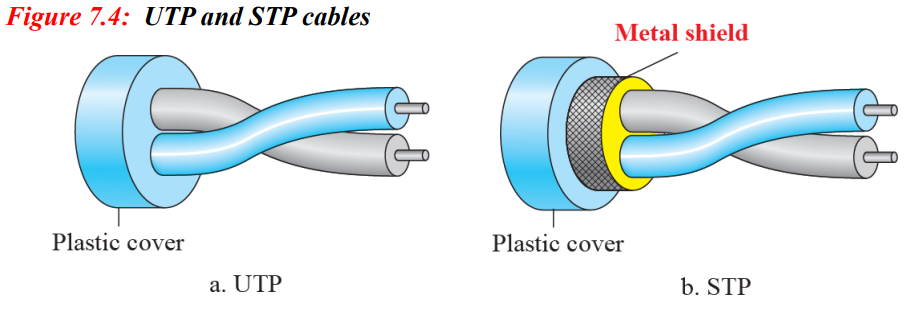
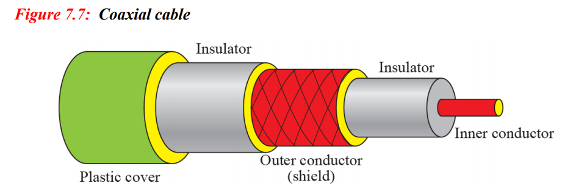

# Transmission Media
- src 에서 dest로 정보를 전달 하는 모든 것
- physical layer 밑에 존재하며, physical layer를 통해 통제됨(**layer zero** 라고 불림)
- 신호는 전자기적인 에너지로 전파된다
## Gudied Media(유선)
- 장치사이에 전선관이 존재함
- 이 매체들을 통해 전송되는 신호는 physical limit에 준함
### Twisted Pair Cable (TP Cable)
- 두개의 전도체로 구성, 각각의 플라스틱 절연체 포함
- 하나는 receiver로 **신호를 보내고**, 하나는 **ground reference로** 사용
  -> receiver는 둘의 차이를 데이터로 사용
- 노이즈(Noise)나 혼선(Crosstalk)으로 인해 두 선에게 모두 원하지 않은 신호가 보내질 수 있음
- 꽈배기 모양
- UTP(Unshielded TP) : 쉴드가 없는 TP로, 혼선방지가 **제대로 안됨**
- STP(Shielded TP) : 메탈 쉴드가 있는 TP로, 노이즈 밑 혼선을 방지하는 효과가 있음(Metal foil/braided-mesh)
- Performance : 100kHz 이상의 주파수에서 급격하게 감쇠가 늘어남
- Usage : 전화선, 10 Base-T, 100 Base-T in LAN

### Coaxial Cable
- TP보다 고주파를 전달, TP와 매우 다르게 설계됨
- 중앙에 코어 전도체 가 있고(주로 구리), 절연체로 감싸져있으며 다시 outer 전도체로 감싸져있음(metal foil / braid)
- 바깥쪽의 메탈릭 래핑은 쉴드와 동시에 전도체로 작용한다
- ex) Bayonet Neill-ConcelMan(BNC)
- Performance : 대역폭이 매우 크지만, TP보다 감쇠가 더 크며 신호가 빠르게 약해짐
  -> 많은 리피터 필요
- Usage : 아날로그/디지털 전화 네트워크, 케이블 TV 네트워크, 이더넷 LAN
  -> 빠르게 광케이블로 교체 됨

### Fiber-Optic Cable
- 유리/플라스틱 재질로 만들어져있으며, **빛의 형태로** 신호를 전달함
- 빛은 한 물질을 통과 할때 직선으로 움직이며, 다른 밀도의 다른 물질을 만나면 방향이 바뀜
- 임계각과 같거나 임계각보다 작으면 굴절, 임계각보다 크면 반사
- 반사를 이용해서 빛을 전달, 밀도가 작은 유리/플라스틱 피복으로 감싸짐
- Cable connectors : Subscriber channel(SC) - 케이블 TV, Straight-tip(ST) - 네트워크 장치
- Performance : TP, Coaxial Cable보다 감쇠가 적음(1/10 수준)
  -> 리피터가 적게 필요
- Usage :
  중추 통신망(SONET using WDM - 1600 Gbps),
  동축 케이블과 통합해서 사용(backbone - 광케이블, premise - 동축케이블),
  LAN : 100 Base-FX(빠른 이더넷), 1000 Base-X
- 장점 : 대역폭이 크다, 감쇠가 적다, 전자기적 혼선에 면역, 무게가 가볍다, 도청 면역력이 높다
- 단점 : 설치/유지에 전문적 지식 필요, 빛을 쏘는게 단방향이라서 양방향 통신을 위해선 두개의 케이블 필요, 높은 가격
#### Step index Multimode (about 50 micron core)
- 가장 오래 된 시스템
- 짧은 거리에서 전파(~500m)
- 쌈
#### Graded Index Multimode
- spreading 문제점을 굴절속성을 변경해 signal refocusing으로 잡음
- 중간중간에 light를 계속해서 refocusing
- ~1000m에서 전파
#### Single mode(about 5 micron core)
- 빛 하나(beam)을 쏨
- 굉장히 긴 거리에서도 수신 가능(spreading 없음)
- 비싸고, 생산이 힘드며 빛이 완벽히 정렬되어 있어야 함

## Unguided Media(무선)  
- 물리적인 전도체 없이 전파를 전달
- 해당 공간에 있는 장치 누구나 전달 받을 수 있다(Broadcast)
- Ground Propagation(지상파) : 저주파의 신호가 전방향으로 발산, 신호강도에 따라 통신거리가 결정 - ~2 MHz
- Sky Propagation(공중파) : 고주파 전자파가 이온층에 발산, 반사되어 다시 돌아옴 - 2 ~ 30 MHz
- Line-of-Sight propagation : 초고주파 신호가 안테나간에 왔다갔다, 안테나들은 서로를 직접 바라봐야함(방해물 X) - 30 MHz ~
### 전파(Radio Wave)
- 전파(3KHz ~ 1 GHz)/극초단파(1 GHz ~ 300 GHz) -> 확실한 경계는 없음
- 파의 특성이 주로 구분하는 기존
- Omnidirectional Antenna : 전방향으로 신호 발산, 여러개의 receiver가 receive 가능 - ex) AM/FM radio, TV
### 극초단파(Microwaves)
- 1 ~ 300 GHz의 주파수를 가진 전자파
- 단방향임
- 안테나는 서로 정렬돼있어야함
- 다른 안테나와 혼선의 가능성이 적다
- Undirectional Antenna : Parabolic dish antenna(포물선 모양) 모든 시그널라인이 평행, focus를 통해  모아짐
  Horn antenna - 거대한 스쿱처럼 생김
  -> 일대일 통신(Unicasting)에 사용, 위성통신, 무선 LAN
### 적외선(Infrared)
- 300 GHz ~ 400 THz 의 전자파, 단거리 통신에 사용
- 벽을 통과 할 수 없음 : 혼선의 여지가 적다 ex) 리모컨
- 데이터 통신의 잠재력이 높음(높은 대역폭 : 400 THz)
- IrDA port(PC <-> Keyboard 통신)
- Line-Of-Sight : 송수신자간의 교신 가능
